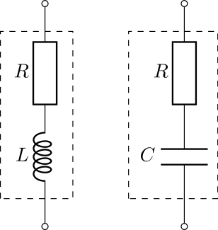
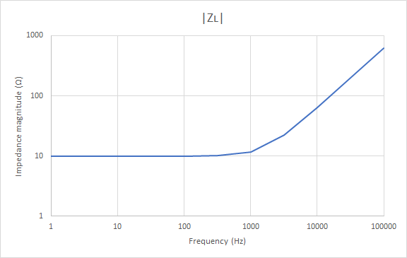
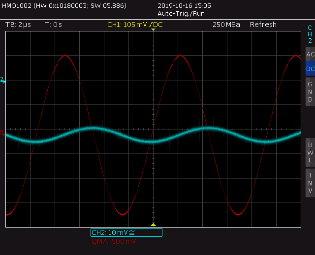
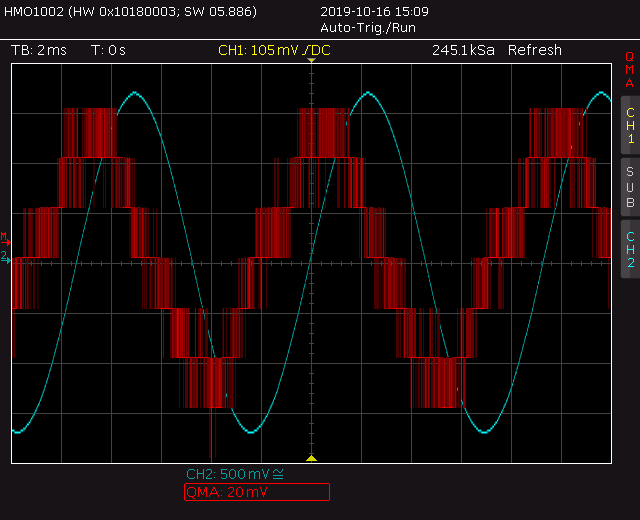

# Analysis and Design of Circuits Lab
# Part 1: Autumn Term weeks 4--6

## Section 2: Reactive Components

Ideal capacitors and inductors can be analysed by giving them an reactance $X$, which depends on the value of the component and the frequency of the AC voltage and current.
The unit of reactance is Ohms, but it is an imaginary number.
For example, a 1mH inductor has an reactance of $X=j\omega L=6.3j\Omega$ when the frequency is 1kHz.
A 1μF capacitor has a reactance of $X=1/j\omega C=-159j\Omega$ when the frequency is 1kHz.
Using imaginary impedance makes it possible to analyse circuits containing capacitors and inductors without using differential equations.
		
However, real-world components are never purely reactive and they are better represented as a complex impedance $Z=X+R$.
Depending on the application, the non-ideal impedance may be important and it can be characterised using the same test circuit as in [Section 1](Section1.md).
		

		
The calculation you applied earlier still works if the variables are complex: 

$$ Z=R\frac{V_\text{Z}}{V_\text{R}} $$

Considering just the magnitude of the impedance gives:

$$ |Z|=R\frac{|V_\text{Z}|}{|V_\text{R}|}=R\frac{v_\text{Z}}{v_\text{R}} $$

We're using a notation where $V$ is a complex voltage, a phasor, while $v$ is a real voltage that has a magnitude but no argument.
The component $Z$ is drawn as a resistor, but the relationship is true of any passive component with a complex impedance $Z$.

### Before the lab

Real-world passive components have parasitic impedances — they behave like combinations of ideal components.
The most significant parasitic impedance for inductors and capacitors is a series resistance, so the equivalent circuits can be drawn like this:
			

			
The parasitic resistance comes from the use of ohmic conductors in the components.
For example, most of the parasitic resistance in an inductor comes from its internal coil of wire.
			
Use a spreadsheet to calculate the overall complex impedance ( $Z_L$ ) of an inductor with inductance $L$ and parasitic resistance $R$ based on the expression $Z_L=j\omega L + R$.
Set up the spreadsheet to create a table of impedances for frequencies between 1Hz and 100kHz. For example, with $L=1 \times 10^{-3}\text{H}$ and $R=10\Omega$ :

| $f$ | $\|Z_L\|$ | $\arg(Z_L)$ |
| --- | ------- | ----------- |
| 1   | 10.0    | 0.0         |
| 3.2 |  …      | …           |
| 10  |         |             |
| 32  |         |             |
| 100 |         |             |
| …   |         |             |
			
Create formulas to calculate the magnitude and argument of $Z_L$ for each frequency based on the chosen values for L and R.
Note that the frequencies increase in an exponential sequence, not linear — this is a more useful way of showing data which covers such a large range and it is used very commonly in EEE.
Remember to convert from frequency in Hz to angular velocity $\omega$ in $\text{rad}s^{-1}$.
			
Finally, create a graph showing:
- $|Z_L|$ vs. $f$
- $\arg(Z_L)$ vs. $f$

Set the graph to use logarithmic scales for axes showing $f$ and $|Z|$, and linear scales for axes showing $\arg(Z)$.
As an example, $|Z_L|$ vs. $f$ should look something like this, depending on the values of $R$ and $L$:
			

### Characterising a capacitor
	
The impedance of a capacitor decreases in magnitude with frequency.
Change $Z$ in your circuit to a 1μF capacitor and measure its impedance by recording $v_\text{Z}$ and $v_\text{R}$.
This time, you will need to take measurements at multiple points between 1Hz and 100kHz because the impedance of a capacitor varies with frequency.
At each frequency, use $v_\text{Z}$, $v_\text{R}$ and $R$ to calculate impedance.
Record the measurements in a spreadsheet and use a formula to make the impedance calculation $|Z|=Rv_\text{Z}/v_\text{R}$.
		
| $f$ | $R$ | $v_\text{Z}$ | $v_\text{R}$ | $\|Z\|$ |
| --- | --- | ------------ | ------------ | ------- |
| 1   | …   | …            | …            | …       |
| 3.2 |     |              |              |         |
| 10  |     |              |              |         |
| 32  |     |              |              |         |
| …   |     |              |              |         |
		
You will need to choose a value of $R$, the test resistance: start with 1kΩ.
The value of $R$ has an effect on the accuracy of the measurement.
Therefore, change $R$ as you take measurements according to the following rules:

- If $v_\text{Z}$ (CHB) is less than 5mV RMS, decrease $R$ by a factor of 100 down to a minimum of 10Ω.
- If $v_\text{R}$ (math channel) is smaller than 1 vertical division peak to peak, increase $R$ by a factor of 100.
		
These rules ensure that the magnitudes of $R$ and $Z$ do not differ by many decimal places.
If the magnitudes differ a lot, your measurements will become inaccurate.
If you are not sure if your oscilloscope measurement is accurate, you can also calculate the theoretical value of $\|Z\|$ and choose $R$ to be similar.

Here are some examples of inaccurate oscilloscope measurements that could be fixed by changing $R$:

*CHB is small and fuzzy, and the vertical sensitivity is at its limit. Decrease R*

*The math channel is blocky (quantised) and it can't be accurately measured. Increase R*

		
Make measurements at the same frequency values that you used in your spreadsheet in the preparation task.
Plot a graph to confirm the reciprocal relationship between impedance and frequency.
Use logarithmic scaling on both axes, which will show the $Z\propto1/f$ characteristic of the capacitor as a straight line with gradient -1.
Capacitors tend to have a near-ideal relationship between frequency and impedance in the frequency range you are measuring.
		
- [ ] Measure impedance at different frequencies to confirm that the 1μF and 33nF capacitors obey the equation $|Z_C|=1/(\omega C)$ between 10Hz and 100kHz.

### Characterising an inductor
	
The impedance of an inductor can be measured in the same way as the capacitor.
We now expect the opposite relationship between frequency and impedance.
Inductors tend to be less faithful to an ideal component than capacitors, particularly at low frequencies when the parasitic resistance of the coil of wire can become significant compared to the reactance.
Furthermore, capacitance between the tightly-packed turns of wire can cause non-ideal behaviour at high frequencies too.
		
The parasitic impedances makes it important to take care when making measurements.
Update your graph with each data point so that you can see whether or not your points lie on a trend.
If three points within a decade ( $\times10$ difference) of frequency lie on a straight line you can assume the characteristic between the points is a straight line.
If not, then check your measurements and fill in extra observations to find the shape of the curve between measurements.
On logarithmic axes, small deviations can represent quite large amounts so don't be tempted to explain anomalies as experimental inaccuracy.
		
- [ ] Characterise the impedance of the 1mH and 100mH inductors between 1Hz and 100kHz. Find the extent of frequencies over which they obey the ideal equation $|Z_L|=\omega L$.
		
Plot your experimental data on the same axes as your prediction from the preparation exercise.
Tune the values of $L$ and $R$ to make the model fit your real inductor as closely as possible.
How well does the model fit?
		
- [ ] Fit your model to the experimental data and create a graph that compares them.
		
### Challenge: unmarked components

There is a box of unmarked capacitors and unmarked inductors.
Pick out two capacitors and two inductors.
Find their capacitance or inductance and also the parasitic resistance of the inductors.
Identify any other non-ideal phenomena.
Verify your results using the LCR bridge (ask for help with this piece of equipment).
Return the unmarked components afterwards so that others can use them.

- [ ] Characterise the unmarked components
