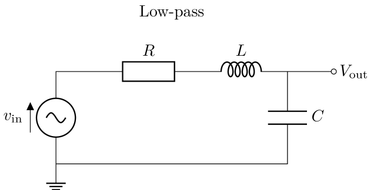
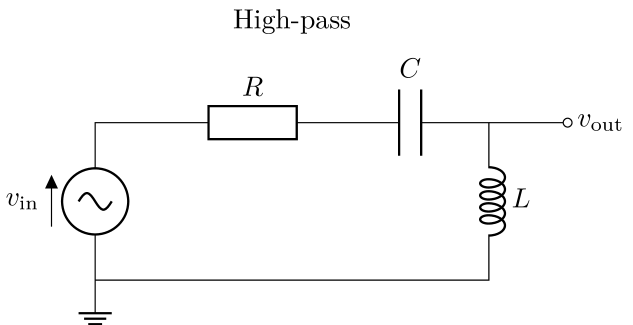
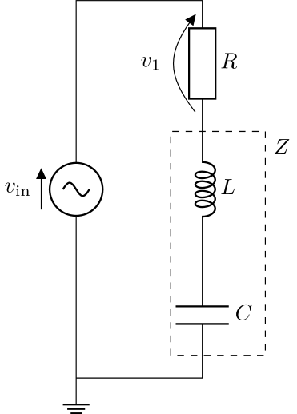
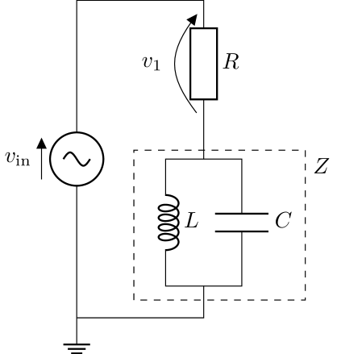
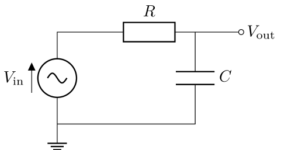
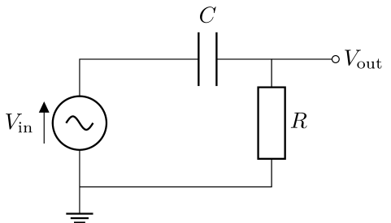

# Analysis and Design of Circuits Lab
# Part 1: Autumn Term weeks 4--6

## Section 3: Resonance and Filters

Capacitors and inductors exhibit resonance when they are connected together — at a certain frequency their impedances are equal and opposite resulting in an overall impedance that is (theoretically) either zero or infinity.
In practice, impedance never reaches zero or infinity due to parasitic resistance.
In this section you will measure the impedance of resonant networks and make filter circuits that use complex impedance to block certain frequencies.
		
## Before the lab
A resistor, capacitor and inductor can be combined to make a *second-order RLC filter*, meaning that the transfer function $T(f)=V_\text{out}(f)/V_\text{in}$ has a relationship $T\propto f^2$ or $T\propto 1/f^2$ for low or high frequencies.
			

			

			
Use your lecture notes to design a RLC filter to achieve the shape and corner frequency listed for your pair in the table at the end of this page.
Choose a value of $R$ that will make your system critically-damped ( $\zeta=1$ ).
Pick component values from the list of available parts below to get a corner frequency within 10\% of the specification.
			
Use LT SPICE to produce the magnitude and phase responses of your filter (do this after LT SPICE has been introduced in problem classes)

**Resistors ( $\times10^0\Omega$ to $\times10^6\Omega$ )**

|    |    |    |    |
| -- | -- | -- | -- |
| 1.0 | 1.1 | 1.2 | 1.3 |
| 1.5 | 1.6 | 1.8 | 2.0 |
| 2.2 | 2.4 | 2.7 | 3.0 |
| 3.3 | 3.6 | 3.9 | 4.3 |
| 4.7 | 5.1 | 5.6 | 6.2 |
| 6.8 | 7.5 | 8.2 | 9.1 |

**Capacitors (multilayer ceramic)**

|    |    |    |    |
| -- | -- | -- | -- |
| 1nF | 2.2nF | 4.7nF | 10nF |
| 22nF | 33nF | 47nF | 68nF |
| 100nF | 220nF | 470nF | 1μF |

**Inductors**

|    |    |    |
| -- | -- | -- |
| 1mH | 2.2mH | 3.3mH |
| 4.7mH | 10mH | 22mH |
| 33mH | 47mH | 100mH |

## Resonant networks

### Series LC network

Use the same method as Section 1 and 2 to measure the combined impedance of a 100nF capacitor and 100mH inductor in series.
The series combination of the inductor and capacitor forms $Z$, the impedance to be tested.
		

		
Resonance occurs at the frequency, $\omega_0$, when the magnitudes of the reactances of the capacitor and inductor are equal, i.e. $\omega_0 L = \frac{1}{\omega_0 C} $. Rearranging gives $\omega_0=\sqrt{\frac{1}{LC}}$
		
For an ideal capacitor and ideal inductor in series, $Z(\omega)=Z_L(\omega)+Z_C(\omega)=j\omega L+\frac{1}{j\omega C}$
		
At resonance, $Z(\omega) = j\omega_0 L + \frac{1}{j\omega_0 C} = 0$
		
Plot your impedance measurements to find $\omega_0$, the frequency where impedance is at a minimum.
You will need to take extra measurements around the resonant frequency to see the characteristic in enough detail, so plot your measurements as you take them to see where you need to try intermediate frequencies.
Compare the results to theory and also try to explain the exact value of $Z(\omega_0)$, which isn't zero as predicted by theory.
		
- [ ] Plot the impedance of the series LC network as it varies with frequency and compare the measurements to theory.

### Parallel LC network
A parallel LC network also exhibits resonance.
		

		
Using the equation for impedances in parallel, $Z(\omega)=\frac{Z_L(\omega)Z_C(\omega)}{Z_L(\omega)+Z_C(\omega)}$
		
Since $Z_L(\omega_0)=-Z_C(\omega_0)$
		
$Z(\omega_0)=\frac{Z_L(\omega_0)Z_C(\omega_0)}{0}$, which tends to positive infinity as $\omega \longrightarrow \omega_0$.
		
Repeat the process of measuring impedance, once again with extra measurements to add detail around $\omega_0$.
Use the same values for $L$ and $C$.
Find the maximum magnitude of the impedance and explain why that is the maximum.
		
- [ ] Plot the impedance of the parallel LC network as it varies with frequency and compare the measurements to theory. Overlay the plot with your results of the series LC network.

## First-order filter

A filter is a circuit that transforms a signal by amplifying or attenuating certain constituents, and a *linear* filter selects those constituents according to frequency.
The most common type of linear filter made from passive components is a resistor-capacitor (RC) filter, which can be either low-pass (attenuates high frequencies) or high-pass (attenuates low frequencies).
In an audio system, the subwoofer would be driven by the output of a low-pass filter while the tweeter would use a high-pass.
		

A filter is characterised by its *transfer function* $T(\omega)$, which is the the relationship between the input and output signals and its dependency on frequency: $T(\omega)=V_\text{out}(\omega)/V_\text{in}$.
To measure it,  you'll need to record the ratio of output voltage to input voltage over the range of frequencies you are interested in.
That means, compared to the earlier exercises where you measured impedance, you can discard the math channel measurement and just measure $V_\text{in}$ with oscillscope CHA and $V_\text{out}$ with CHB.
		
Note that the transfer function is complex: it has a magnitude and a phase.
The magnitude is the ratio of the voltage amplitudes and the phase is the difference in phase angle between the output and input sine waves.
The phase response of an RC filter was used to make the phase shifter in the lab skills experiment.
Use the oscilloscope cursors to measure the phase difference between input and outpu.

Measure and plot the transfer functions of RC high-pass and low-pass filters made from a 1μF capacitor and 1kΩ resistor.
Frequency and $|T(f)|$ should be plotted on logarithmic axes and $\arg(T(f))$ should be plotted on a linear axis.
Measure the transfer function at the same frequency points that you used to measure impedance.
		
- [ ] Plot the magnitude and argument of transfer function of the high-pass and low-pass filters.

## Challenge: test your second-order filter

- [ ] Build the filter you designed in the preparation activity.
Measure the magnitude and phase responses between 1Hz and 100kHz.
Produce a plot comparing the magnitude and phase responses with the results of your simulation.
Explain any discrepancies.

## Specifications for RLC filters ##

Each lab pair has a specified filter type and corner frequency for their RLC filter.

| Pair | Type | $f_c$ |
| -- | -- | -- |    			
A01|	LP|	1900
A02|	HP|	8700
A03|	HP|	7400
A04|	HP|	1800
A05|	HP|	8800
A06|	HP|	1900
A07|	HP|	8800
A08|	HP|	5000
A09|	HP|	2800
A10|	LP|	2700
A11|	HP|	2300
A12|	LP|	1900
A13|	HP|	4900
A14|	HP|	5000
A15|	HP|	5300
A16|	LP|	5900
A17|	LP|	7400
A18|	LP|	7300
A19|	HP|	4100
A20|	HP|	1700
A21|	LP|	7400
A22|	HP|	5900
A23|	LP|	3400
A24|	LP|	1600
A25|	HP|	8700
A26|	HP|	8800
A27|	HP|	3400
A28|	LP|	8800
A29|	LP|	8700
A30|	LP|	970
A31|	HP|	730
A32|	LP|	3400
A33|	HP|	3400
A34|	HP|	5900
A35|	LP|	4000
A36|	HP|	3400
A37|	LP|	1700
A38|	LP|	8700
A39|	LP|	5100
A40|	HP|	4000
A41|	LP|	3400
A42|	HP|	5900
A43|	HP|	4000
A44|	HP|	1900
A45|	HP|	4900
A46|	HP|	5900
A47|	LP|	2800
A48|	LP|	6600
A49|	HP|	2300
A50|	HP|	6100
A51|	LP|	5000
A52|	LP|	5900
A53|	LP|	7300
A54|	HP|	8900
A55|	LP|	2800
B01|	LP|	4500
B02|	LP|	7400
B03|	LP|	3400
B04|	HP|	1400
B05|	LP|	6100
B06|	LP|	1900
B07|	HP|	1600
B08|	LP|	1600
B09|	LP|	4400
B10|	HP|	1700
B11|	HP|	1100
B12|	LP|	4900
B13|	LP|	5900
B14|	LP|	1900
B15|	LP|	2300
B16|	HP|	2300
B17|	LP|	4400
B18|	HP|	5900
B19|	HP|	8900
B20|	HP|	7400
B21|	HP|	8800
B22|	LP|	5300
B23|	HP|	1100
B24|	HP|	4900
B25|	HP|	7300
B26|	LP|	2800
B27|	LP|	4400
B28|	LP|	2000
B29|	LP|	2300
B30|	LP|	5000
B31|	HP|	1500
B32|	HP|	5100
B33|	HP|	2300
B34|	LP|	2300
B35|	LP|	3400
B36|	LP|	4900
B37|	HP|	3400
B38|	HP|	3300
B39|	LP|	2400
B40|	LP|	3300
B41|	HP|	2300
B42|	LP|	5100
B43|	LP|	2700
B44|	LP|	5000
B45|	LP|	3400
B46|	LP|	4800
B47|	LP|	5900
B48|	HP|	8700
B49|	HP|	1100
B50|	HP|	7300
B51|	HP|	7300
B52|	LP|	2100
B53|	LP|	8800
B54|	LP|	1400
B55|	HP|	5900

*HP: High-pass, LP: Low-pass*
