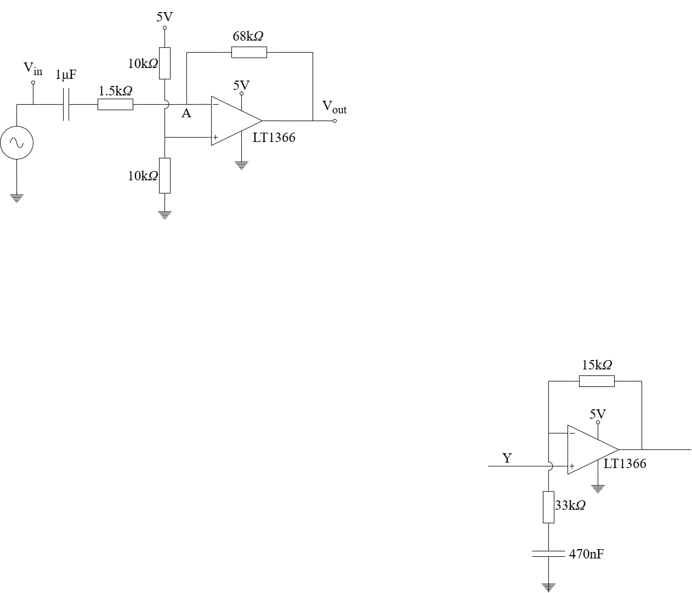

# Analysis and Design of Circuits Lab
# Part 2: Autumn Term weeks 8–10

## Section 2: Bandwidth and filtering}
	
Opamp circuits have frequency-dependent transfer functions just like passive networks containing capacitors and/or inductors.
In this section you will measure the built-in bandwidth limitation of the LT1366 opamp and design a circuit with a custom transfer function.

## Before the lab
1. Look up the datasheet for the LT1366 and find out the *Gain-bandwidth product* for the opamp.
   Also locate the plot for gain versus frequency. How does the gain-bandwidth product relate to the gain transfer characteristic?
2. Signal source mode 8 generates a melody with an annoying whine.
   Use the (Analog Devices Filter Wizard)[http://www.analog.com/designtools/en/filterwizard/] to design a low-pass active filter that will block out the unwanted signal.
   Observe the following specifications:
   1. The notes of the tune are in the range 200Hz–2KHz and must lie within the passband
	 2. The unwanted signal is at 8kHZ must lie within the -40dB stopband
	 3. The filter must use no more than two opamp stages (4th order)
	 4. The filter must use 5V and 0V power supplies

The tool shows the *order* of the filter and the number of stages; i.e. the number of opamps required.
The slider under 'Filter Response' allows you to try different circuit types.
You can view the generated circuit in the 'Components' tab.
The generated component values are precise and may not match the values available in the lab component drawers.
Enable the 'I want to choose' option for components and you will see a slider that allows you to trade off between larger capacitors and larger resistors.
You can adjust the slider separately for each stage (opamp) in the design.
Use the slider so that capacitors match available values (e.g. 100nF and 1μF).
Then achieve the required resistances using parallel and series combinations, and allowing a ±10% tolerance.

## Gain bandwidth product
Opamps have built-in low-pass filtering to help ensure that circuits remain stable — without it, high frequency oscillation would occur.
The frequency at which the opamp *open loop* gain drops to unity (0dB) is known as the *gain-bandwidth product* (GBP) and it is usually illustrated in a graph in the opamp datasheet.
Remember that open loop gain is the gain of the opamp with no negative feedback, which is ideally infinite.
The gain of an opamp in a circuit with negative feedback cannot be greater than the open loop gain.

			
The circuit above has a relatively high gain for a single-opamp amplifier.
Use the oscilloscope signal generator (AWG) as an input instead of the signal source module, and set it up with a sine wave with 50mV amplitude and 0V DC offset.
			
Plot a graph of the gain and phase transfer functions of the amplifier by observing the input and output waveforms on the oscilloscope at a number of frequency points between 100Hz and 100kHz.
You will observe a low-pass transfer function with a single corner frequency and a first order roll-off.
			
- [ ] Characterise the gain and phase transfer characteristics of the amplifier. Extrapolate the transfer function at high frequency to confirm that the gain drops to unity (0dB) when frequency equals the gain-bandwidth product of the opamp.

## Challenge: Active Filter
Opamps can be used to create active filters with customised transfer functions by adding reactive components to the circuit paths which control the gain.
Compared to filters that use only passive components, active filters can implement tighter transfer characteristics with higher order roll-off slopes.
They also avoid the need for inductors, which are more expensive and exhibit more significant parasitic characteristics than capacitors.
A number of active filter designs exist and there are trade-offs between them.
Designing them can be complex but computer tools make the job easier by modelling the transfer functions and suggesting circuit designs.
				
The preparation for this experiment uses an online tool to design an active filter.
Build the circuit suggested by the tool and, using the signal generator, compare its transfer function to the one modelled by the tool.
Connect the signal generator directly to the input of the circuit and apply a 1V DC offset to the signal so that the signal is always greater than 0V.

- [ ] Build, characterise and test the active filter.

Once you have characterised the filter, replace the signal generator input with a signal source module and confirm that the filter successfully removes the annoying whine in signal mode 8.
You will need to use a potential divider to add a DC bias to the signal source input, like the non-inverting configuration in the [previous section](Section1.md#single-supply-non-inverting-amplifier).
				
- [ ] Confirm that the filter removes the whine
