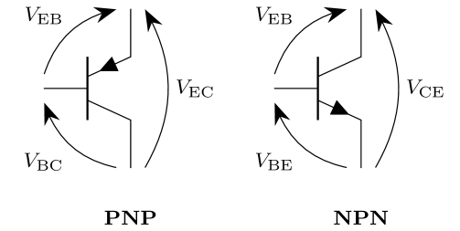
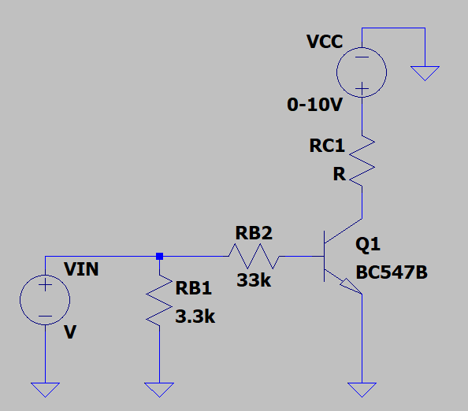
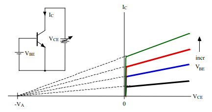

# Analysis and Design of Circuits Lab
# Part 3: Spring Term weeks 3--5

Transistors are the core building blocks of every modern piece of electronics. 
BJTs and FETs are used for a wide set of applications ranging from switching to amplification, and every electrical and electronic engineer needs to have at least a basic understanding of how they work and how they are used in circuits.

This experiment has been designed to give you some insight and fundamental understanding of basic BJT operation and characterisation and their use in circuits. 
You will learn about different biasing schemes and thermal stability, and investigate some simple voltage amplifiers. 
This material directly relates to the first part of the Spring term ADC course.

By the end of it you should understand BJT characteristics and be able to design simple Common Emitter amplifier circuits, and see their performance limits in terms of AC gain, distortion and thermal effects.
    
You will need the following equipment:
    
| **Item** | **Quantity** |
| ---- | -------- |
| Bench Power Supply Unit (PSU) | 2 channels |
| Breadboard | 1 |
| Oscilloscope | 1 |
| BC547B or BC548B NPN transistor | 3 |
| Multimeter | 1 |
| Wire | |	
| Wire strippers | 1 |
| **Capacitors** | | 
| 100 nF | 4 |
| 10 µF | 2 |
| **Resistors** | | 
| As required | |

## Section 1: Characterising a BJT
    
### Before the lab

The bipolar transistor (BJT) consists of two PN junctions placed back to back.
Since the two junctions are placed so close together, significant interaction occurs between them.
			
 
            
By considering the flow of charges through this double PN junction, we can derive equations which model the operation of the transistors.
The following equations describe the basic behaviour in the normal active region; that is, the base-emitter forward biased and the collector-base reverse biased.
The equations as written are for an NPN device; to obtain the corresponding equations for PNP replace $V_\text{BE}$ with $V_\text{EB}$ and $V_\text{CE}$ with $V_\text{EC}$.
            
$I_\mathrm{C} = I_\mathrm{S} \mathrm{e}^\frac{V_\mathrm{BE}}{V_\mathrm{T}} \left(1+\frac{V_\mathrm{CE}}{V_\mathrm{A}}\right)$
            
$V_\text{T}$ is the thermal voltage, $V_\mathrm{T} = kT/q$.
$T$ is the temperature in Kelvin, $q$ is the electron charge and $k$ is Boltzmann’s constant.
$V_\mathrm{T} =$ 25mV at room temperature (≅300K) and is proportional to temperature.  If the transistor heats up, $V_\text{T}$ goes up too.
            
$I_\text{S}$ is the saturation current of the transistor, typically of the order of 10–15-9A at room temperature.
It’s very small because it describes the leakage current in the device when the transistor is cut-off (where, ideally, no current flows). 
$I_\text{S}$ doubles for every 8°C temperature rise (in silicon devices). 
$V_\text{A}$ is the device ‘Early voltage’ and relates to how well the transistor approximates a constant current generator in the active mode. 
            
Typically $V_\mathrm{A}$ is around 50–120V for modern transistors, although in specialist devices it may be as high as 1000V. 
            
- [ ] Refer to the [data sheet for BC547B/BC548B](https://www.mouser.co.uk/datasheet/2/308/1/BC550_D-2310266.pdf) and estimate the Early voltage for this transistor. As shown in the lecture notes, you can extrapolate the active region of the curves in Figure 1 of the datasheet to find the $x$ intercept — this is $-V_\mathrm{A}$.

Since $V_\mathrm{A}\gg V_\mathrm{CE}$, the collector current equation is often approximated to:
            
$I_\mathrm{C} = I_\mathrm{S} \mathrm{e}^\frac{V_\mathrm{BE}}{V_\mathrm{T}}$
            
This simple exponential relationship between $I_\mathrm{C}$ and $V_\mathrm{BE}$ is probably the most important relationship in analogue bipolar circuit design.
Finally, the output (collector) to input (base) current gain of the bipolar transistor is given by 
            
$\frac{\Delta I_\text{C}}{\Delta I_\text{B}} = \beta$
            
$\beta$ (also referred to as $h_\mathrm{FE}$) is known as the forward emitter current gain of the transistor.
For the following circuit designs we can make good engineering approximations for performance with the aid of just $\beta$.
            
- [ ] From the transistor data sheet, find typical values of $h_\mathrm{FE}$ for the device operating with a collector current $I_\mathrm{C}$ of 2mA, a collector emitter voltage $V_\mathrm{CE}$ of 5V and at a temperature of about 25°C.

Note the wide spread of values for $h_\mathrm{FE}$ — you can't depend on it being a certain value when you design a circuit, even if $I_\mathrm{C}$, $V_\mathrm{CE}$ and $T$ are exactly the values in the datasheet.
You will explore $\beta$ further in the next section.

### Characterising the BJT

> **Note** Working with BJT circuits
> - Use colour coded wires; red and black for $V_\mathrm{CC}$ and GND.
> - Treat the transistors with care: always check before applying power, and disconnect the power before making changes.
> - Put sleeving from stripped breadboard wires on resistor leads if necessary to prevent them touching each other.
> - You will sometimes need a smaller input voltage than the signal generator is able to supply. If this is the case, make up an attenuator (potential divider) using two resistors.
> - When using a scope probe, DO NOT push the probe into holes in the breadboard — this damages the contact mechanism.  Instead, use a piece of wire as a probe extension.

Build the circuit below for characterising a BJT.

            
| **Component** | **Value** |
| ------------- | --------- |
| $V_\text{IN}$ |	Varied (0-5V) |
| $V_\text{CC}$ |	Varied (0-10V) |
| $Q_\text{1}$ | BC547B or BC548B |
| $R_\text{B2}$ |	3.3 kΩ |
| $R_\text{B3}$ |	33 kΩ |
| $R_\text{C3}$ |	100 kΩ |

Look at the table of 'Absolute Maximum Ratings' in the datasheet and find the maximum collector current that the device can tolerate.
Assuming you use $V_\text{IN}$ of 5V in maximum case, are you likely to exceed the transistor’s ratings in the lab?
        
It is now time to characterize the transistor, plotting the collector current $I_\text{C}$ against the collector-emitter voltage $V_\text{CE}$.
        
The only value you’ll need to change in this section is $V_\text{IN}$ and $V_\text{CC}$ in order to achieve the desired values of $I_\text{B}$ and $V_\text{CE}$.
You may use LTspice to double-check your calculations before turning the circuit on. We will take the following measurements for three different base currents: 20µA, 50µA and 100µA. 

Estimate the required value of $V_\text{IN}$ to drive 20µA of base current by assuming $V_\text{BE}$=0.7V.
Double check your estimation by measuring the voltage drop across $R_\text{B2}$ with your Multimeter.
Set $V_\text{IN}$ to relevant value on the first channel of the Bench PSU to obtain $I_\text{B}=20$µA.
        
- [ ] Set the base current to 20µA.
        
Now that the base current is set, we can start ramping up $V_\text{CC}$ from 0 to 10V from the second channel of the Bench PSU.
You’ll need to record:
        
- $I_\text{C}$ (calculated from the voltage drop across $R_\text{C}$)
- The collector-emitter voltage $V_\text{CE}$
- $V_\text{CC}$
        
Make measurements at closer intervals for low values of $V_\text{CC}$. 
Also make sure that your base current keeps constant during your measurements.
        
- [ ] Characterise the transistor over a sweep of $V_\text{CC}$ while $I_\text{B}=20$µA.
        
- [ ] Repeat the characterisation for $I_\text{B}=50$µA and $I_\text{B}=100$µA.
        
You can now plot the collector currents you have measured against collector-emitter voltages for the different values of base currents.
You should obtain something that looks like the curves in your lecture notes and the transistor datasheet:
        

        
- [ ] Estimate the Early voltage $V_\text{A}$ of the device by finding the horizontal intercept of the flat parts of your $I_\text{C}$ curves. How does it compare to the value you extrapolated from the datasheet?
