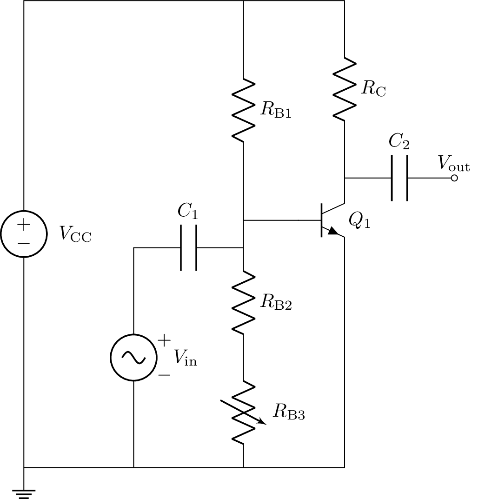
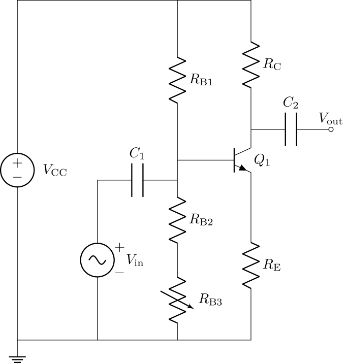
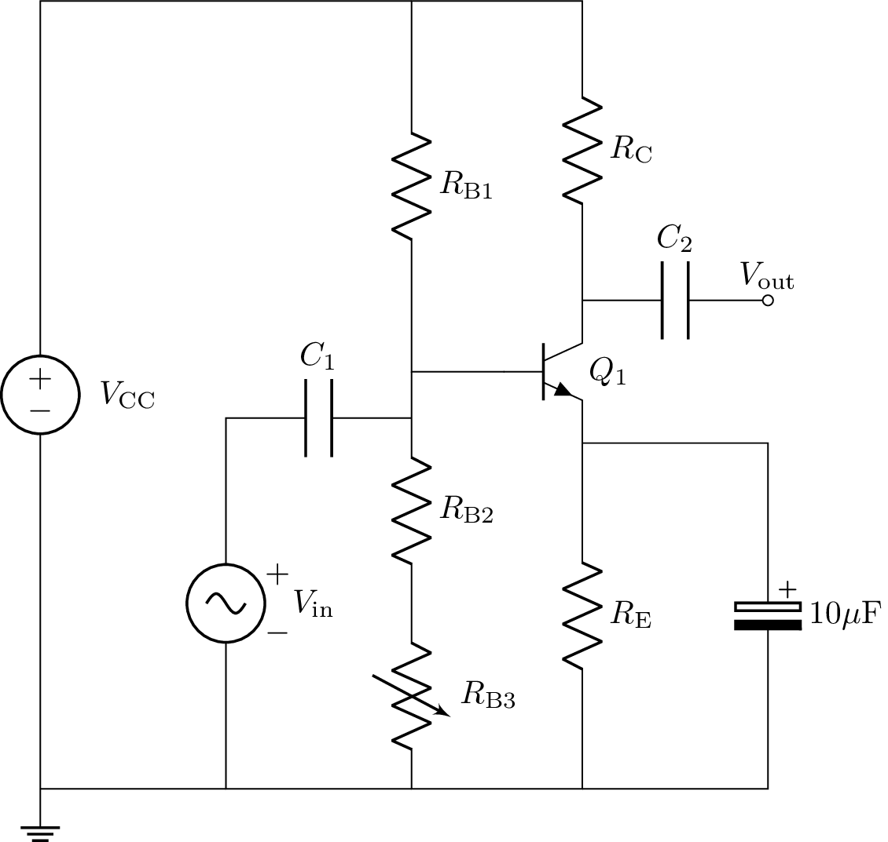

# Analysis and Design of Circuits Lab
# Part 3: Spring Term weeks 3--5
## Section 2: Common Emitter (CE) Amplifiers

In many applications (such as transistor level design of an op-amp), it is desirable to have a high voltage gain from a single amplifier stage.
The most common configuration of a high gain voltage amplifier is the common emitter (CE) configuration (the emitter being the common point to input and output voltages).
In fact the CE stage is the only single transistor configuration that gives high voltage and high current gain simultaneously.
        
The circuit below shows a simple common emitter amplifier, together with associated biasing resistors.
Biasing sets up DC voltages and currents in a circuit so that the transistors remain in the active region when an AC input signal is applied.
You should have a basic understanding of the operation of this circuit from the ADC lecture notes.

 
| **Component** | **Value** |
| ------------- | --------- |
| $V_\text{in}$ |	Oscilloscope Signal Generator |
| $V_\text{CC}$ |	5V (Orangepip) |
| $Q_\text{1}$ | BC547B or BC548B |
| $C_\text{1}$, $C_\text{2}$ | 100 nF |
| $R_\text{C}$ | 10 kΩ |
| $R_\text{B1}$ |	220 kΩ |
| $R_\text{B2}$ |	27 kΩ |
| $R_\text{B3}$ |	10 kΩ Potentiometer |

### Biasing the circuit

As you have seen in the lectures, operating the amplifier at the correct biasing point is important: we need to get a high gain, and we need to avoid saturation of the BJT.
Our general aim therefore is to place the quiescent operating point (i.e. when $V_\text{in}$ is open circuit) such that $V_\mathrm{C} = V_\mathrm{CC}/2$.
Using a single rail supply ($V_\text{CC}=5$V and connecting emitter node E to GND), we can bias the output of the amplifier at a quiescent voltage of about 2.5V.
Thus 2.5V will be dropped across resistor $R_\text{C}$, so chose \$R_\text{C}=10$kΩ to get 0.25mA of quiescent collector bias current. 
            
Given the values of $R_\text{B1}$ and $R_\text{B2}$, estimate an expected value for the potentiometer $R_\text{B3}$ to bias your CE amplifier around a quiescent output voltage of 2.5V.
This depends on the actual $\beta$ of your transistor, the chosen collector current and the temperature. β should be in the range you found in the datasheet.
            
You can now build the circuit for the CE amplifier, omitting the input and output capacitors $C_\text{1}$ and $C_\text{2}$ for now.
Power $V_\text{CC}$ at 5V and adjust $R_\text{B3}$ until the voltage at the collector terminal is exactly 2.5V.
If your transistor has an extreme value of $\beta$ and you cannot achieve 2.5V, you may need to swap $R_\text{B2}$ with a different value.
            
- [ ] Estimate the value of $R_\text{B3}$ needed to bias $V_\text{C}$ at 2.5V and find the actual value needed in your circuit.
            
Now that the circuit is properly biased let’s test how sensitive it is to temperature changes: carefully hold the transistor’s plastic package between your fingers (whilst it is powered up).
Observe how the collector voltage changes.
Make a note of the minimum collector voltage you achieve.
Can you explain why this happens?
            
### Amplifier performance

Add $C_\text{1}$ and $C_\text{2}$ to your circuit.
Connect the signal generator to $V_\text{in}$ and and the oscilloscope probes to $V_\text{in}$ and $V_\text{out}$.
Capacitor $C_\text{1}$ is for AC coupling — it prevents any DC voltage from the input changing the biasing and raising $V_\text{BE}$ above 0.7V, which would damage the transistor.
            
Set the signal generator to produce a triangle wave at $V_\text{in}$ with a frequency of 1kHz and an amplitude of 5mV.
You should see $V_\text{out}$ showing the same signal with a much larger amplitude.
Increase the amplitude of $V_\text{in}$ until $V_\text{out}$ starts to show distortion.
Record what the distortion looks like and find the maximum output amplitude without distortion.
What happens if the bias point of $V_\text{C}$ is adjusted slightly away from 2.5V by changing $R_\text{B3}$?
            
Switch to a sine wave with an amplitude that causes no distortion and find the gain of the amplifier by calculating $V_\mathrm{OUT}/V_\mathrm{IN}$.
            
- [ ] Find the gain and maximum output amplitude of your amplifier.
            
Another important parameter is the input impedance of your amplifier.
Measure it by applying a sine wave input such that $V_\text{out}$ is not distorted, and measuring the amplitude of $V_\text{out}$.
Then, without changing the input amplitude, introduce a 10kΩ resistor in series with the signal generator input.
This will cause $V_\text{out}$ to drop according to the equation below.
             
$ V_\mathrm{OUT1} = V_\mathrm{OUT2} \left(1+\frac{10k}{R_\mathrm{IN}}\right) $

 Here, $R_\text{IN}$ is the input impedance of the amplifier. Can you derive this formula yourself?
            
- [ ] Find the input impedance of the amplifier.
            
### Emitter Degeneration

Whilst you should have observed the previous circuit does indeed amplify, it has a significant problem in practice:  the transistor is biased at a constant $V_\text{BE}$.
This is undesirable because, as we have observed, a small change in temperature can cause a big change in $V_\text{out}$.
It also requires fine tuning to adjust for $\beta$, which varies between transistors.
            
An emitter resistor $R_\text{E}$, shown below, introduces a form of negative feedback: when the emitter current changes due to thermal effects, the voltage drop across $R_\text{E}$ changes accordingly, shifting $V_\text{BE}$ in the opposite direction.
This helps stabilise $I_\text{E}$ at its desired value despite changes in $\beta$.
The technique is called emitter degeneration.
             

| **Component** | **Value** |
| ------------- | --------- |
| $V_\text{in}$ |	Oscilloscope Signal Generator |
| $V_\text{CC}$ |	5V (Orangepip) |
| $Q_\text{1}$ | BC547B or BC548B |
| $C_\text{1}$, $C_\text{2}$ | 100 nF |
| $R_\text{C}$ | 10 kΩ |
| $R_\text{B1}$ |	220 kΩ |
| $R_\text{B2}$ |	56 kΩ |
| $R_\text{B3}$ |	10 kΩ Potentiometer |
| $R_\text{E}$ | 2 kΩ |

Build the circuit above, omitting $C_\text{1}$ and $C_\text{2}$.
Like before, estimate a value of $R_\text{B3}$ that will bias $V_\text{C}$ at 2.5V and then adjust $R_\text{B3}$ so that you measure 2.5V with your multimeter.
Repeat the test for temperature stability by touching the transistor.
Is the biasing more resistant to temperature changes than the previous version?
            
- [ ] Build the amplifier with emitter degeneration and set up the biasing. Assess the temperature stability.

 Now add $C_\text{1}$ and $C_\text{2}$, and connect the Oscilloscope.
 Repeat the measurements of maximum output amplitude and gain. How do they compare to the CE amplifier without emitter degeneration?
            
The circuit below uses an additional electrolytic capacitor in parallel to the emitter resistor.
Add it to your circuit and find the effect on gain.
Biasing won't be affected because the capacitor has no impact on DC voltages or current.
            

            
- [ ] Find how emitter degeneration affects the gain of the amplifier, with and without the parallel capacitor.
