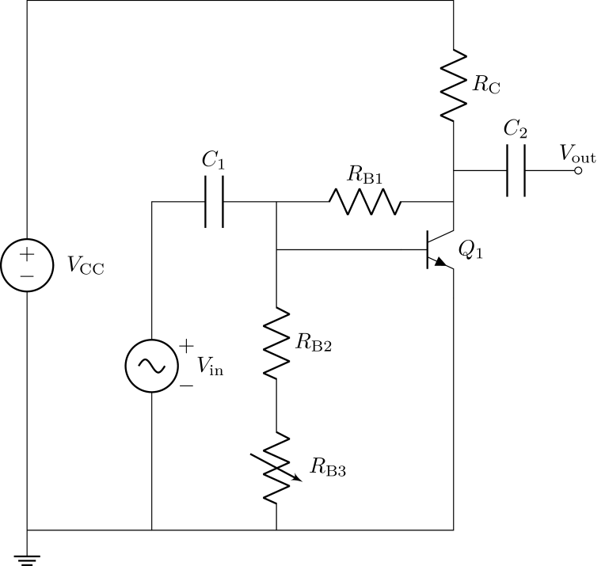

# Analysis and Design of Circuits Lab
# Part 3: Spring Term weeks 3--5
## Section 3: Optimisation of a different configuration of CE amplifier

This part of the lab is less prescriptive and more open-ended.
You are given the circuit below, which is biased by deriving the $V_\text{BE}$ from the collector of the BJT.
            

### Operating Point

Begin by capturing the circuit in LTspice.
Find the BC547B by placing a NPN BJT then right-click to pick a new transistor.
Estimate suitable values for the bias resistors to achieve similar quiescent values for $V_\text{C}$ and $I_\text{C}$ to your previous circuits.
Once you have some initial values you can quickly simulate the bias conditions in LTspice by selecting the 'DC op pnt' (DC operating point) simulation mode.
Running the simulation reveals a window showing the bias voltage at every node and the current through every component.
            
Add a 'SPICE Directive' to your circuit and enter the text `.TEMP 40` — this sets the temperature of the simulation to 40°C.
Repeat your simulation at a few different temperatures to check the temperature stability of the biasing.
It's common for commercial circuits to be specified for a temperature range of 0–85°C.
            
The operating point simulation can also tell you the power consumption.
Look in the results for the current through the voltage source you used for the power supply and multiply by the voltage.
            
- [ ] Use LTspice to find a suitable biasing for the amplifier. Find the temperature stability of the bias point and the power consumption.

### Gain          

You can measure the gain of an amplifier in simulation by running an AC analysis.
That will show you the amplitude of signals as a function of frequency, including the transfer function.
Use the 'Add trace' option to add a plot of $V_\text{out}/V_\text{in}$ to the graph.
You will see that the gain is constant with frequency, except for a roll-off at low frequency due to the high-pass filter made from $C_\text{1}$ and the input impedance of the amplifier.
            
Find the gain of the amplifier.
Try changing the bias resistors to see how they affect gain.
Optimise the circuit to achieve a good trade-off between gain and power consumption, whilst maintaining a quiescent voltage of 2.5V at $V_\text{C}$.
Investigate how gain is affected by temperature.
            
- [ ] Find an optimal configuration for the amplifier.
            
### Challenge: Build Your Amplifier

Once you are happy with the component values in your amplifier, build it on your breadboard.
You will need to find the closest resistor values available in the lab.
Check the bias conditions and measure the transfer function to compare your circuit with the simulation.
