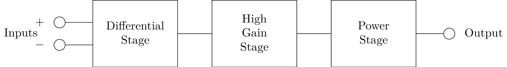
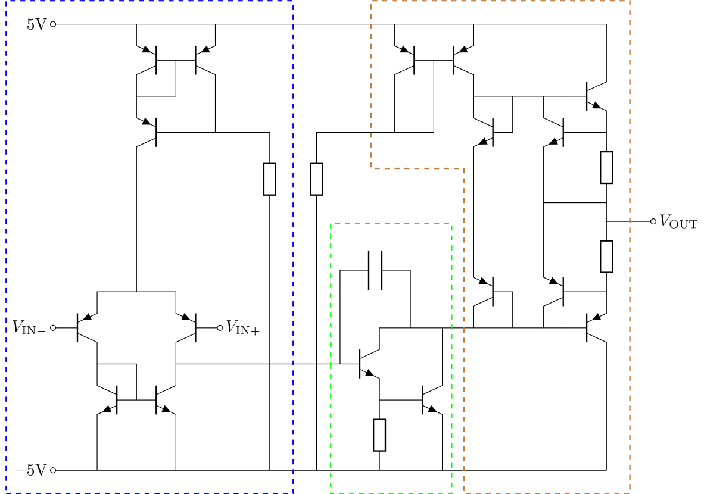
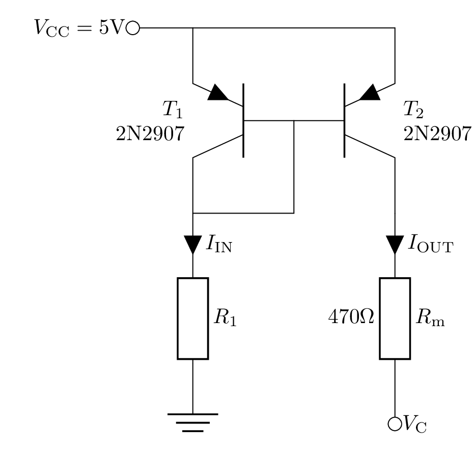
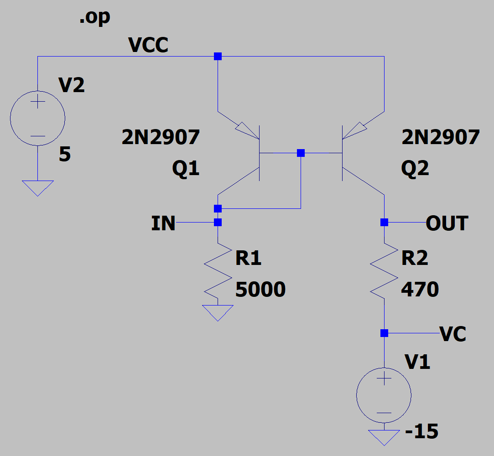
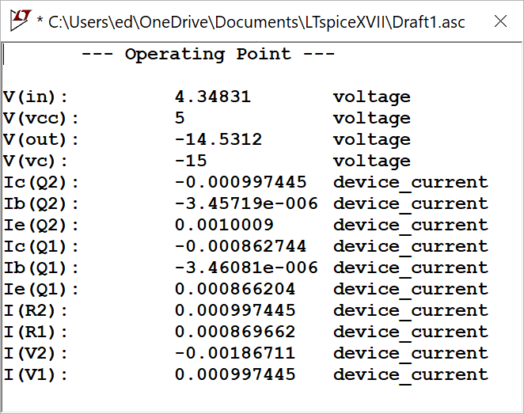
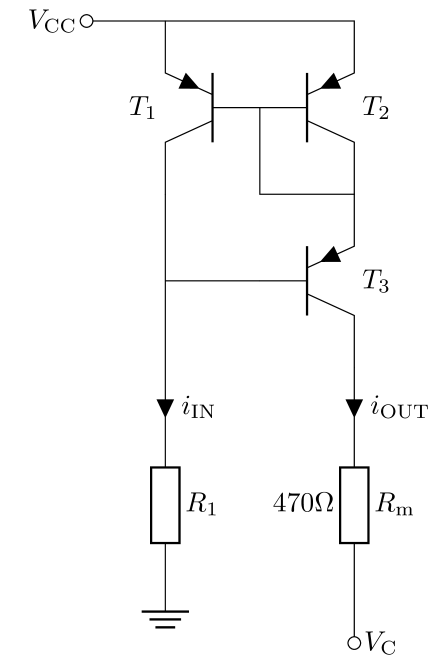

# Analysis and Design of Circuits Lab
# Part 4: Spring Term weeks 7–10

## Introduction
	
An operational amplifier has several ideal parameters, including:
- Very high differential gain
- Very low common-mode gain
- Very high input impedance
- Very low output impedance
    	
The aim of this experiment is to explore how BJT building blocks can achieve these properties and be combined to make a working opamp.
The experiment is conducted in simulation using LTspice, which will be quicker and less susceptible to errors than building circuits on a breadboard.

### Background

Opamps are widely used in analogue systems.
They are *integrated circuits*, meaning that they consist of many transistors on a single silicon chip.
Opamps are often further integrated as blocks in more complex ICs.
The gain and transfer function of an opamp amplifier can be carefully controlled using external components in closed loop configurations.
A typical opamp architecture generally has three amplifier stages. 
    

        
The differential stage acts to amplify the difference between the two input signals, while ignoring any *common mode* input, i.e. the mean voltage of the two inputs.
The high gain stage applies a large amount of voltage gain, such that the opamp can be treated as having infinite gain for the purposes of analysing the behaviour of a closed loop application circuit.
The final stage increases the output current so that the opamp has a low output impedance for driving other circuits.
At the transistor level, these blocks look like the diagram below.
It looks complex but by the end of the experiment you will be familiar with all the blocks that make it up.
    

        
The behaviour of the BJTs is defined by the usual expressions:
        
$I_\mathrm{C} = I_\mathrm{S} \mathrm{e}^\frac{V_\mathrm{BE}}{V_\mathrm{T}} \left(1+\frac{V_\mathrm{CE}}{V_\mathrm{A}}\right)$
        
For $V_\mathrm{A}\gg V_\mathrm{CE}$, this is approximated as:
                
$I_\mathrm{C} = I_\mathrm{S} \mathrm{e}^\frac{V_\mathrm{BE}}{V_\mathrm{T}}$
        
We will also use the small signal output impedance:
        
$r_\mathrm{0} = \frac{V_\mathrm{A}}{I_\mathrm{C}}$

## Current Mirror and Current Source
    
The current mirror is a widely used building block that acts as a current buffer.
The current flowing in the input branch of the circuit is mirrored so that the same current also flows in the output branch.
An ideal current mirror has an infinite output impedance since it acts like a current source.
It can be built with PNP transistors to make a source of positive current, and NPN transistors to make a current sink. 
    
### Simple current mirror

A simple PNP current mirror looks like this:
        

        
The circuit consists of two similar transistors with their bases and emitters connected.
Since the base-emitter voltages of the two transistors are equal then their collector currents should also be equal.
The input transistor $T_1$ has its collector connected to its base, so it acts like a diode and provides a sink for the base currents of the transistors.
Simulate the current mirror using this circuit:

                
Make sure to select a specific transistor model after you have placed them on your schematic.
Use 2N2907 for PNP transistors.
The diode-connected transistor $T_1$ has a fixed collector voltage, allowing the input current to be set with $R_1$. $V_\mathrm{CC}$ and $V_\mathrm{C}$ should be set up with voltage sources, with $V_\text{C}=-10$V at first. Choose a value of $R_1$ so that $I_\text{IN}=1$ mA.
            

                
We are interested in the DC (bias or quiescent) performance of the current mirror, so run a DC operating point simulation — 'DC op pnt' in the simulation setup window in LTspice.
When you run the simulation this returns a table listing all the DC voltages and currents in the circuit.
Note how the use of node names in the circuit makes it easier to read the simulation results.
            

                
- [ ] Run a DC analysis to find $I_\mathrm{IN}$ and $I_\mathrm{OUT}$. What is the *current transfer ratio* between input and output?

The current mirror can be compared to an ideal current source by finding its output resistance $R_\mathrm{OUT}$.
Find this by varying $R_\mathrm{OUT}$ between −15V and −5V.
You can use the `DC Sweep' simulation mode, which allows you to step the value of $V_\mathrm{C}$ and record the output current for each step.
            
$R_\text{OUT}=\frac{\Delta V_\text{C}}{\Delta I_\text{OUT}}$
            
- [ ] Find the output resistance of the current mirror. Does it match the predicted output resistance $r_\text{0}=V_\mathrm{A}/I_\mathrm{C}$?

### Wilson Current Mirror
            
The simple current mirror has a few sources of inaccuracy:
- $I_\mathrm{C}$ for the two transistors is only equal if the transistors are identical. In simulation this is true, but in practice transistors will have slightly different $I_\mathrm{C}$ for the same $V_\mathrm{BE}$
- $I_\mathrm{IN}$ includes the $I_\mathrm{B}$ of $T_2$ and, since $\beta$ is finite, this causes a difference between the currents
- BJTs have a finite output resistance and $I_\mathrm{OUT}$ will depend on $V_\mathrm{CE}$ of $T_2$
  
A much higher quality current-mirror can be obtained by the addition of just a single transistor, connected between the input and the output of the simple current-mirror.
The modified circuit is shown below — it is known as the Wilson current mirror after its inventor. 

            
The extra transistor, $T_3$, now accounts for most of the voltage drop between $V_\mathrm{CC}$ and the output.
That means $T_1$ and $T_2$ have a similar $V_\mathrm{CE}$ and therefore $I_\mathrm{C}$ of the two transistors is closer.
$T_3$ also cancels out the effect of the base current in the output and reduces the error due to finite β.
            
Choose the value of $R_1$ so that $I_\text{IN}=1$ mA again. Note that the voltage of the input node is now $V_\text{CC}-2V_\text{BE}$
            
- [ ] Repeat the characterisation of the current mirror and look for an improvement in the current transfer ratio and output impedance.
