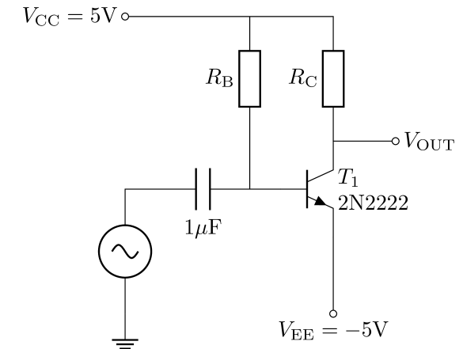
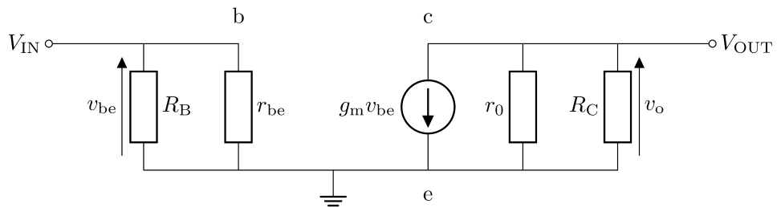
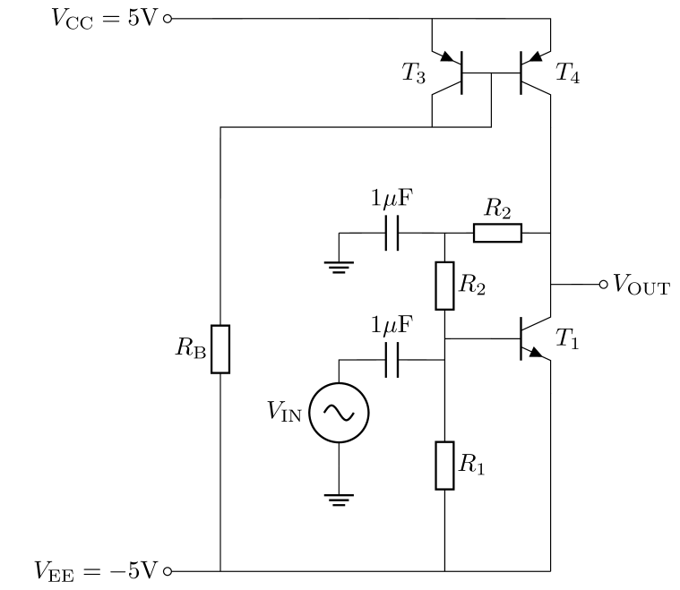
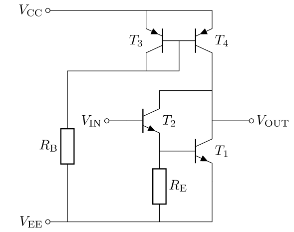

# Analysis and Design of Circuits Lab
# Part 4: Spring Term weeks 7--10

## Amplifier Stages

An opamp should have a very high voltage gain, which we can achieve with a common emitter amplifier.
        

            
The base of the transistor is biased from $V_\mathrm{CC}$ via $R_\mathrm{B}$ — select a value that will result in a collector current of 1mA.
The capacitor blocks any bias current from the input. $R_\mathrm{C}$ should be selected to set $V_\mathrm{OUT}$ at 0V under quiescent conditions.
    
- [ ] Choose bias resistors for the common emitter amplifier and confirm with a DC operating point simulation

### Gain

The gain of the amplifier can be analysed using the small signal equivalent circuit:
        

            
$r_\mathrm{be}$ is the input resistance of the transistor:

$$r_\text{be}=\frac{\beta}{g_\text{m}}$$
            
$r_\mathrm{o}$ is the small signal output impedance:

$$r_\mathrm{0} \approx \frac{V_\mathrm{A}}{I_\mathrm{C}}$$
            
$g_\mathrm{m}$ is the small signal transconductance of the transistor which relates the change in collector output current to the change in base-emitter input voltage:
            
$$g_\text{m}=\frac{\mathrm{d}I_\text{C}}{\mathrm{d}V_\text{BE}}=\frac{I_\text{C}}{V_\text{T}}$$
            
The gain can be derived from the equivalent circuit:
            
$$A_\text{V}=\frac{v_\text{o}}{v_\text{in}}=-g_\text{m}\left(\frac{R_\text{C}r_\text{o}}{R_\text{C}+r_\text{o}}\right)$$
    
- [ ] Calculate the theoretical gain of the amplifier
            
The gain of a circuit is usually simulated with an AC analysis, which uses a small signal model of the circuit derived from an initial computation of the DC operating point.
The output is a plot of the circuit's transfer function.
Run an AC analysis by:
            
1. Add net labels to the input and output nodes
2. Set the amplitude of the input source to 1 by opening the source properties and entering `1` in the box `AC amplitude'
4. Choose a decade sweep with 100 points per decade. Set the start frequency to `10` (10Hz) and the stop frequency to `100meg` (100MHz)
5. Run the simulation
6. Select the output node. This will add lines showing the transfer function of the circuit as a gain (in dB) and phase
            
This circuit should give an output of around 45dB in the passband.
Since the input amplitude was 1 (0dB), that makes the gain 45dB, which is around $A_\text{V}=180$.
In a real circuit, an input amplitude of 1V would cause the output to clip, but for an AC analysis this doesn't matter because the small signal model is a *linearised* representation of the circuit around the DC bias point.
The simulated gain would be the same whatever input amplitude is specified, but a real circuit or transient simulation would only exhibit this gain with a small input amplitude.

You will also see that the gain rolls off at low and high frequency.
The low frequency rolloff is caused by the input coupling capacitor and the high frequency rolloff is caused by the internal parasitic capacitance of the transistor.
            
- [ ] Perform an AC analysis to find the gain of the circuit.
    
### Input resistance

Ideally, voltage amplifiers would have infinite input resistance, to ensure that all of the signal voltage from the source is transferred to the input of the amplifier.
The input resistance given by the small signal model for our amplifier is:
            
$$r_\text{in} = \frac{R_\text{B}r_\text{be}}{R_\text{B}+r_\text{be}}$$
            
We can find $r_\text{in}$ in simulation by finding the effect of adding a series resistor to the input.
If the amplifier did have infinite input resistance then this resistor would have no effect because there would be no current flowing through it.
Add a 10kΩ resistor in series with the capacitor and run the simulation again.
You will find the gain has reduced — call the new gain $A^\prime_\text{V}$ (in $V/V$, not dB).
You can now calculate the input resistance of the amplifier as:
            
$$A^\prime_\text{V} = A_\text{V} \frac{r_\mathrm{in}}{r_\mathrm{in}+10\mathrm{k}}$$

$$r_\mathrm{in} = 10\mathrm{k} \frac{A^\prime_\text{V}}{A_\text{V} - A^\prime_\text{V}}$$
            
- [ ] Find the input resistance according to the small signal model and verify it with a simulation
    
### Using an active load

According to the [equations above](#gain), we can increase the gain of the amplifier by increasing $R_\text{C}$.
However, we don't want to reduce $I_\text{C}$ because that would reduce $g_\text{m}$ and increase $r_\text{o}$.
We can't greatly increase $V_\text{CC}$ to maintain $I_\text{C}$ for practical reasons, such as power dissipation.
Furthermore, an opamp is an integrated circuit and large resistors on an IC consume a very large amount of silicon area compared to transistors.

Instead, we can replace $R_\text{C}$ with a [current mirror](Section1.md#simple-current-mirror), which in this application acts as an *active load*.
The current mirror has a high output resistance and the output current can be set independently of the output voltage by choosing the input current.
Replace $R_\text{C}$ with a current mirror in your amplifier schematic:
    

            
The base current for $T_1$ is now biased by resistors $R_1$ and $R_2$.
A bypass capacitor to ground prevents the bias resistors from reducing the AC gain through negative feedback.
$I_\text{C}$ will be set at 1mA by $R_\text{B}$ via the current mirror.
Choose $R_1$ so that the current in $R_1$ is around $2I_\text{B}$.
Then choose $R_2$ to set $V_\text{OUT}$ at 0V, observing that $V_\text{CB}=2R_2\times 3I_\text{B}$.
Confirm the biasing with an operating point simulation and adjust the resistor values if necessary.
            
Now that $R_\text{C}$ is the output resistance of $T_4$, the gain of our amplifier becomes:
            
$$A_\text{V} = \frac{v_\text{o}}{v_\text{in}} = -g_\text{m} \left( \frac{1}{r_\text{o,T1}} + \frac{1}{r_\text{o,T4}} + \frac{1}{R_2} \right)^{-1}$$
            
- [ ] Add the current mirror to your CE amplifier, set up the biasing and measure the gain with an AC analysis
    
### Darlington Pair

Earlier you found the [input resistance](#input-resistance) of the common emitter amplifier, which wasn't very high.
We can improve it using a Darlington pair configuration:
        

            
Since $I_\text{B}$ for $T_1$ comes from the emitter of $T_2$, the input current for the amplifier is decreased by a factor of approximately β.
The resistor $R_\text{E}$ is used to make sure that the collector bias current is split equally between $T_1$ and $T_2$.
This ensures that both transistors have similar high frequency behaviour (based on capacitance), which is dependent on $I_\text{C}$.
            
Including the effect of $R_\text{E}$, the input resistance is now:
            
$$r_\text{in} = \beta \left( \frac{1}{R_\text{E}} + \frac{g_\text{m}}{\beta}\right)^{-1}$$
            
It is easier to bias this amplifier when it is integrated with the other amplifier blocks, so you don't need to simulate it on its own.
