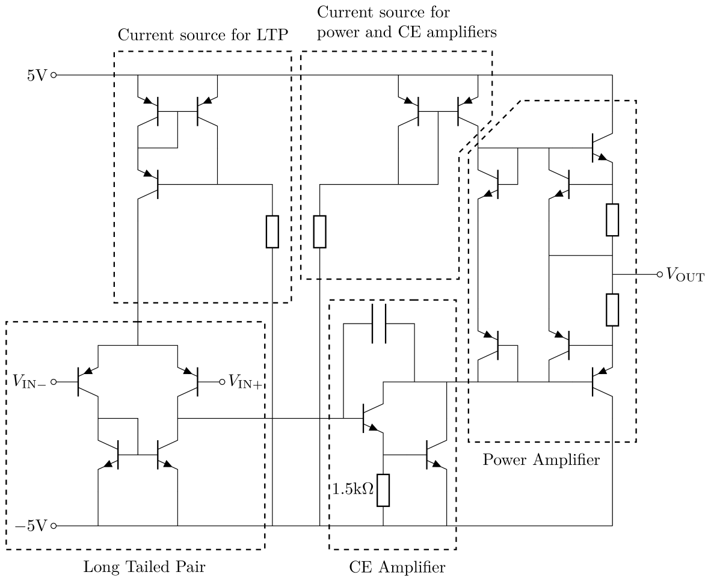
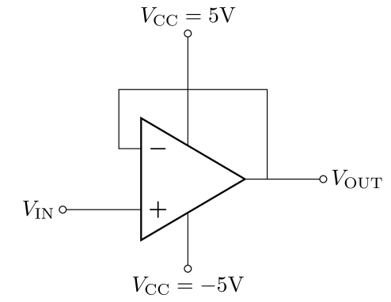
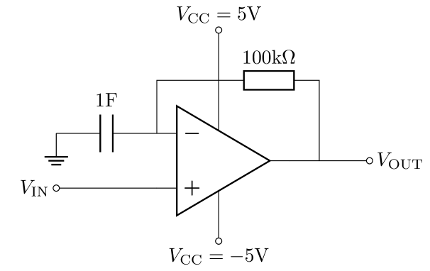
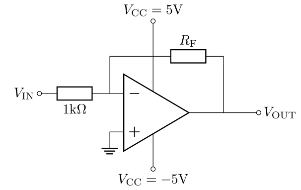
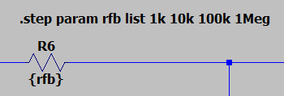

# Analysis and Design of Circuits Lab
# Part 4: Spring Term weeks 7--10

## The complete opamp
    
The circuit for the complete opamp is below.
Notice how the bias current for the power amplifier is shared with the common emitter amplifier.
This means the input node for the power amplifier has moved to the base/collector of $T_4$, but that is not a problem since it's only 0.7V difference to the output — equivalent to less than 1mV of input voltage. 
        
Enter the circuit in LTspice, copy-pasting your earlier schematics were appropriate.
Label the input, output and power supply nodes.
Note that $V_{\text{IN}+}$ and $V_{\text{IN}-}$ have swapped to account for the phase inversion introduced by the CE stage.
Omit the capacitor for now.
    

    
### Initial test at unity gain

Begin testing the opamp by configuring it as a unity-gain voltage follower:

            
Initially, the opamp will be susceptible to oscillation.
Simulate a small amount of input noise by connecting $V_{\text{IN}+}$ to a behavioural voltage source (bv in the component library).
Change the function of the voltage source to `V=white(2e8*time)/1000`
                
Run a transient simulation for 50μs.
The simulation runs slowly when there is a high frequency oscillation so the simulation length is kept short.
You will see that the output oscillates, when it should follow the input.
            
-[ ] Simulate the complete opamp as a voltage follower
            
### Frequency compensation

The oscillation is caused by the delay of the opamp between input and output.
The lag means there is a phase-shift between input and output, and for high frequencies the phase shift is enough to make the inverting input act as a non-inverting input, which causes positive feedback and oscillation.
You can see this effect by performing an open-loop, AC analysis of your opamp.
Configure it as shown below:
            

            
The feedback path provides unity gain at DC and maximum gain at AC.
Without this, the input offset voltage error of the opamp, which is less than 1mV, would be greatly amplified and the output would be saturated.
The circuit isn't practical, but it ensures the biasing is correct for the AC analysis with open loop.
            
Run the AC analysis with a maximum frequency of 100MHz and plot the magnitude and phase of the output.
You will see the gain at low frequencies is extremely high: over 100dB.
That is what we intended and it means we can assume infinite gain for the purpose of analysing circuits with negative feedback. As frequency increases, the gain drops off due to capacitance in the transistors.
            
- [ ] Obtain the open loop transfer function of the opamp.
            
The phase plot shows why the voltage follower circuit is unstable: the phase lag increases with frequency and the gain is still greater than 0dB at the point where phase lag reaches 180° and negative feedback becomes positive feedback.
The phase at 0dB gain is known as the *phase margin*, and a circuit with negative phase margin is unstable.

$${\displaystyle \mathrm {PM} =\varphi -(-180^{\circ })}$$
            
The capacitor in the opamp is a compensation capacitor for stabilisation.
It acts to bypass the common emitter stage and further reduce the gain at high frequencies.
Add the capacitor and adjust its value until the phase margin is small, but positive.
Start with a value of 1nF.
            
Confirm that the capacitor has removed the oscillation in the unity gain test with noise input.
The output should have a similar amplitude to the noise input: $<1\text{mV}$
            
- [ ] Use the compensation capacitor to stabilise the opamp
            
### Input offset voltage

In the open loop test you needed to provide a DC feedback path to compensate for the input offset voltage.

The input offset voltage is an important parameter in amplifiers used for instrumentation, where small input voltages need to be measured precisely.
Find the input offset voltage of your opamp by running a DC operating point simulation of your unity gain amplifier.
Record the difference between the inverting and non-inverting inputs, which is also the output voltage when the input is zero at unity gain.
That is your input offset voltage.

The offset is small, but it might be significant for some kinds of sensors.
Mutliply the offset by the open loop gain to find the voltage the opamp would like to produce if you connected the input nodes together.
It is larger than power supply, and this explains the feedback arrangement needed for the open loop test.

- [ ] Find the input offset voltage of your opamp

### Inverting amplifier
        
Configure your opamp as an inverting amplifier:
        

            
Set $R_\text{F}$ as 10kΩ and $V_\text{IN}$ as a sine wave with 1kHz frequency and 10mV amplitude.
Run a transient simulation to confirm that you get the expected amplification.
            
Simulation allows us to do a parametric sweep, which explores the effect of varying a parameter such as gain.
Change the value of $R_\text{F}$ to `{rfb}` and use the Edit menu to add a SPICE directive to the schematic.
Set the directive to `.step param rfb list 1k 10k 100k 1Meg`
        

    
Now run the AC analysis and you will see the overlaid transfer functions for each resistor value.
Notice how they converge at high frequencies. What is the gain-bandwidth product for your opamp?
            
- [ ] Find the transfer functions for inverting amplifiers with different gains. Determine the gain-bandwidth product.
