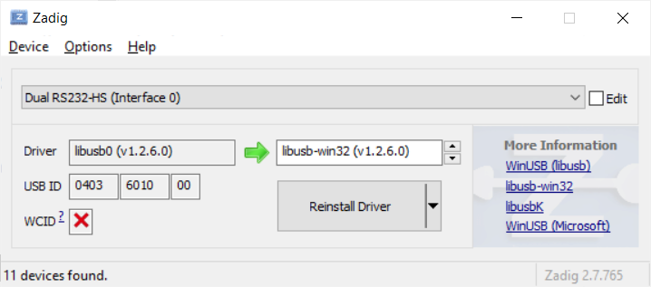

# Running Issie designs on hardware
# Section 1: Getting Started

Issie has an experimental feature that allows you to turn your designs into a configuration for a *field-programmable gate array* (FPGA).
A FPGA is a silicon chip that contains a large number of logic gates that can be programmed with any truth table.
There is also a wiring matrix that can connect gates together in any configuration, plus registers and blocks of RAM for storing data.

The IssieStick FPGA module is designed to support digital design in Issie.
It contains a [Lattice ICE40](https://www.latticesemi.com/iCE40) FPGA with 7680 *Lookup Tables*, each of which can implement a logic gate with up to 4 inputs.
There is also an array of 256 RGB LEDs and 5 push buttons.

## Preparing your computer

Issie uses some open source drivers and tools to synthesise your design (convert it into an FPGA configuration) and load it onto hardware.
These are not yet fully integrated with Issie so some setup is required:

1. Download [OSS CAD Suite](https://github.com/YosysHQ/oss-cad-suite-build).
   1. Go to [latest release](https://github.com/YosysHQ/oss-cad-suite-build/releases/latest) and download the appropriate file for your computer.
   2. Unzip the archive. On Windows, put it in a location with a simple file path, like `C:\oss-cad-suite`.

2. (Windows only) Install the compatible USB driver for the IssieStick.
   1. Download the [Zadig](https://github.com/pbatard/libwdi/releases/latest) USB driver configuration tool.
   2. Connect the IssieStick to a USB port on your computer.
   3. Run Zadig.
   4. Select 'List All Devices' from the options menu
   5. Open the drop down list at the top of the main window. You will see a list of every USB device connected to your computer. Select 'Dual RS232-H (Interface 0)'.

   6. Select the driver 'libusb-win32' in the middle box of the window.
   7. **Warning: changing the driver for the wrong device will stop it from working. Make sure you have selected 'Dual RS232-H (Interface 0)' and the 'USB ID' fields match the screenshot above. Ask for help if you are not sure.**
   8. Click 'Replace Driver'. The process will take a little while.
   8. Repeat the process for the device 'Dual RS232-H (Interface 1)'
   9. Close Zadig. Disconnect and reconnect the IssieStick.

## Running the sample project

This repository contains an example project which displays a counter on the LED array.

1. [Download](https://github.com/edstott/EEE1labs/archive/refs/heads/main.zip) and unzip this repository
1. Load the environment for OSS CAD Suite
   1. In Windows, run `start.bat` in the main directory for OSS.
   2. In Mac or Linux, start a terminal and run `source <extracted_location>/oss-cad-suite/environment`. `<extracted location>` is the parent for OSS
   3. OSS GitHub has [full instructions](https://github.com/YosysHQ/oss-cad-suite-build#installation)
2. Run Issie in the same terminal. In Windows, `start.bat` creates a terminal for you. You'll need to change to the directory where you have extracted Issie and run `Issie`.
3. In Issie, open the 'LEDCounter' [project](downloads/LEDCounter). Open the `main` sheet. You will always need to return to `main` after editing another sheet because Issie will always try to compile the current sheet.
5. The FPGA build options are hidden by default. Enable them by clicking View -> Show/Hide Build Tab. Open the build Tab.
6. Under 'Device Selection', choose 'IssieSick v1.0'.
7. Click 'Build an upload'.

After all the stages successfully complete you will see digits counting on the LED array.
You can reset the counter by pushing the centre button.

## Build errors

The hardware build system does not yet produce meaningful errors, partially because it uses third-party tools.

### Synthesis fails
The synthesis step can fail for the following reasons:

- There are errors in your sheets. Go to the simulation tab and check that simulation is available. If not, fix the errors that are reported
- The project is stored in a directory path that contains spaces. In OneDrive for Windows, you can work around this without moving your files by creating a link to your Issie project directory with a different path. [This guide tells you how.] (https://blog.jongallant.com/2020/01/onedrive-rename-remove-spaces-from-folder-name/)
- Issie is stored in a directory path that contains spaces. Move it to a path with no spaces.
- OSS tools are not available. Make sure you run Issie in the OSS environemnt as described above every time you want to build.
- (Mac only) Your project folder does not contain the 'hdl' folder with the build dependencies.
- (Failure after running for several minutes) Your design contains a large asynchronous ROM or RAM, which can't be implemented efficiently on the FPGA. Use a synchronous memory or smaller memory instead.

### Place and route fails
The place and route step can fail for the following reasons:

- You are trying to build a sheet that isn't the main sheet.
- Your sheet contains port names that don't exist on the IssieStick. Refer to the example projects to see the correct port names.
- Your design is too complex for the FPGA. This may be due to an asynchronous ROM or RAM.

### Upload fails
The upload step can fail for the following reasons:

- The IssieStick isn't connected
