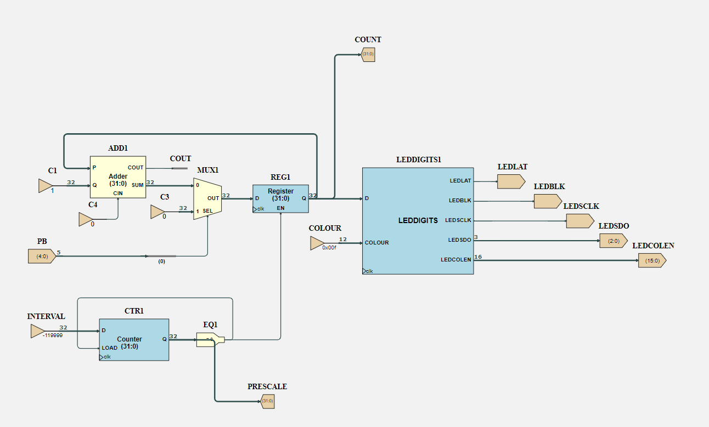

# Section 2: Clock and counters

## The LEDCounter example project

Load the LEDCounter project in Issie. It works like this:
- Components `REG1`, `MUX1` and `ADD1` form a counter with load, just like [Part 1, Section 3](../Part1/Section3.md).
The load signal is connected to bit 0 of the `PB` input port, which is the centre push button.
    - `PB` contains 5 bits. Each bit of `PB` is used for a different button on the board.
- Component `LEDDIGITS1` is the logic for the LED array.
The LEDs are not connected to the FPGA individually because there would be too many wires.
Instead, they are connected in a grid with wires to drive each row and column, and an LED is lit by setting its column connection high and its row connection low.
To light the whole display, the columns are enabled one by one in sequence, very quickly so all the activated LEDs appear lit simultaneously.
The `LEDDIGITS` component contains logic to control this sequence, plus a memory containing dot patterns for each hexadecimal digit.
The block is connected directly to the various outputs that drive the LED array.
An input port `COLOUR` sets the colour of the digits with a 12-bit bus made up of three 4-bit fields concatenated together, one for each colour channel (red, blue, and green, in that order).
- Component `CTR1` acts as a *prescaler*.
The clock speed of the FPGA is 12MHz, which is too fast to drive a human-viewable counter directly.
The counter is loaded with the value -119999 and it counts up until it reaches 0, at which point it restarts and enables `REG1` for one clock tick.
Therefore, `REG1` increments at $12 \times 10^6 \text{MHz} / 120000 = 100$ counts per second.

Try making some changes to the project:
- Connect the colour port to a multiplexer controlled by the remaining 4 push buttons, so that pressing different buttons chooses a different constant
- Change the constant `INTERVAL` to $-(12\times 10^6-1)$  (-11999999), so that the counter increments once per second

- [ ] Become familiar with the LEDCounter project by making changes to it.

## Debugging

One advantage of loading designs onto hardware is that you can see them working in real time — it would take a very long time to step through 12 million clock ticks in a simulation.
However, you no longer have the ability to observe any signal in the design in the waveform editor.
You can help understand your hardware designs by using debug viewers.

Place two 'Viewer' components ('Input/Output' section of the catalogue) on the sheet, each 32 bits in size.
Name one `COUNT` and connect it to the output of `REG1`, and name the other `PRESCALE` and connect it to the output of `CTR1`.
Build the project again, this time selecting 'Build and Debug'.

In debug mode, the project starts with the clock paused, so nothing will happen at first.
Press 'Continue' and the counter will start running as before.
Press 'Pause' and the clock will stop again.
At this point, Issie will read the current value of each viewer from the FPGA and display it in the table on the build tab.
`COUNT` will show the value that was displayed in hexadecimal on the LED array when you paused the clock.
The LEDs themselves don't work when the clock is paused because they require the clock to continue sequencing through the columns.

Press 'Step' and the clock will advance by one tick.
You will see the value of `PRESCALE` increment by one.
If you happened to pause the clock when the prescaler was about to reach 0 and reset you would also see `COUNT` increment, but that is very unlikely.
Press 'Continue' and the counter will resume.

- [ ] Use debugging mode to view the state of the internal counters.

## Snake Head Position

We are going to implement a [snake game](https://en.wikipedia.org/wiki/Snake_(video_game_genre)) on the IssieStick.
The first task is to implement an up/down counter that will determine the position of the snake's head in one axis. With two of these, we will be able to control the position of the snake's head in the 2D LED array.

Create a new sheet called `UPDNCTR` and make a 16-bit counter using a register and an adder. Use a register with an enable input. The counter needs to increment, decrement or stay the same depending on button presses, to correspond to moving the snake one direction or the other along an axis.
So instead of passing a constant 1 to the adder, use a 4-input multiplexer to choose the constant as follows:

| SEL | Constant  |
| --- | -- |
| 00  | 0 |
| 01  | 1 |
| 10  | -1 |
| 11  | 0 |

Connect the 2-bit multiplexer select input to an input port named `DIR`, connect the register enable to a port `EN` and the register `Q` output to a port `POS`.
Simulate the sheet with a step simulation. Set `EN` to 1 and check that the ouput increments and decrements as expected.

- [ ] Create and test the up/down counter

Go back to the main sheet and remove the main counter. Keep the prescale counter.
Place two instances of the up/down counter, naming one `HEADX` and the other `HEADY`.
Use Bus Select components to connect the bits of the `PB` port to the `DIR` inputs of the counters as follows:

| `PB` Bit | Button | Function | Counter  | `DIR` bit |
| --- | ------ | -------- | -------- | ------- |
| 1   | Left   | $X=X-1$  | `HEADX` | 1       |
| 2   | Down   | $Y=Y-1$  | `HEADY` | 1       |
| 3   | Right  | $X=X+1$  | `HEADX` | 0       |
| 4   | Up     | $Y=Y+1$  | `HEADY` | 0       |

We'll display the value of the two counters for now. Use a MergeWires component to join the outputs of the two counters to make a single 32-bit bus.
Connect that bus to the `D` input of the `LEDDIGITS` component.
The counter will count continuously when a button is pressed, so limit the count rate by connecting the output of the prescaler to the `EN` port of both counters, just like it was with the single counter previously.
Build and upload the design. If it works, you will the see output of one counter on each row and you will be able to increment and decrement each using the push buttons.

- [ ] Test the counters on the IssieStick
