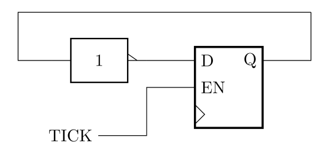

# Section 3: Snake

## Using the LED array in RAM mode

The project contains another LED driver block, `LEDMATRIX`, which gives you more control over the display.
It works like a random-access memory, where each word of the memory controls one LED.
Remove the `LEDDIGITS` component from your main sheet and replace it with an `LEDMATRIX`.
Wire up the 5 output ports to the corresponding sheet output ports as they were with the `LEDDIGITS`.

The input ports for the `LEDMATRIX` are like a RAM — you present the address of the word and the data you wish to write, and set `WEN` high to update that word in the memory.
The outputs of the two head counters will be the coordiantes of the snake's head, so they will form the address input controlling which LED to write.
The LED array is 16×16 pixels, so only 4 bits are needed to address each axis.
Use a Bus Select to extract the 4 LSBs of the output of each head counter and merge the results together to make the 8-bit address bus.
Connect it to port `A` of the `LEDMATRIX`. Bits `0:3` of `A` control the X-axis position, and bits `7:4` control the Y-axis position on the grid.

The `D` port is the colour that will be written to the LED. Set it to a non-zero constant of your choice.
`WEN` is used to execute the write. Connect it to the prescaler output. Set the prescaler constant to -5999999 to give a tick rate of 2Hz.
Build and upload the design. You may wish to attach viewers to the head counter outputs and use debug mode.

- [ ] Test the `LEDMATRIX` component. You should be able to fill in dots in the array by pressing and holding the direction buttons.

## Snake Tail

The snake should have a finite length and that means turning off the LED at its tail.
The RAM-based display mode only permits you to write to one LED at a time, so we'll need to alternate between turning on the head and turning off the tail.

Create a toggle flip-flop by connecting the `D` input of a D flip-flop to its `Q` output via a NOT gate. This causes it to toggle state on every clock tick.
Use a 'D flip-flop with enable' from the catalogue and connect the `EN` input to the prescaler output so that it toggles once per prescaler period.
Double the prescaler frequency by setting the constant to -3999999.

The toggle will allow us to switch the memory inputs between head and tail.
Connect a 2-input multiplexer to the `D` input of the `LEDMATRIX`, with its `SEL` input connected to the toggle.
When the toggle is low, we will turn on the head LED, so connect the `0` input of the multiplexer to your constant for the LED colour.
When the toggle is high, we will turn off the LED, so connect the `1` input of the multiplexer to a constant 0.

We also need to switch the address between head and tail.
For now, we will make the tail lag one prescaler cycle behind the head by connecting the head address to the `D` input of a new register (with enable) `TAIL`.
Add another multiplexer to choose the `A` input of the `LEDMATRIX`, with the toggle driving the `SEL` input as before.
Connect input `0` to the head address and connect input `1` to the tail address, which is the output of `TAIL`.

- [ ] TODO: Diagram of tail register

Finally, we need to make sure the head position only updates on every second prescaler tick, so there is one increment or decrement for every toggle cycle.
Do this by combining the prescaler signal with the toggle signal using an AND gate.
Connect the output of the AND gate to the enable signals of the head counters and the tail register.
Build and upload your design. Now you should see the LEDs turning off behind the head position you move around.
You will see a flashing effect, especially if you leave the head stationary, due to the alternating head-tail write cycle.

- [ ]  Add the logic for turning off the snake tail

## Shift register

The snake is only 1 or 2 pixels long. We can make it longer by making the tail position lag further behind the head using a *shift register*.
Create a new sheet called `SR8` and place 8, 8-bit registers with enable.
Connect the registers together in a chain, `Q` output to `D` input.
The `D` input to the first register should come from an input port `D` and the `Q` output from the last register should go to an output port `Q`.
All the `EN` ports of the registers should be connected together and driven from a single input port `EN`.

Simulate the block with step simulation. Set `EN` high and apply a test value to port `D`.
Advance the simulation by 8 clock ticks and you should see the test value appear on the `Q` port.

- [ ] Implement and test the shift register

The shift register will allow us to store a queue of 8 coordinates and erase the LEDs at the tail in the correct sequence.
Replace the `TAIL` register in your main sheet with the shift register. Connect the `EN` port to the toggle/prescale AND gate as before.
Build and upload the design, and you will see a longer snake.
You'll need to keep a button held down for the snake to reach its full length because the tail will continue to move even if the head stays still.

- [ ] Increase the length of the snake

