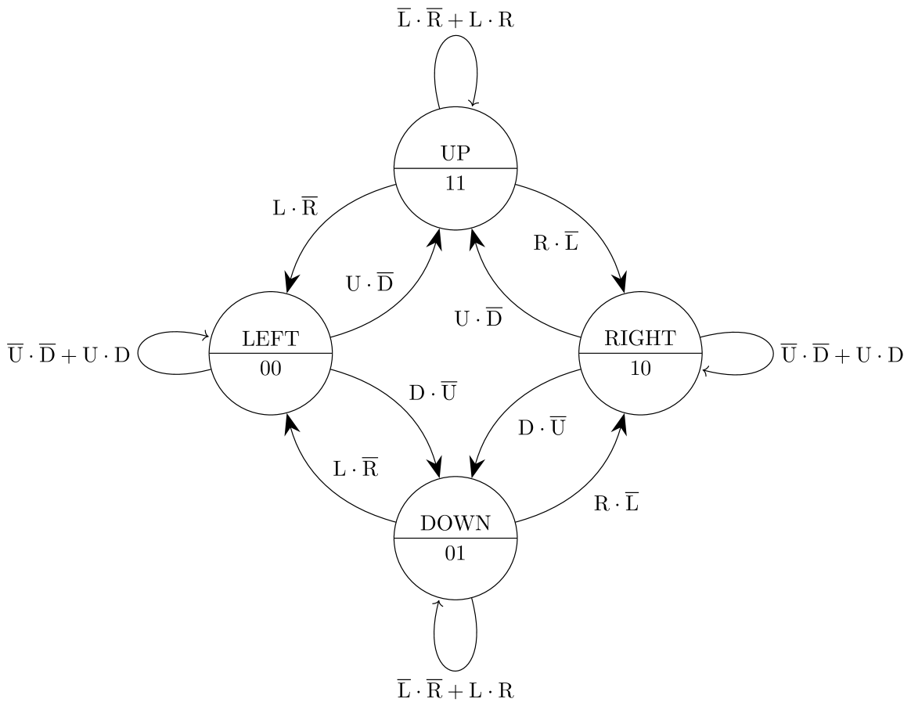
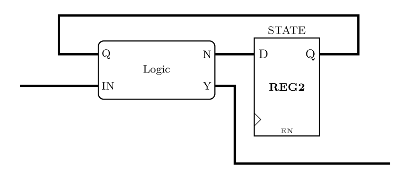
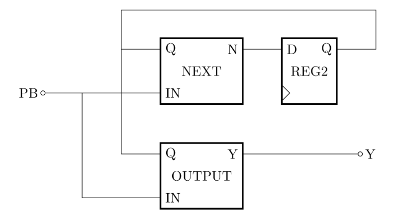
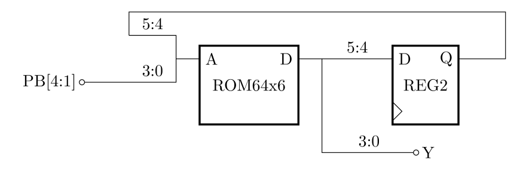
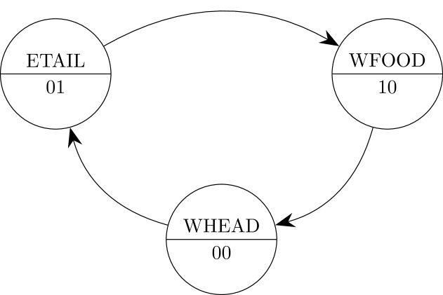

# State machine

## Designing the state machine

It's not usually possible to stop the snake moving in a snake game.
If the player releases all the keys then the snake should continue moving in the same direction.
Futhermore, it should be impossible to reverse direction 180° on the spot.

To fix this, we'll need a state machine to remember the current direction of the snake.
A state machine is always in one condition of a finite set of possibilities.
In this case, there will be a state for each direction, represented by a state variable Q with 2 bits:

| State name | Q |
| ----- | ------- |
| LEFT   | 00    |
| DOWN    | 01    |
| RIGHT   | 10    |
| UP      | 11    |

A state machine can be represented with a state transition diagram, which shows states as nodes and possible transitions between states as *edges* (lines) connecting the states.
Each edge is annotated by the conditions necessary to trigger the associated change of state.
Some edges loop back to their origin node to show that the state does not change in that circumstance.
The state transition diagram for the snake direction will look like this:

The state machine has 4 inputs: L, R, U & D. Each input comes from a push button using the same mapping as previously:
| PB bit | Symbol |
| ------| ------- |
| 0  | C |
| 1  | L    |
| 2  | D    |
| 3  | R  |
| 4  | U     |

Push button C (centre) is unused in the snake game.

The state transition diagram has many edges but there is some symmetry. Each state has two possible transitions to other states, for example `LEFT` → `UP` and `LEFT` → `DOWN`, and it is also possible to remain in the same state.
The state machine will be clocked using the `TICK` signal as an enable, which means that Q, the state, changes only on system tick.
This ensures that the snake cannot reverse direction in a single game step, since two transitions are necessary to change from, for example `LEFT` to `RIGHT`.
The state machine must be in one of the four states, so the snake will always be moving.

Note that each state is responsive to only two of the `PB` inputs.
For example, if the state is `LEFT` then we don't care about the L or R inputs, only U and D.
By using the don't care symbol (X), we can write a simplified truth table that relates the inputs (`PB`) and the current state (`Q`) to the next state, `N`.

| Q | PB (URDL) | N |
| ----- | ------------- | ---------- |
| 00    | 0X0X          | 00         |
| 00    | 0X1X          | 01         |
| 00    | 1X0X          | 11         |
| 00    | 1X1X          | 00         |
| 01    | X0X0          | 01         |
| 01    | X0X1          | 00         |
| 01    | X1X0          | 10         |
| 01    | X1X1          | 01         |
| …    | …         | …        |

- [ ] Complete the truth table for state transitions

The state machine will generate direction signals for the head position counters, so its output `Y` will be a 4-bit bus.
The value of `Y` will depend on N:

| N | Y | Effect |
| ----- | ------------- | ---- |
| 00    | 0001 | Left |
| 01    | 0010 | Down |
| 10    | 0100 | Right |
| 11    | 1000 | Up |

N is dependent on the `PB` inputs, which means there is a combinational logic path between inputs and outputs.
That makes the state machine a *Mealy* state machine, which means that the outputs depend on the current state *and* the inputs.

The alternative to this would be to redesign the state machine by deriving the output `Y` from the current state `Q` only, so that the outputs would depend *only* on the current state.
That would break the combinational path from input to output and the outputs would change only when the state changes, which is a *Moore* state machine.
In this case, that would be a disadvantage because there would be an extra tick of latency before the output changes after pressing an input.

- [ ] Write down Boolean expressions for each of the 4 bits of the outputs.

## Implementing the state machine

A state machine is formed from a feedback loop of a register and a block of combinational logic.
The counters you have already implemented are examples of state machines, where the combinational logic is based on an adder.
A generic Mealy state machine has a block diagram like this:

Create the state machine in a new sheet called `DIRSM` with input ports `PB` and `EN` and and output port `Y`.
Place a 2-bit register with an enable input to store the current state, Q.
There are two methods for implementing the logic for next state and outputs. Choose the one you prefer:

### (Option 1) Combinational logic with gates

Ignoring the C input for the centre button (`PB` bit 0), the N signal is dependent on 6 binary signals: the 2-bit current state `Q` and 4 `PB` inputs.
That's too many to reduce with a Karnaugh map, but you can nevertheless derive an efficient logic mapping with gates for each bit of N.
Start by writing a sum-of-products expression with a term for every line in the truth table that produces a logic 1, for example:

$$ N_0 = \overline{Q_1}·\overline{Q_0}·\overline{U}·D + \overline{Q_1}·\overline{Q_0}·U·\overline{D} \ldots $$

Then look for factorisations and equivalences that simplify the expression to a minimum number of gates.
In fact, the FPGA synthesis tool will do its own logic optimisation, so there is no practical benefit to hand optimisation.
It can, however, result in a tidier and more maintainable sheet.

You also need to generate logic for the state machine outputs `Y`, which are derived quite easily from `N` according to the output table.
You can use gates for the output logic, or you can use a 4-port DEMUX component (independent research required).

- [ ] (Option 1) Implement the logic to generate `N` (next state) and `Y` (outputs) with gates.

### (Option 2) Combinational logic with ROM

It is common to implement the combinational logic for state machines in a ROM.
The ROM contains values for `N` and `Y` for every input combination: $2^6 = 64$ combinations in this case.
The advantage of ROM implementation is that it is easier to modify the state machine in future, since the ROM contents are a direct transcription of the truth table.
On an FPGA implementation, the synthesis tool can automatically choose whether to convert the ROM to an optimal implementation in lookup tables, or to use a dedicated memory block.

This next state and output logic block will require a ROM with 64 words (a 6-bit address port).
The address input port will be formed by merging `Q` (the current state) with the 4 relevant bits of `PB`.
The simplified truth table above needs to be expanded by elaborating don't cares and adding the outputs.

| Q | PB (URDL) | N | Y | ROM Address | ROM Data |
| ----- | ------------- | ---------- | ------ | ----------- | -------- |
| 00    | 0000          | 00         | 0001   | 0x00        | 0x01     |
| 00    | 0001          | 00         | 0001   | 0x01        | 0x01     |
| 00    | 0010          | 01         | 0010   | 0x02        | 0x12     |
| 00    | 0011          | 00         | 0001   | 0x03        | 0x01     |
| …     | …             | …          | …      | …           | …        |

Notice that the rows of the state transition table are ordered by increasing binary count of the two input columns, which are concatenated to form the ROM Address.
It is important to use a consistent mapping of signals to the bits of ROM address and data.
For the table above, the mapping of ROM address bits is this:

| ROM add bit | Signal |
| ----------- | ------ |
| $A_0$       | L      |
| $A_1$       | D      |
| $A_2$       | R      |
| $A_3$       | U      |
| $A_4$       | $Q_0$  |
| $A_5$       | $Q_1$  |

Implement the state machine with the correct size of ROM.
Use Bus Select and MergeWires components to connect the address and data ports to the appropriate signals.
Transfer the state transition table to the ROM contents.

- [ ] (Option 2) Implement the logic to generate `N` (next state) and `Y` (outputs) with a ROM.

### State machine testing

Simulate the completed state machine with step simulation.
Exhaustive testing would be laborious so you can ignore the cases where multiple buttons are pressed:

| Tick | Input | Expected Next State | Expected Output | Comment |
| ---- | ----- | ------------------- | --------------- | ------- |
| 0    | 0000  | 00                  | 0001            | No Input: stay in state 00 |
| 1    | 0001  | 00                  | 0001            | Input Left: stay in state 00 |
| 2    | 0100  | 00                  | 0001            | Input Right: stay in state 00 |
| 3    | 0010  | 01                  | 0010            | Input Down: switch to state 01 |
| …    | …     | …                   | …               | … |

- [ ] Simulate the state machine sheet and confirm that it works as you expect

The state machine was designed to use push button signals as inputs and generate the same coding on its outputs, so you can almost drop it into your main sheet between the `PB` input port and the head counter `DIR` inputs.
There is just one complication: the `PB` input port on the main sheet has 5 bits because it includes the centre button on bit 0.
Use a bus select to connect just the upper 4 bits of `PB` to the state machine `IN`.
Likewise, you'll need to connect your head counter `DIR` inputs to bits 0–3 of the state machine output, where previously you used bits 1–4.

Build and upload your design. Now the snake should move all the time with the buttons just acting to change the direction.

- [ ] Test the state machine in the snake game on the IssieStick

## Next steps

There are more features you can add to the game but from here on the guidance will be high level, giving you the opportunity to innovate and try out ideas.

### Food

The aim of a snake game is to eat food.
The starter project contains a sheet `RND8` for generating pseudo-random 8-bit numbers, which can be used as random locations for food.
Connect its `TICK` input to the prescaler to continuously generate new random numbers internally.
Use the `LATCH` input to output a new random number on the `OUT` port whenever the head position matches the food position.
Simulate the sheet first to confirm how it works.

Displaying the food will require an extra memory write to the `LEDMATRIX`.
Don't try to do this only when the food moves — it's simpler to write the food every time the snake moves.
That also prevents the food disappearing if it appears on top of the snake and it gets erased by the tail.
You'll need to convert your toggle into a small state machine (it already was the simplest possible state machine) so that you can execute a 3-stage cycle of write head → erase tail → write food.

### Expanding snake

Once your snake can eat food it should start to grow longer.
That requires a variable-length shift register, which is known as a *first-in, first-out* (FIFO) buffer.
A FIFO is implemented using a RAM and two counters.
The counters act as pointers for the write address and read address to the RAM.
A new value (e.g. the head position) is written to the address stored in the write pointer and the write pointer is incremented.
Data is read (e.g. the tail position) from the address stored in the read pointer, which is also incremented.

The pointer increment enables, address multiplexer and read/write enables need to be connected to tick signals that activate on appropriate stages of the memory control state machine.
The FIFO can be accessed at the same time as the display RAM because it's a different memory, so you won't need any more states.
The snake grows by disabling the read pointer increment when a food is reached, so tail position doesn't change on that clock cycle.
The FIFO RAM should be sized to accommodate the maximum possible snake length.

- [ ] TODO: FIFO block diagram

### Collisions

The snake game ends when the snake collides with itself.
How do you know when this happens?
- You could check the locations stored in the tail buffer shift register or FIFO, but that would require a complex state machine to iterate over each value and compare it to the head.
- You could check the display memory to see if the LED is already lit with your snake colour before writing the head, but that would mean modifying the `LEDMATRIX` block to fit the reads in with the LED scanning logic.

The simplest option would be to create a new RAM to record whether every display location is occupied by snake, or not.
That memory needs a word size of only 1 bit.
You can write a 1 when the head is written to the display, using the same address. Likewise write the tail as a zero.
On the third cycle, when the food is written to the display, you can read the RAM to check if the next head location is already set to 1.
If it is, a collision has occurred and you can stop the game by disabling any future change to the state machine.

What happens next is more complicated.
You can't simply reset the FPGA because the contents of the memories, which contain all your game state, is only rewritten when the FPGA is configured.
If you want to show a splash screen, or just clear the memory to start again, you'll need a state machine that can iterate over the display and collision memories to set every value.
The FIFO can be reset more simply by setting the read pointer and write pointer to 0.

