# Digital Electronics and Computer Architecture Lab
# Part 1: Autumn Term weeks 4--6
## Introduction
	
Digital electronic systems form the basis of information processing, storage and communication.
All software is executed on a digital system.
Digital circuits today are usually highly *integrated*, meaning that many functions are packed into a single silicon chip.
This makes them smaller and faster, since taking digital signals out of an integrated circuit and onto a circuit board imposes significant limitations on the density and switching frequency.
		
Large integrated circuits are expensive and time-consuming to fabricate so they are designed and extensively tested in software first.
Simulation can be considered entirely faithful in terms of circuit function due to the representation of data as discrete high or low voltage levels — the Boolean equations are solved the same way in software as in hardware.
		
In this part of the lab experiment for Digital Electronics and Computer Architecture, you will design digital logic systems in software and run simulations to confirm that they behave correctly.
You will learn how to build up complex systems from simple building blocks and use groups of binary signals to represent and manipulate data.

## Before the lab

In this experiment, you will use software called Issie (Interactive Schematic Simulator and Integrated Editor).
It is available for Mac or Windows, and it can also be run using Wine under Linux.
To prepare for the lab, follow the instructions on the [Issie project webpage](https://github.com/tomcl/issie#getting-started) to install Issie and get it running on your own computer.

Issie uses the IEC 'retangular shape' standard for logic gate symbols.
Take time to learn how they correspond to the 'distinctive shape' symbols that you might see elsewhere.

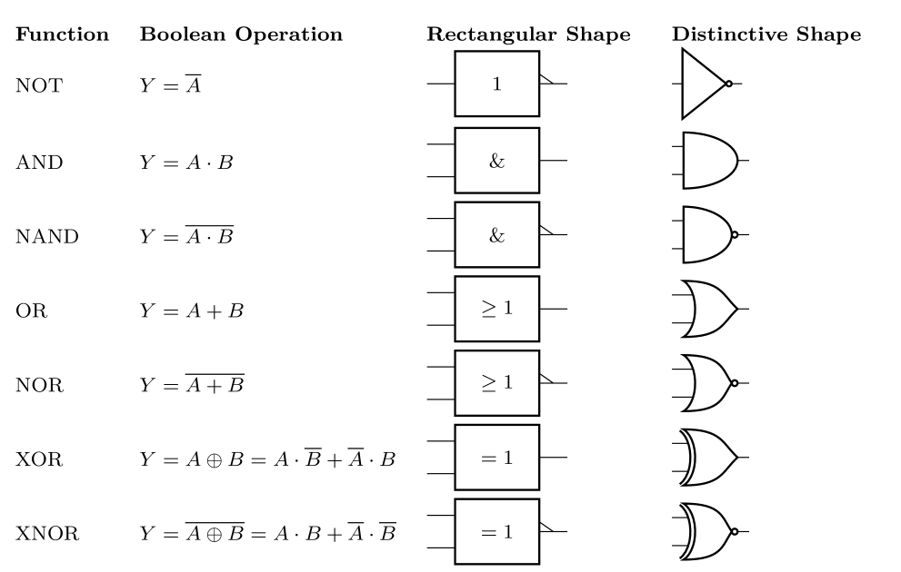

## Design with Issie
			
Logic designs in Issie are made in projects.
A project contains a single logic circuit, but it may contain multiple design files (called *sheets* in Issie) to describe components that link together to create the circuit.
			
### New Project and Sheet
Start up Issie and select 'New project' on the screen that appears.
An Issie project is just a folder containing all of the sheets that will be used in that project, along with a file that describes the project.
Sheets have the extension `.dgm`, and the project file has the extension `.dprj`.
Select where you would like to save your project and enter the project name `DECA1` in the 'File name' box that appears.
Click 'Create project' and your project will be created.
			
Your new project is a folder containing the project file, which will be `DECA1.dprj`, and one sheet called `main.dgm`.
When you finish creating your project, Issie will automatically open the sheet for you.
You will see a blank canvas, with the *catalogue* on the right-hand side.
			
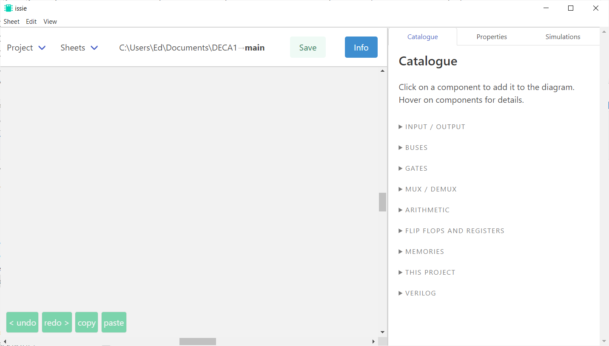
			
### Adding Gates and Port

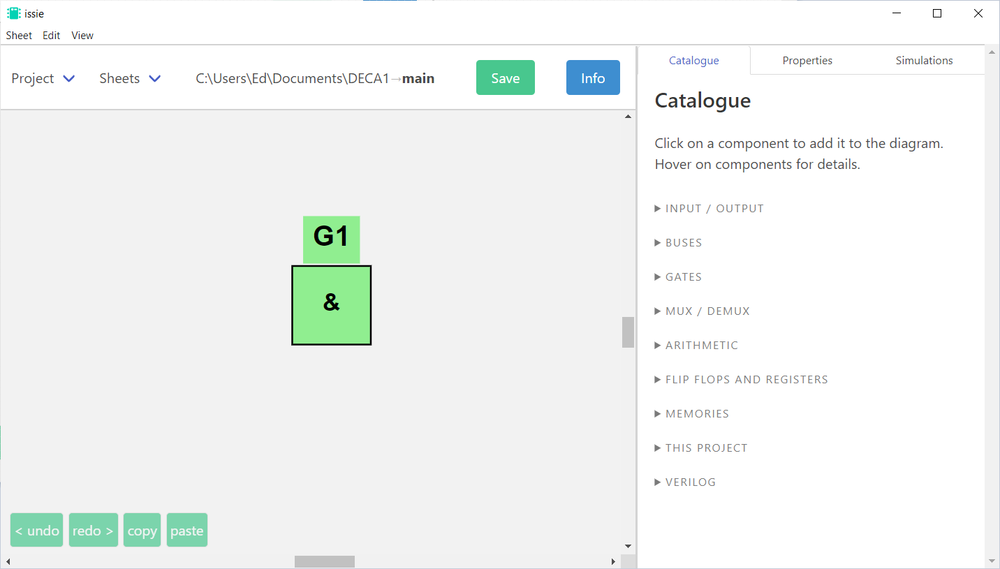
			
We'll start with a simple 2-input AND gate.
The catalogue is used to insert predefined logic functions into your design.
Expand 'GATES' from the list of contents and then select 'And'.
Click on the canvas to place a 2-input AND gate.
You can click and drag any component to move it around the canvas.
			
The next stage is to add input and output ports, which form the interface points between the logic design and the outside world.
Use the 'Input' and 'Output' components from the catalogue to place two input ports left of the gate and one output port right of the gate.
You will be prompted to name the ports as you go, so name the input ports `A` and `B`, and the output `Y`.
Keep the default number of bits, which is 1.
		    
You can now wire the ports up to the inputs and output of the gate respectively.
Hover over a component until the terminals of that component appear, then click and drag to a terminal on another component.
If you need to delete a wire, click on it then press delete (not backspace).
		    
The names of each port will appear on the diagram itself, and you can use the 'Properties' tab of the sidebar on the right-hand side of the screen to view and change the name and bit-width of components.
Simply select the component by clicking on it, and its properties will be displayed in the properties tab.
The names of each port and component will become important as we proceed to testing the design.
			

			
Save your work when the design is complete, and continue to save regularly as you progress.

- [ ] Create an Issie project with a sheet containing inputs, an output and a 2-input AND gate.

### Simulation

Simulation tests the design by presenting a pattern of inputs and calculating the corresponding outputs.
It's part of an overall process called *verification*, which is an important step in producing commercial digital circuits.
			
####  Simulation Setup and Testing Strategy

Since our logic design is very simple, we can use a simulation strategy of *exhaustive coverage*, which means testing every possible input combination and checking that the output is correct in every case.

To start simulation, click on the 'Simulation' tab of the sidebar, then click 'Start simulation'.
This will begin simulation of the circuit as it currently is; if you make any changes to the circuit, you must stop and re-start the simulation to ensure that you are simulating the correct version of your design.
If there are any inconsistencies in your design you will see a list of errors instead of the normal simulation interface - they are normally quite descriptive about the problem in question, so rectify them and restart the simulation.
			
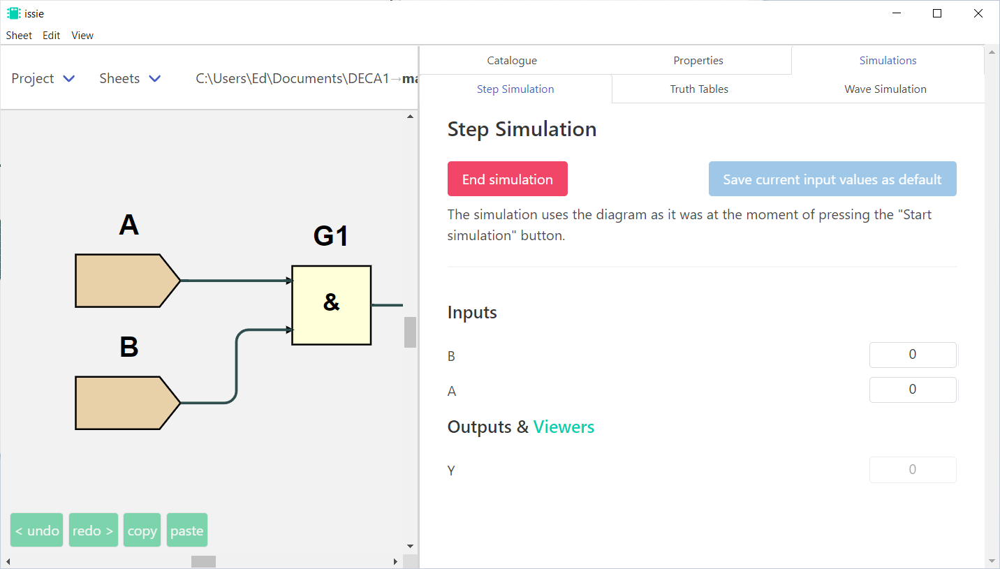
			
You will see a list of your inputs `A` and `B` and the output `Y`.
Each input has a value that can be changed by clicking, and the output has a read-only value that is calculated by simulating your design.
			
To properly confirm the functionality of your circuit, you must be systematic in your approach to testing.
As we are doing exhaustive testing for this circuit, you must make a note of which states you have tried, and you should methodically work through them one by one, noting the output as you go.
Write out a truth-table like the one below to ensure that you test all cases.

| $A$  | $B$  | $Y$  |
| -- | -- | -- |
| 0  | 0  |    |
| 0  | 1  |    |
| 1  | 0  |    |
| 1  | 1  |    |

When you are done, confirm that the AND function is performed correctly, and that `Y` is 1 if and only if both `A` and `B` are 1.

- [ ] Simulate the 2-input AND gate to verify its functionality.

Issie can generate a truth table automatically. Select 'Truth Table' in the simulations tab and click 'Generate Truth Table'

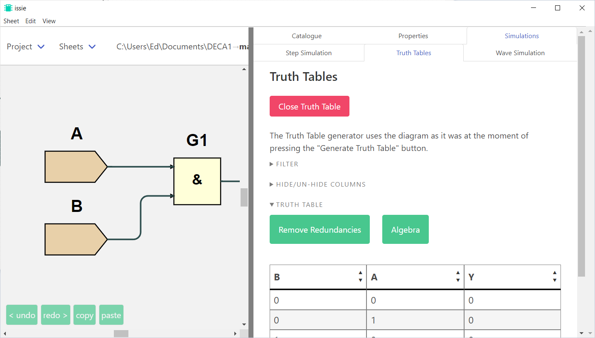

- [ ] Check your truth table against Issie's auto-generated truth table

### A 2-input multiplexer

A design usually contains many logic primitives connected together.
The library already contains a primitive for a 2-input multiplexer, but we'll create one from scratch using gates as an exercise.
            
In Issie, create a new sheet (in the top-left, select Sheets > New sheet) called `mux2` and input the design for the multiplexer, which has the Boolean function $Y = \overline{S}A + SB$.
A multiplexer in digital logic performs a function similar to a `if...else` statement in C and C++ programming: it allows you to select one of a number of different options.
Here, if $S=1$ then $Y=B$, else $Y=A$.
			
As you build your design, you may find that some wires appear to overlap.
This isn't a problem for circuit function, since wires in Issie are only between components; wires cannot connect to other wires directly.
But readability of your schematics is important, both for yourself and for others who need to look at your design, so you should make your design neater by moving the wires to be more visible.
Click on a wire and drag any sections that are obscured by components or other wires.
			
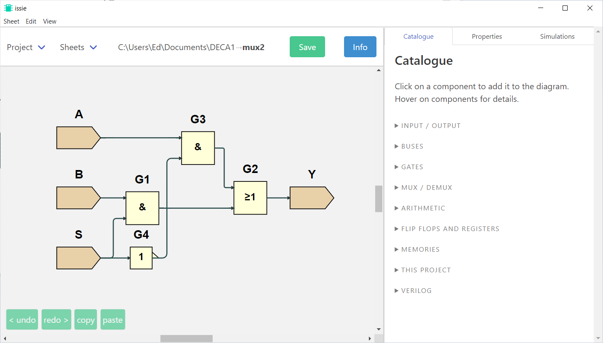
				
Simulate the design to check it works correctly.
You now have three inputs and 23 = 8 different input combinations.

- [ ] Build and test the 2-input multiplexer
        
### Hierarchical Design
		
A complex design in a single sheet would be very hard to work with, and prone to mistakes.
Instead, you can define custom components and create a hierarchical design.
Each component is defined by one sheet but it can be used multiple times as different *instances*.
In the diagram below there are four sheets that define three components plus the *main* sheet.
Component 1 is used as two instances in *main*.
			
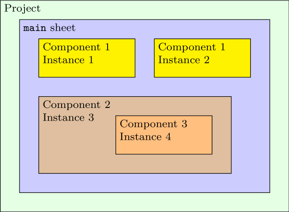
			
In each Issie project, you will be treating one of your sheets, usually `main`, as the *top-level component* of your design.
This will be the sheet that defines the inputs and outputs to the entire system, and it will be the sheet you have open when you wish to simulate the entire system.
This sheet will contain instances of other components, which are each defined in different sheets, each with their own set of inputs and outputs.
Each component can be instantiated more than once within any other sheet, meaning that a component can be built and tested once, and then used repeatedly without worrying about its functionality after that point.
			
Using hierarchical design, we can use three instances of a two-input multiplexer to make a four-input multiplexer:
			
The boolean expression for the multiplexer is
$$Y=A\overline{S_0}~\overline{S_1}+BS_0\overline{S_1}+C\overline{S_0}S_1+DS_0S_1$$
It means that the output Y is the same as one of the inputs A,B,C or D.
We can represent the function in an algebraic truth table, where symbols are used to reduce the number of rows required.
Here, we don't enumerate every combination of input ports A, B, C and D — instead we note where the output Y is equal to a particular input, no matter the value of that input.

| $S_1$ | $S_0$ | $Y$ |
| ----- | ----- | --- |
| 0     | 0     | A   |
| 0     | 1     | B   |
| 1     | 0     | C   |
| 1     | 1     | D   |

### Building and testing the 4-input multiplexer

Create a new sheet called `mux4` and use your existing `mux2` component to construct a 4-input multiplexer as show in the diagram.
If you have saved the `mux2` sheet and it does not contain errors, then you will be able to find the `mux2` component in the Catalogue, under 'This Project'.
**Do not try to implement the 4-input multiplexer from gates on a single sheet** — use three instances of the tested 2-input multiplexer you built earlier, as shown in the diagram above.
			    
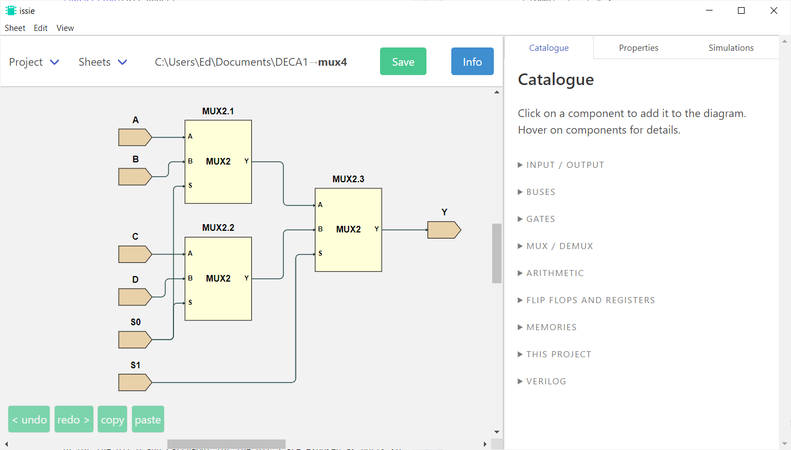
			    
Add I/O ports and test your design by running a simulation with the `mux4` sheet open. The testing process is now more complex because you have more inputs. For an exhaustive simulation you will need to test $2^6=64$ input combinations.
			
- [ ] Create and simulate a 4-channel multiplexer from a tree of three 2-input multiplexers.

Issie can replace inputs in a truth table with algenraic symbols to reduce it's size. Generate the truth table for the 4-input multiplexer and clcik 'Algebra'. A window appears that lets you select which inputs should be represented symbolically. Choose 'Algebra' for inputs A, B, C and D and click 'Apply'. You will now see a simplified truth table matching the one above, where the output is shown as a function of the inputs A, B C and D. You should consider the function of the circuit when you enable algebraic inputs — A, B, C and D work here because we know that the output should always match one of those inputs. If you select algebra for S0 or S1, the resulting table is harder to interpret.

- [ ] Use Issie to generate an algebraic truth table for the 4-input multiplexer

## Busses

A single digital signal can represent a one or zero, which is not very useful on its own.
Larger numbers are represented using *busses* of digital wires.
Each wire within the bus is known as a *bit*.
In *unsigned*, *twos complement* encoding, each bit represents the number $2^n$, where $n$ is the *index* of the bit.
For example, a 4-bit bus would contain bits indexed 0–3 and would represent numbers between zero and $2^0+2^1+2^2+2^3=15$.
We will expand the 1-bit multiplexers `mux2` and `mux4` to 4-bit versions so that they switch 4-bit busses instead of individual bits.
				
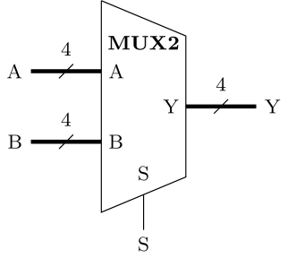
				
The symbol above is not strictly a circuit diagram symbol because individual lines and ports represent more than one wire.
Instead, it is a *block diagram* symbol, where lines show the flow of information instead of every physical wire.
It is easier to design digital systems with block diagrams because there are fewer lines, but take care that connected blocks are compatible, e.g. their bus ports have the same number of bits.
Block diagrams are used in the rest of these instructions, where busses are drawn with thick lines and the /n notation to indicate the number of bits.
		
### Bus ports

Create a new sheet, called `mux2x4`.
On this sheet, add four of the `mux2` components you made earlier — each one of these will be responsible for handling one bit of each input and output busses.
When you add the ports, make sure that the `S` port is one bit wide, and the `A`, `B` and `Y` ports are four bits wide.
Wire up the `S` port so it controls all four multiplexers together, but leave the other ports for now. 
				
You will notice that the bus ports are labeled with numbers next to them, e.g. `A(3:0)`.
In this example, this means that the port is called `A`, and it has bits indexed between 3 (the most significant bit) and 0 (the least significant bit).
				
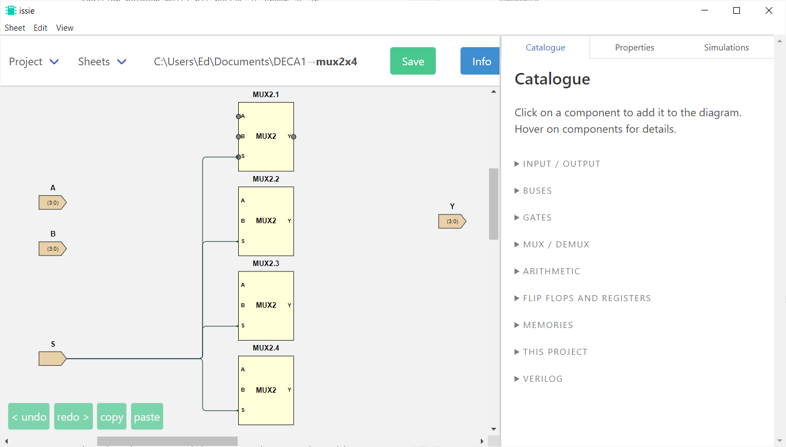
				
### Bus wiring
			
You cannot simply connect a 4-bit port to the 1-bit terminals of one of your `mux2` multiplexers, as the software doesn't know which of those four bits to use. 
There is also a problem at the output; you will have to join the four 1-bit outputs coming from the four mux2 components into the single 4-bit `Y` port.
If you directly join together any ports with incompatible bit widths, Issie will produce an error. The 'BUSES' section of the catalogue contains tools that can adapt buses to different widths.
				
The 'Bus Select' component allows you to choose a sub-set of bits from a bus.
In this case, we want to select a single bit from the input bus `A` to connect to the first `mux2` component.
Place a Bus Select and configure it to have an output width of 1 bit and an input bit of 0.
Connect the input of the bus select to port A and the output to input A of the first `mux2`.
Repeat this for all four instances of `mux2` so that each `mux2` is connected to a different bit (0–3) of port A.
The Bus Select shown below is selecting bit 2 from the input bus, for example.
				
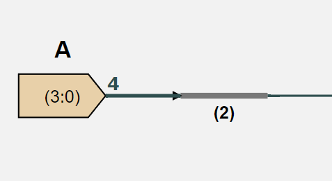
				
Connect both input ports of your `mux2x4` to the `mux2` components. 
Make sure that each `mux2` gets the same bit index from each input bus.
				
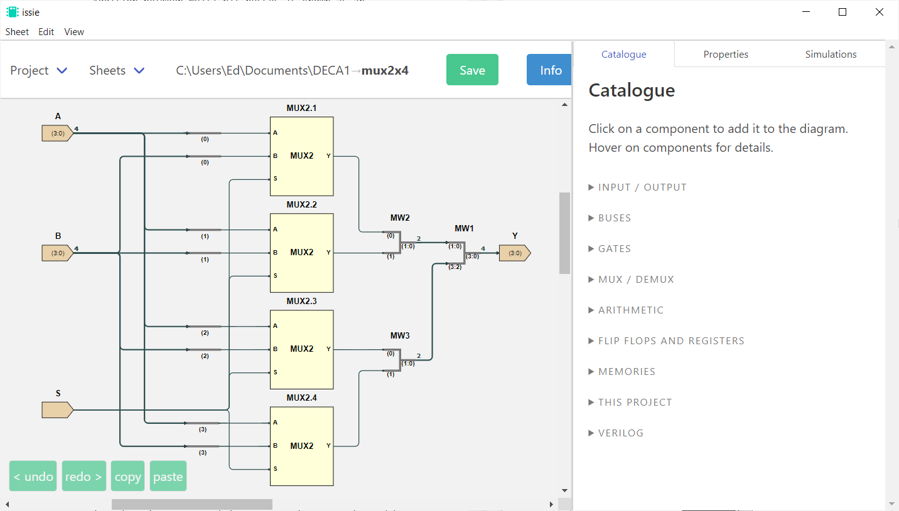
				
For the output port, use the 'MergeWires' component, which connects two busses or wires together to make a wider output bus.
The top input of a MergeWires is connected to the least significant bits of the output and the bottom input is connected to the most significant.
That means you can use a simple tree structure of three MergeWires components to join the outputs of all four `mux2` instances to the port `Y`, as shown above.
A MergeWires doesn't need any configuration because it automatically sizes the output to be the sum of the widths of both inputs.
For example, the MergeWires below combines two 2-bit busses to make a 4-bit bus.
				
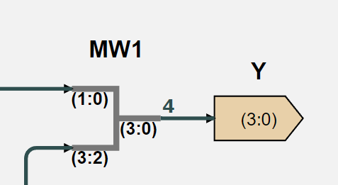
			
 - [ ] Create a 4-bit multiplexer from four 1-bit multiplexers.
			
### Testing the 4-bit bus multiplexer

An exhaustive test of this design is not practical for manual inspection of the results because there are now $2^{9}=512$ combinations.
However, we already know that the underlying `mux2` blocks work correctly from the earlier test, so we just need to check the bus wiring in the `mux2x4` sheet.
That can be done with a reduced set of inputs that exercises each bit of `A` and `B`, but doesn't test every possible combination:

| `A`  | `B`  | `S` | `Y` |
| ---- | ---- | --- | --- |
| 0001 | 1110 | 0   |     |
| 0001 | 1110 | 1   |     |
| 0010 | 1101 | 0   |     |
| 0010 | 1101 | 1   |     |
| 0100 | 1011 | 0   |     |
| 0100 | 1011 | 1   |     |
| 1000 | 0111 | 0   |     |
| 1000 | 0111 | 1   |     |
				
In the Simulation tab you will see that the bus inputs are given text fields, not buttons.
You can enter data in three different formats here: binary (prefix with `0b`, e.g. `0b1010`), hexadecimal (prefix with `0x`, e.g. `0xa`), and decimal (no prefix).
You can also change the radix of the output using the provided buttons.
				
- [ ] Simulate the 4-bit multiplexer and test to ensure it works as expected.
				
### Hierarchical design with busses

Splitting and merging the busses was quite laborious but there is a great benefit once you build hierarchical designs with busses.
To illustrate, we'll create a 4-input, 4-bit multiplexer, using the 2-input, 4-bit multiplexer we just built.
Create a new sheet called `mux4x4`. The layout will be similar to the `mux4` component, except most of the wires will now be busses.
				
Using the diagram for a [4-input, 1-bit multiplexer as a reference](Section1.md#building-and-testing-the-4-input-multiplexer), place 4-bit bus input ports `A`, `B`, `C` and `D`, and an output port `Y`.
We can also use a bus to combine the two select inputs, so create a 2-bit input port `S`.
Next, recreate the 4 channel multiplexer with the same tree structure as the `mux4`, using your `mux2x4` component instead of `mux2`.
Notice that you can now directly connect the input ports with the `mux2x4` instances since the widths of both ports match.
The bits of the `S` bus will need selected individually to control each layer of the multiplexer tree.
				
Run the simulation on this new sheet, and test the circuit.
You should use a similar testing strategy to the one used to test the `mux2x4`.
Choose test inputs that prove that the output matches the correct input `A`–`D`, depending on the state of `S`.
				
- [ ] Implement and test the 4-input, 4-bit multiplexer.
		
## Challenge: a multi-purpose logic gate

One application of a multiplexer is to implement instructions inside a CPU.
For example, a CPU might have two operands $A$ and $B$ and four different operations:
- Bitwise $\text{ NOT } A$
- $A \text{ OR } B$
- $A \text{ AND } B$
- $A \text{ XOR } B$
				
*Bitwise* operations are performed independently between each bit of one multi-bit operand and the corresponding bit of the other operand.
For example, $0111\text{ AND }1101=0101$ as a bitwise operation.
				
Separate logic gates calculate each function and an instruction code selects which result is passed to the output.
The resulting logic block is the beginnings of a CPU component called an *arithmetic and logic unit* (ALU).
				 
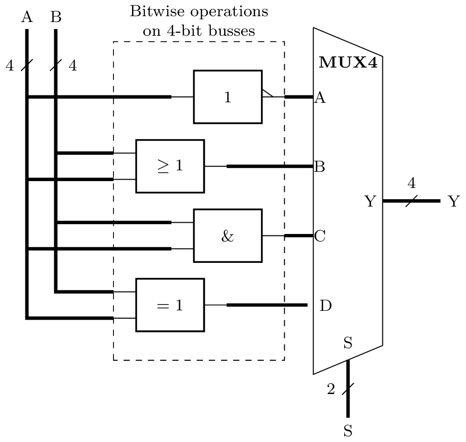
				 
Create a hierarchical design that implements this functionality with components (sheets) called `NOT4`, `AND4`, `OR4`, `XOR4` and `mux4x4`.
The inputs `A` and `B`, and the result `Y` should each have 4 bits, while the instruction input `S` should have 2 bits. Each of the logic gates shown above represent bitwise operations and you will need to create sheets for them that contain four instances of each gate to process all the bits of the input operands.
				 
Simulate the design with a similar strategy to before: select several different test values for `A` and `B`, and for each of these try the four possible values for the instruction code `S`.
Check that the output matches what you would expect for each bitwise operation.
