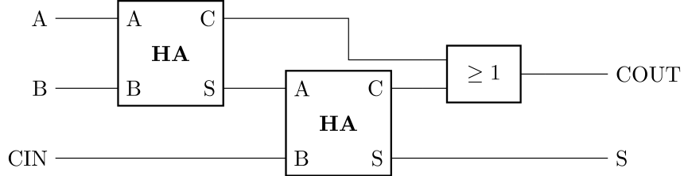
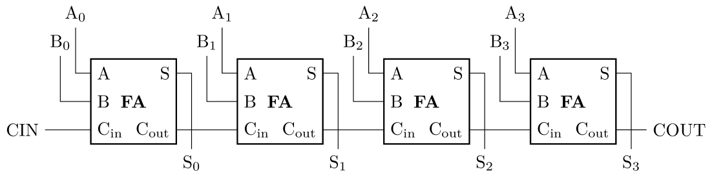
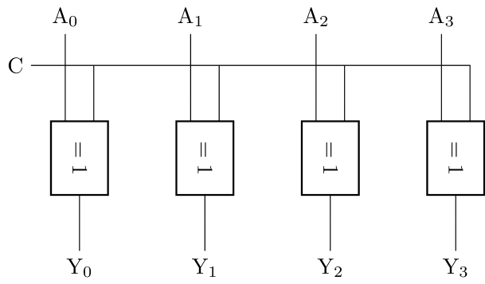
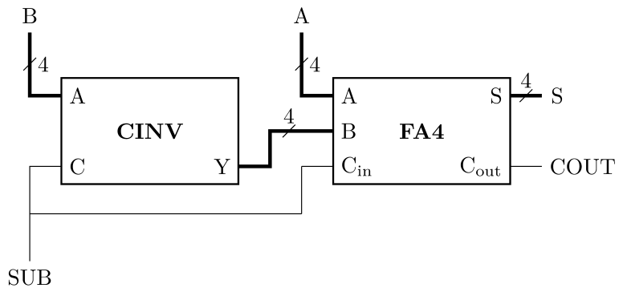
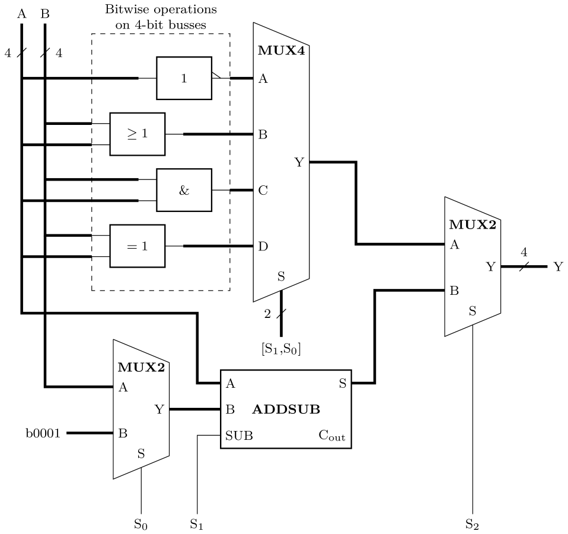

# Digital Electronics and Computer Architecture Lab
# Part 1: Autumn Term weeks 4--6
## Section 2: Digital Arithmetic

## Before the lab

In Issie, create a new project called `arithmetic`.
In this project, make a new sheet, `halfadd`, containing the design for a half adder, a combinational circuit with the following Boolean functions:
				
$$S=A\oplus B$$
				
$$C=AB$$
				
The half adder performs a binary equivalent function to the decimal addition of two single-digit numbers and it produces a sum ( $S$ ) and a carry out ( $C$ ).
Simulate and find the truth table $A$ and $B$:
				
| $A$  | $B$  | $C$  | $S$ |
| -- | -- | -- | -- |
| 0  | 0  |    |    |
| 0  | 1  |    |    |
| 1  | 0  |    |    |
| 1  | 1  |    |    |
				
## Full adder
		
A full adder adds together three 1-bit inputs to produce a sum output and a carry output.
The third input is important because it allows full adders to be chained together to add multi-bit busses.
A full adder can be made of two half adders and an OR gate:
			

			
Create a full adder component in a new sheet in Issie called `fulladd` by instantiating two `halfadd` instances and an OR gate, and wiring them together.
Carry out an exhaustive simulation of every combination of inputs `A`, `B` and `CIN`.
		
- [ ] Create and simulate a full adder
		
## Ripple-carry adder
		
Addition between multi-bit busses is known as an *arithmetic* operation, because it treats each bus as representing a number.
Unlike the bitwise operations, there is a dependency between the bits of a bus via the carry signals.
The simplest form of multi-bit adder is called a *ripple-carry adder* and it is made by chaining full adders together:
			

			
The inputs `A` and `B`, and the output `S`, are now 4-bit busses and there is one full adder per bit.
The carry signals are chained together in the direction of the least-significant bit towards the most significant bit — the passing of carry bits is like you would do decmial addition on paper.
The dangling carry-in for the bit 0 and carry-out for the bit 3 are exposed as ports so that multiple 4-bit adders could be chained together.
Create a 4-bit adder by instantiating full adders in a new sheet, `fa4`.
Individual bits should be grouped together into 4-bit busses for ports `A`, `B` and `S`.
Simulate the component using several different random numbers on the inputs `A` and `B`.
For now, the carry input `CIN` should be set to constant 0.
Confirm that the outputs `S` and `COUT` are as expected for each test.
		
- [ ] Create and simulate a 4-bit adder
			
## Subtraction
		
An adder can be turned into a subtracter by negating input `B` so the operation becomes $A+(-B)$.
For more flexibility we can create a control signal that switches the block between add and subtract by controlling the negation of $B$.
We are using a *twos-complement* number representation so negation is achieved by inverting each bit and adding one.
			
We can use an XOR gate to make an inverter that can be switched on and off, observing that $A\oplus 0=A$ and $A\oplus 1=\overline{A}$.
An XOR gate either buffers or inverts $A$ depending on the value of input $B$.
There are four bits of data so you'll need to make a controllable inverter component in a new sheet (`cinv`) that has a 4-bit input and a 4-bit output, plus a single bit control input:
			

			
The second part of the negation, adding one, could be achieved with an additional adder.
However, we can also use the carry input to the existing adder as it effectively provides a third, single-bit operand ($Y=A+B+C_\text{in}$).
The two parts of the negation, inversion and adding one, are both enabled by a logic 1, so a single control input `SUB` can be used to drive both.
So putting together the controllable inverter and adder to make an add or subract block looks like this:

			
Create the adder/subtracter as a component called `addsub`.
Simulate it with different random inputs for `A`, `B`, and `SUB`.
Confirm that the function changes from addition to subtraction when `SUB` is high.
This testing strategy aims to cover a sufficiently large number of the possible cases to allow you to be reasonably certain that the circuit totally works.
		
- [ ] Create and simulate a 4-bit adder/subtracter.
		
## Challenge: ALU with addition and subtraction

Previously, you created an ALU with AND, OR, XOR and NOT functions.
A useful CPU also must do arithmetic operations including add, subtract, increment (add 1) and decrement (subtract 1).
Expand your ALU to include these four new arithmetic instructions:

- $Y=A+B$
- $Y=A-B$
- $Y=A+1$
- $Y=A-1$
				
This will require two extra multiplexers: one to switch the output between the bitwise functions and the arithmetic functions, and one to select between input B and constant 1 for the second add/subtract operand.
				

				
Every combination of the 3-bit control bus enables a different function, so the alegbraic truth table looks like this:
				
| $S_2$ | $S_1$ | $S_0$ | $Y$ |
| ----- | ----- | ----- | --- |
| 0     | 0     | 0     | Bitwise $\overline{A}$ |
| 0     | 0     | 1     | Bitwise $A+B$ |
| 0     | 1     | 0     | Bitwise $AB$ |
| 0     | 1     | 1     | Bitwise $A\oplus B$ |
| 1     | 0     | 0     | Arithmetic $A+B$ |
| 1     | 0     | 1     | Arithmetic $A+1$ |
| 1     | 1     | 0     | Arithmetic $A-B$ |
| 1     | 1     | 1     | Arithmetic $A-1$ |
				
Build the expanded ALU and simulate it with random stimulus on inputs `A` and `B`, for every different value of `S`.
