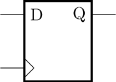
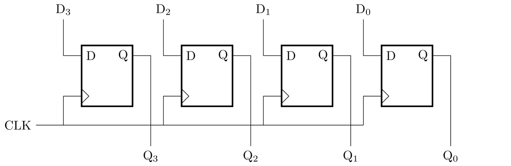
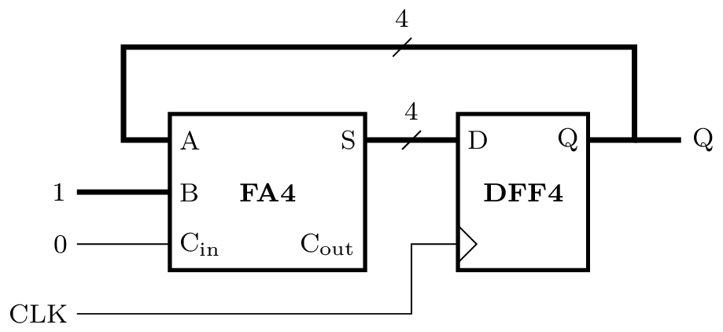
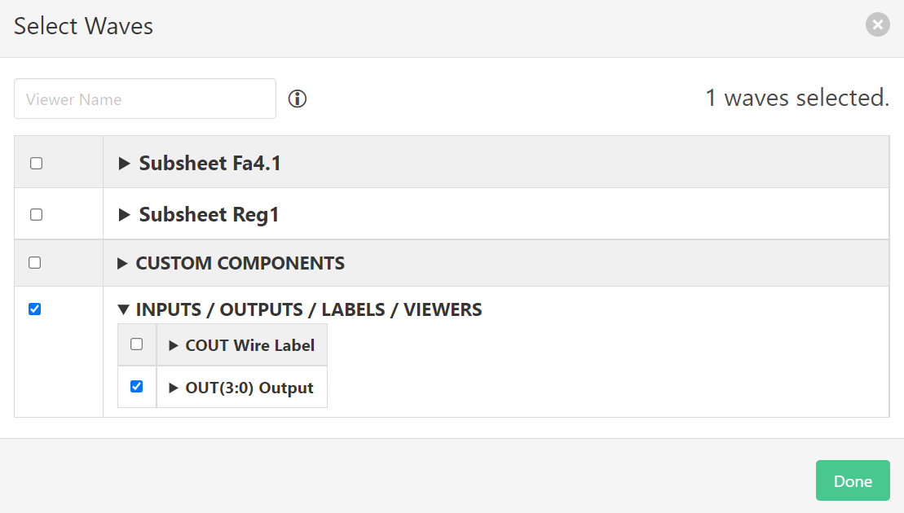
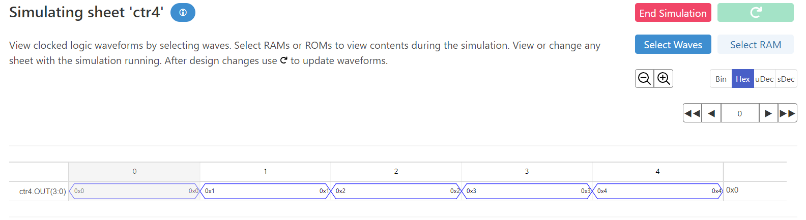
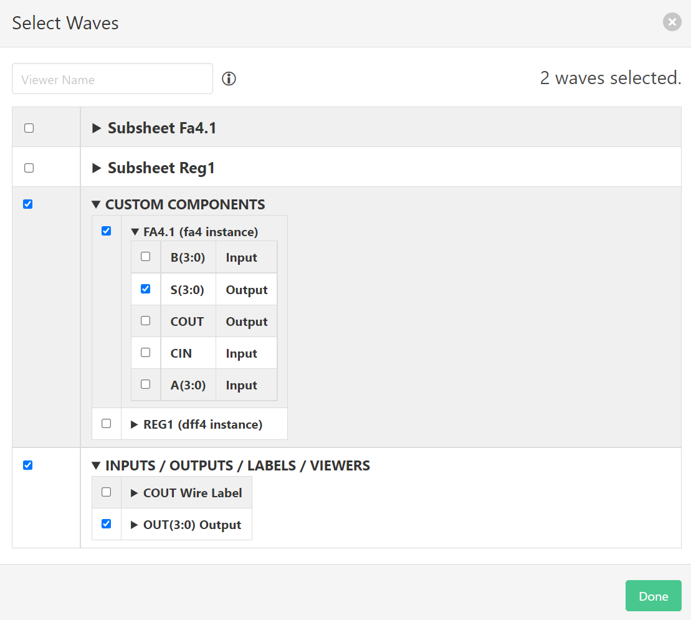
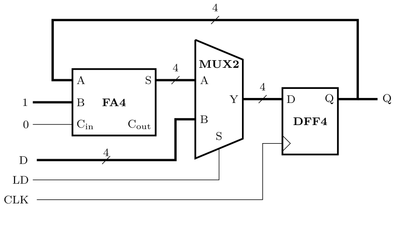
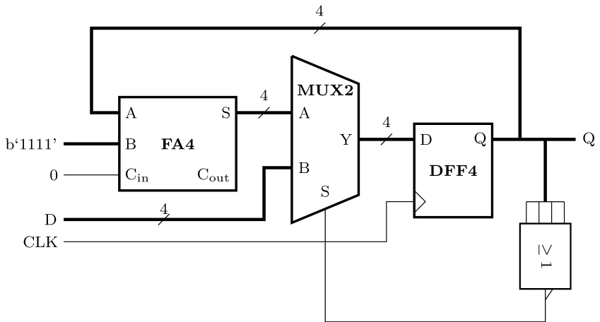

# Digital Electronics and Computer Architecture Lab
# Part 1: Autumn Term weeks 4--6
## Section 3: Sequential Circuits

Sections 1 and 2 of this experiment involved combinational logic circuits: circuits that convert inputs to outputs but do not store information.
Digital circuits which store information are called *sequential* and they contain *registers* and a *clock*.
		
This section uses a register to store the value of a bus.
The output of the register is fed back to the input via an adder, which creates a counter.
			
## Before the lab

The basic unit of information storage within digital circuits is the *D-type flip flop* (DFF).
It stores the state of input `D` at the moment when the clock input (>) changes from low to high, known as a *rising edge* or *clock tick*.
The output `Q` is equal to the stored value and it cannot change until the next clock tick.
				

| D  | Clock | Q  |
| -- | --- | -- |
| X  | 0   | NC |
| X  | 1   | NC |
| 1  | ⮥   | 1  |
| 0  | ⮥   | 0  |			

*X: Don't care, NC: No Change, ⮥: Rising Edge*
					
Often, the state of a bus will be stored so a multi-bit DFF is needed, known as a *register*.
The bits of the register share the same clock input.
				

Make a new project in Issie, and inside make a new sheet with a design for a 4-bit register called `DFF4`, with a bus input `D(3:0)` and a bus output `Q(3:0)`.
Place four of the the Issie component 'D-flip-flop', which is in the 'Flip flops and registers' category of the catalogue.
				
In Issie, all components with a clock input are connected to a global clock line automatically.
Therefore, you do not have to wire the clock inputs up yourself.
				
## Simulating a sequential circuit
		
We will simulate your `DFF4` block with Step Simulation. Open the Step Simulation tab and start the simulation. Now the sheet contains sequential logic you will see buttons for 'Goto' and 'Clock Tick 0'. Click 'Clock Tick 0' and the simulator will send a rising edge clock event (clock tick) to all the \texttt{clk} input ports in the design. The number advances to show you how many clock ticks have passed so far. The 'Goto' button allows you to advance multiple clock ticks. Test the functionality of your `DFF4` block by setting `D` to different values and confirming that `Q` updates after the next clock tick.

In additon to the ports, the simulation tab also shows you the value stored in each of the 'Stateful components', which in this case are your 4 flip-flops.
This helps with debugging because you will need to know the state to determine if the outputs of the sheet are correct.
			
- [ ] Simulate the 4-bit register.
			
## Counter
		
Sequential components allow the creation of feedback loops in digital designs, where the next state (`D` inputs) depends on the current state (`Q` outputs).
A simple example is a counter, where a register is used with an adder to generate a binary number that increments by one every clock cycle.
		

			
Create the counter in a new sheet `CTR4` using your `DFF4` component and a 4-bit full adder.
You can copy the `.dgm` file for `fa4`, `fulladd` and `halfadd` from the previous section into the folder/directory for your current project.
Close and re-open the project in Issie.
The 4-bit adder and its dependencies, `halfadd` and `fulladd`, are now available in the catalogue of your current project.
			
Connect one input to the 4-bit adder to the output of the `DFF4`.
Connect the other input to the adder to a `Constant` component, found in the catalogue under 'Input/Output'.
Set the number of bits of the constant to 4 and the value to 1.
Connect another constant to the carry input, with a width of 1 and a value of 0.

In Issie, floating ports (inputs/outputs of components that are not connected to anything) are not allowed.
To solve this, connect the `Cout` port of your full adder to either an output port, or to the `Wire Label` component from the 'Input/Output' section of the catalogue.
            
Test your counter using the Step Simulation tab.
Each time you click on the 'Clock Tick N' button, you will see the output value increment by one.
Confirm that the counter behaves as you expect.
What happens when the counter reaches 15 (0xF), the maximum value of a 4-bit unsigned number?
			
- [ ] Implement and simulate the 4-bit counter.

Issie has another way of simulating sequential designs: 'Wave Simulation'.
Wave simulation shows a graph of how values in your design change over time.
Open the 'Simulations' tab and select the 'Wave Simulation' tab.
Click 'Start Simulation' and 'Select Waves'.
The 'Select Waves' box appears, which allows you to choose which values will be displayed on the graph.
Select the `OUT` port of the current sheet, found under 'Inputs/Outputs/Labels/Viewers', and click 'Done'

The wave simulation tab now shows a *timing diagram* for your design. The horizontal axis is time, in units of clock ticks.
The signal you selected is shown on a row below, with the value during each clock interval displayed in hexadecimal.
Note how the value changes on each clock tick, which is the transition between the clock intervals.

The wave selection box contains a heirarchical list of every component in your design, which allows you to view signals that are not the main outputs.
Reopen it and add the `S` (sum) port of the 'FA4' component in your sheet, found under 'Custom Components' ▼ 'FA4.1'

Now the timing diagram now includes the output of the 4-bit adder, which is one greater than the main output.
The output of the adder is the input of the 4-bit register and you can see how the register is functioning: it records its input on every rising clock edge and holds that value on its output.
As soon as the register latches a new value $n$, the output of the adder updates to $n+1$. But this value is not latched into the register until the following clock cycle.

- [ ] Simulate the counter with the wave simulator and confirm its operation.
			
## Counter with synchronous load
		
The counter so far follows a fixed sequence and there are no input ports to control its operation.
To make the counter more useful, we wish to introduce the ability to set the value of the counter.
We will create a *synchronous load* function with a multiplexer.
The multiplexer provides the facility to break the feedback loop and instead feed the register with a specific value.
You can use the 4-bit, 2-input multiplexer that you created in the previous section by copying the relevant `.dgm` files, or you can the built-in `2-Mux` component from the 'Mux/Demux' section of the catalogue.
		

			
With load signal `LD` set to 0 the counter will behave the same as before, since the output of the multiplexer is equal to the input `A`.
When `LD` is 1, the register is loaded with the value of input `D`.
Use the step simulation tab to test the load function.
First keep `LD` set to 0 and confirm the count function is the same as before.
Then, set bus input `D` to a value of your choice and set `LD` to 1.
Advance the clock by one tick and the counter will change to the value of `D`. 
Set `LD` back to 0 and the counter will continue to count up from the new value on successive clock ticks.
			
- [ ] Implement and simulate the synchronous load function.
		
## Challenge: Countdown timer with auto-reset

Counters are frequently used as timers that count down for a certain number of clock ticks and then reset and repeat.
Convert your counter with load to a countdown timer. You'll need to:
- Change the adder to a subtracter so it counts down instead of up
- Trigger the load signal automatically when the output is zero
				

			
When you simulate your design, you should find that the output repeats every $D+1$ clock ticks.
				
Note the inclusion of a reduction NOR gate to generate the control signal for the multiplexer.
Reduction logic operations use a Boolean function to convert a bus to a single bit.
For example, reduction NOR produces logic 1 if every bit of the bus is 0, otherwise the output is 0.
You can implement a reduction NOR with the Bus Compare component, which outputs 1 if the bus input equals a predefined value (0 in this case).

- [ ] Create the countdown timer
