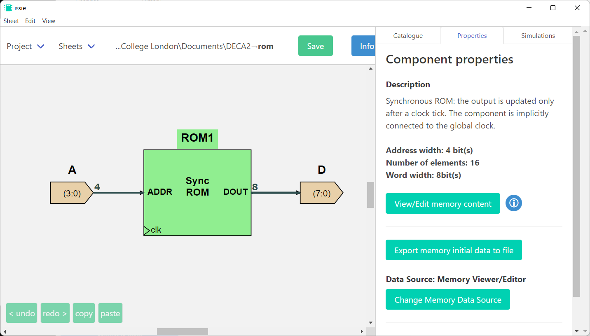
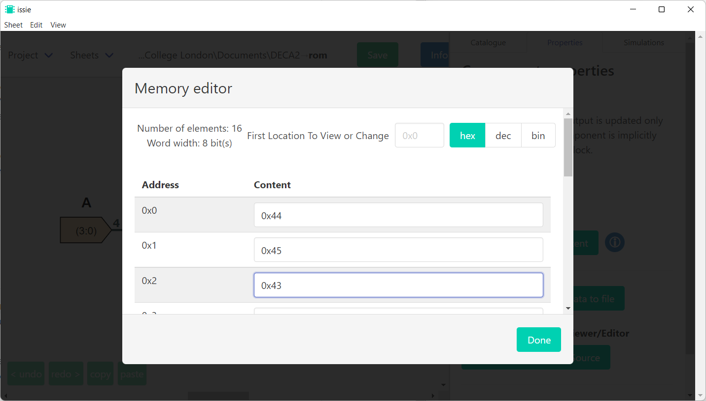
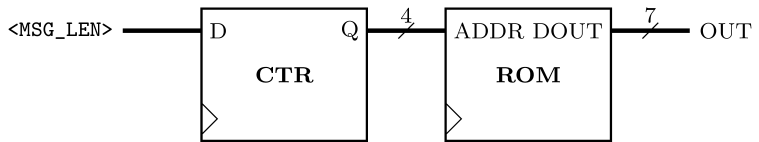

# Digital Electronics and Computer Architecture Lab
# Part 2: Autumn Term weeks 8–10
## Section 1: Memory

Memory allows the storage of large blocks of data.
Unlike registers, in which every bit can be accessed and updated every clock cycle, data in memory must be *addressed* and only one word can be accessed at once.
In this section, a *read-only memory* (ROM) is used to store a text message that can be read one character at a time.

## Before the Lab

In digital systems, text is represented by converting each character to a binary code.
Computer systems need to store not just characters, but also symbols and diacritical marks for all the major scripts in use around the world.
The standard for storing text is called Unicode, and it is still being extended to include new dialects and emoji.
			
Most modern computer operating systems originated in The West, and at first they only supported the Roman letters and Arabic numerals used in English.
Today, the first 128 characters of the Unicode standard still map onto that original set of characters, called the ASCII standard.
That means that simple messages in English can be stored by representing each character as a 7-bit binary code.
			
By referring to a table of ASCII symbols (search online for 'ASCII Table'), prepare a personalised text message of up to 15 characters length and encode it as a list of character codes in hexadecimal format.
For example, 'DECA' would encode as:

| D    | E    | C    | A    |
| ---- | ---- | ---- | ---- |
| 0x44 | 0x45 | 0x43 | 0x41 |

## Initialising ROM

The contents of ROM cannot be changed at runtime, so it must be defined when the design is created.
Make a new Issie project, and inside make a new sheet called `ROM`.
		
In Issie, there are two types of ROM available: synchronous, and asynchronous.
Asynchronous ROM is combinational, and it will immediately output the value stored inside it at the address provided as input.
Synchronous ROM requires a rising clock edge to update its output, much like a D-flip-flop.
When it receives this rising clock edge, it will output the value stored at the address given by the input at that moment.
		
We will use a synchronous ROM for this part.
Add a 'ROM (synchronous)' component (under the 'Memories' section of the Issie catalogue) and set it to have a 4-bit address input and 8-bit words.
Click on the ROM to select it, and then go to the 'Properties' tab.
Click the 'View/Edit memory content' button, and fill in the values of your text message in the memory editor window that appears.
		

		
- [ ] Create a synchronous ROM containing your message.
	
## Simulating the ROM
		
Now that you have set up your ROM, you must add input and output pins to the `ADDR` and `DOUT` ports respectively so that you can run a simulation.
Add port components to connect to each port of the ROM, setting the number of bits as appropriate for the width of each port.
You can check the width of the ROM ports in the `properties' tab.
        
Use step simulation to cycle through the 16 possible values of the `ADDR` input.
Remember that, like the DFF, the ROM is clocked — it will only update the output when it receives a rising edge of the clock, which you can send to it by clicking the 'Clock Tick N' button.
Check that each character code is correctly read from the ROM.

- [ ] Simulate the memory block to confirm its contents.
	
## Challenge: Message writer

The auto-reset counter/timer from the previous challenge can be connected to the ROM to make a system that will output each character in your message sequentially.
Configure the counter to count up from 0 to N-1, where N is the length of your message, then reset and repeat.

Your design will automatically cycle through the message without any user input.
That makes it suitable for testing with Wave Simulation.
Check that the simulation shows each character being read out sequentially.
Since the ROM is synchronous you will see a 1-tick delay between the value of the counter and the output of the ROM.

- [ ] Design and test the message writer
			
It would be useful to add a trigger input so that the message is read out on request instead of on a continuous loop.
Modify your counter so that it only counts from 0 to 1 if the trigger input is true:

| Counter value | Condition | Next value | 
| ------------- | ---------- | --------- |
| $Q=0$       | Trigger low | 0         |
| $Q=0$       | Trigger high | $Q+1$          |
| $0 \< Q \< N-1$ | Always    | $Q+1$     |
| $Q=N-1$       | Always    | 0          |

The counter will now stay at 0 until the trigger input is set.
It will still use a multiplexer to select 0 or $Q+1$ as the next counter value.
However, you will need to add extra control logic because there are now two conditions where the next value of the counter is zero.

- [ ]  Design and test the trigger input feature
		
