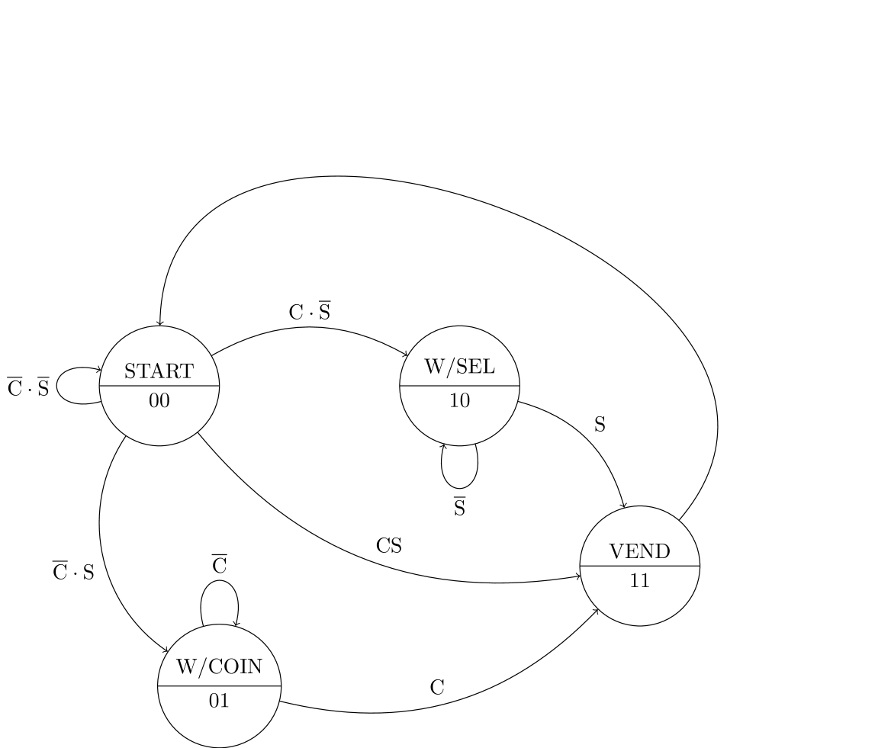
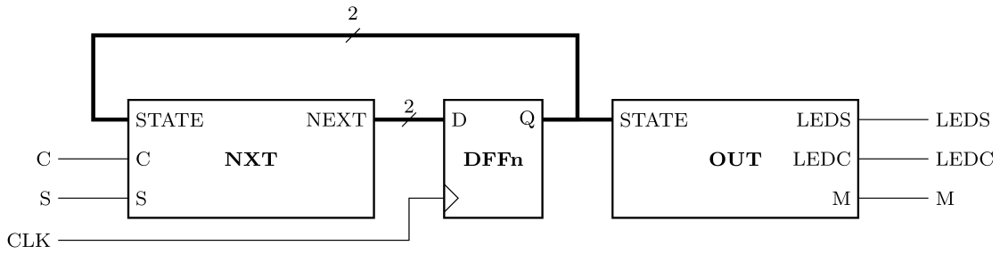

# Digital Electronics and Computer Architecture Lab
# Part 2: Autumn Term weeks 8–10
## Section 2: State Machines

## Before the lab

The following state transition diagram describes a controller for a vending machine.
The vending machine has two inputs: C is a 1-bit sensor to detect whether a coin has been inserted, and S is a 1-bit signal that goes high when the user has selected what they want to buy.
The vending machine needs a coin to be inserted (C high), and a product selection to be made (S high), before it will activate the motor that dispenses the product (state VEND).
If a selection is made without a coin being inserted, or if a coin is inserted without a selection being made, the system will wait.
Once the product has been vended, the machine will automatically go back to the start.

'W/...' means 'WAIT FOR...' in the above state diagram.

Each node on the diagram shows a possible value for the 2-bit state register.
Edges (arrows) show possible transitions between states with the input conditions required to enable them.
For example, the state register will change from 00 (`START`) to 01 (`W/COIN`) if and only if C=0 and S=1.
			
Implementation of the state machine requires *next state logic* that determine the future value of the state register depeneding on the current state and input signals.
Derive the next state logic as two Boolean expressions that depend on the current state variable and system inputs.
Simplify the expressions you obtain using either the rules of Boolean algebra or a Karnaugh map.

## State Machine
In the preparation exercise you determined Boolean expressions to control a state machine.
Make a new Issie project and implement the state machine by creating the following sheets:
1. A register `DFFn` containing sufficient bits to store the state variable
2. Combinational logic `NXT` that determines the input to the state register
3. Combinational logic `OUT` that determines the outputs
4. A top-level sheet `VEND` that connects everything together
		

		
- [ ] Create the state machine and check its function using step simulation.
		
## Outputs
To make the state machine useful as a vending machine, it must have outputs.
When the `VEND` state is active, the machine must activate a motor to vend the product, and when the machine is in one of the `WAIT` states, it should indicate to the user what it is waiting for.
We will assume that the vending machine has two status LEDs: one will indicate that money must be inserted, and one will indicate that a selection must be made.
	    
Hence, there are three outputs: `M` to enable the motor, `LEDS` to light the 'Selection Needed' LED, and `LED-C` to light the 'Insert Coin' LED.
The truth table for these outputs is:

| State |	M   |	LEDS | LEDC |
| ----- | --- | ---- | ---- |
| START |	0   |	1    | 1    |	
| W/SEL | 0   |	1    | 0    |	
| W/COIN | 0  |	0    | 1    |	
| VEND  |	1   |	0    | 0    |	

Create boolean logic expressions for these outputs, and simplify them if necessary.
Make a combinational logic block on a separate sheet that outputs the correct values for the current state, and simulate it to check that it works.
		
- [ ]	Create the combinational output block and run Simulation to check that it works.

Connect your combinational logic block to your state machine to make a complete system, as shown.

		
Test the system using the Simulation tab, confirming that the outputs are what you expect.
		
 - [ ] Connect your output block to the state machine and simulate it to confirm that it works.

## Challenge: Extending the Vending Machine

Add an input `V` to the vending machine that indicates whether or not the product has been vended.
The sensor will be low while vending is in progress, and will go high when the machine detects that vending is complete.
The vending machine should stay in the `VEND` state until successful vending is detected, and this will keep the vending mechanism activated until then.
				
Write out the truth table again as you did at the start of this section, and include the new input (this will mean adding one line and modifying one existing line).
There are too many inputs now to simplify the Boolean logic expressions with a Karnaugh map, but you can write a sum-of-products expression and simplify it with Boolean alegebra
				
- [ ] Add the required logic to your state machine and test it with the new sensor.
			
