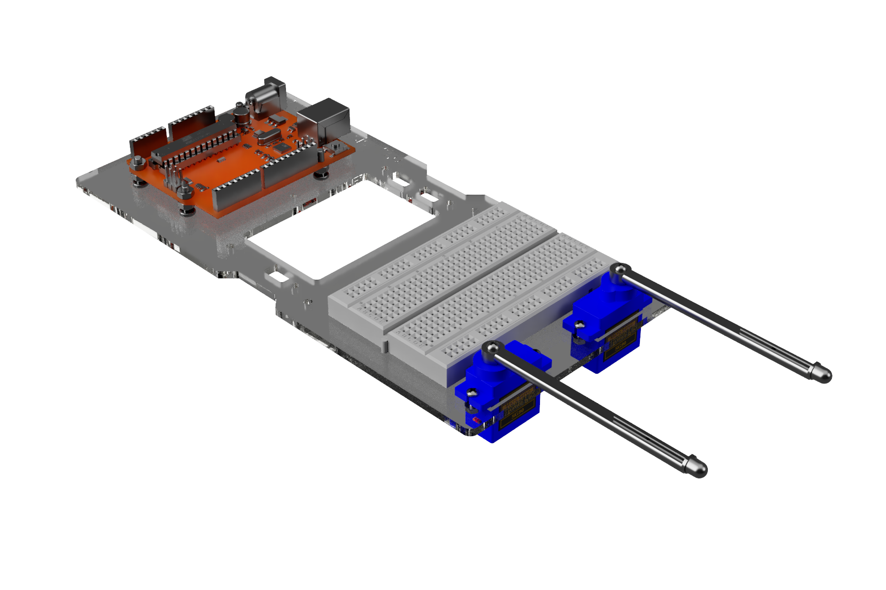
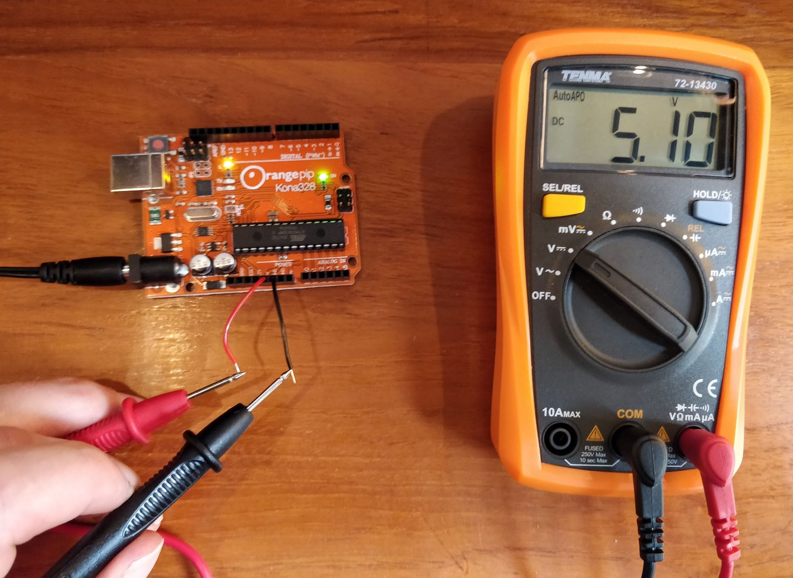
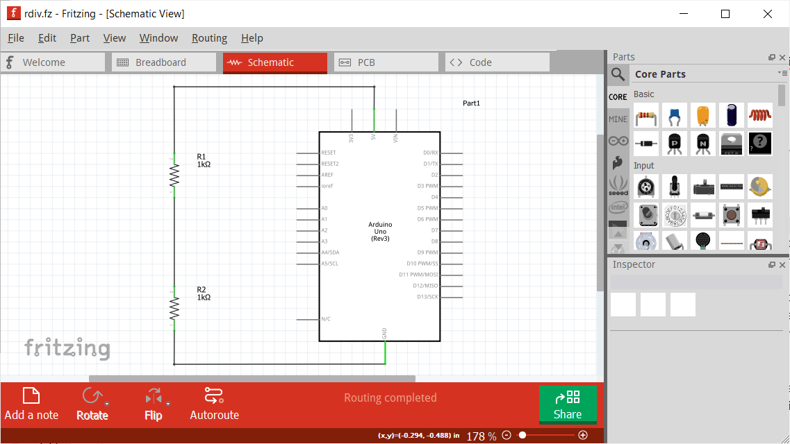
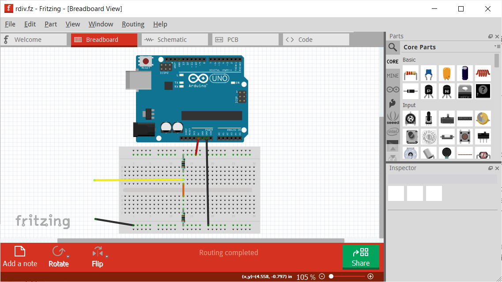
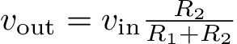
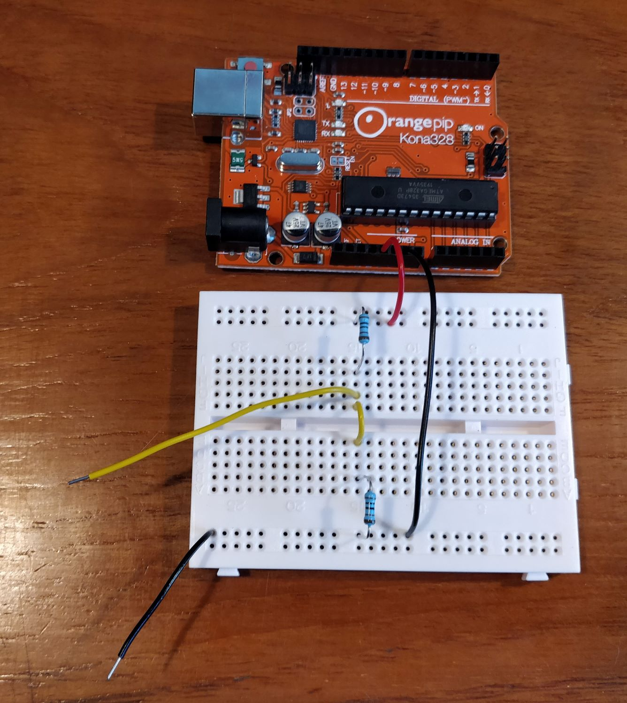

# Lab Skills
## Part 1
## Section 1 - Construct the EEEBug

### Identify Components
You have a kit of mechanical and electronic parts to build your EEEbug. You'll need the following items for this lab experiment:

| Description | Quantity | 
| -------- | ----------- |
| **Chassis Components** |
| 3mm Acrylic Robot Chassis V3.0 or V3.1 | 1 |
| 2.9mm x 9mm Self-tapping Screw | 2 |
| M3x12mm Pan Head Machine Screw | 4 |
| M3 Nut | 6 |
| M2x8mm Pan Head Machine Screw | 4 |
| M2 Nut | 4 |
| M2 Washer | 4 |
| **Electronic components** |
| 10kΩ rotary potentiometer | 2 |
| 1kΩ resistor† | 2 |
| **Modules and assemblies** |
| Orangepip Kona328 Arduino-compatible Microcontroller Module | 1 |
| KH102 Solderless Breadboard | 1 |
| SG90 Micro Servo Motor | 2 |
| Optical Antenna with SFH300-3/4 Phototransistor
| Equipment |
| Tenma 72-13430 Handheld Multimeter with probes | 1 |
| 7.5V plug-in power supply with 2.1mm output plug | 1 |
| Phillips screwdriver | 1 |
| **Wires and cables** |
| Red insulated solid-core wire | 1m |
| Black insulated solid-core wire | 1m |
| Other colour insulated solid-core wire | 1m |
| **Software** |
| Fritzing |
| `rdiv.fz` Fritzing project |
| `potdiv.fz` Fritzing project |

*†Collect from lab component drawers*

- [ ] *Identify all the items required for this section. Suggested logbook entry: a copy of the parts list and an explanation of any discrepancy, plus photos of parts that you don't recognise*

		
### Assemble the chassis
	
The chassis should be assembled according to the assembly drawing.
Follow it carefully, noting the orientation of components and the ordering of the fastener parts (screw, nuts, and washers).
Insert a photo of it in your logbook and annotate it with anything you might find useful in future, such as areas that are liable to be assembled incorrectly.
It should look like this when it's complete:

	
- [ ] Assemble the chassis.  Suggested logbook entry: a photo of assembly with annotations of any problems or discrepancies with the diagram.

### Voltage source and potential divider

Begin this section by watching [this video about using the hand-held multimeter](https://imperial.cloud.panopto.eu/Panopto/Pages/Viewer.aspx?id=d638ea81-ddd8-4dcc-bbb7-ac4e00bbefa7).

The potential divider is an important building block of electronic circuits. It uses a pair of resistors to reduce a voltage by a certain fraction.
		    

		
First, you need a voltage source. There is a 5V voltage source built into the Orangepip module, which is itself powered by the 7.5V plug-in power supply.
Plug the power supply into an electrical outlet and connect its output cable to the 2.1mm socket on the Orangepip module.
Don't connect the USB cable to the Orangepip at this time.
The LED marked 'ON' will light on the Orangepip and others may flash.
The flashing LEDs aren't important now.
		
You can make connections to the Orangepip by pushing wires into the holes (terminals) in black connector strips on the sides of the module.
Cut 30mm lengths of red and black wire and remove approximately 6mm of insulation from each end using the wire stripping tool.
Look for terminals labelled '5V' and 'GND' --- these are the terminals of the built-in 5V voltage source.
Push a red wire into the 5V terminal and a black wire into one of the GND terminals.
		
It's always a good idea to check a power supply or voltage source is working correctly before using it each time.
It is surprisingly common to find a non-functioning circuit caused by a lack of power.
You can check by using your multimeter.
		
As shown in the multimeter video, turn the selector switch to the DC voltage position `(V \textdirectcurrent{})` and plug in the test leads to the sockets marked VΩmAμA (red) and COM (black).
Hold the red test probe to the red wire (5V terminal) and the black test probe to the black wire (GND terminal).
The multimeter display should show a value of around 5V - a tolerance of ±5% is acceptable since both the voltage source and the multimeter might be slightly inaccurate.
		
Disconnect the 7.5V power supply when you have finished so the Orangepip is not powered while you make changes to the circuit.
		

- [ ]	*Check that the 5V voltage source in the Orangepip module is functioning correctly. Suggested logbook entry: photo of voltage measurement.*

You'll be creating your own circuits on the breadboard and we'll start with the potential divider.
The circuit is very simple but we'll use the opportunity to introduce the Fritzing software, which allows you to draw circuit diagrams and produce designs for building them on a breadboard or printed circuit board.
Download Fritzing from the [ELEC40002 resources section on ed Discussion](https://edstem.org/us/courses/15387/resources).
Load the `rdiv.fz` project and switch between schematic and breadboard views to see how and idealised circuit diagram can be turned into a plan for a physical circuit.
		

	    

		
The circuit uses two 1kΩ resistors.
Find these in the lab components drawers.
Then build the circuit as shown in the breadboard view by inserting the resistors into the breadboard at the locations shown.
Refer to the diagram to push the ends of the wires into the correct holes in the breadboard and Orangepip module (the Orangepip is depicted using the compatible Arduino Uno in Fritzing).
Two lengths of wire are only connected at one end --- you'll use these to make measurements of the output.
		
The potential divider reduces the 5V input voltage by a fixed proportion:
		

		
Since `$R_1=R_2=1\text{k}\Omega$` and `$V_\text{in} = 5\text{V}$`, `$V_\text{out} = 2.5\text{V}$` in this example.
Power up the circuit by reconnecting the 7.5V power supply.
Using DC Voltage mode once more, hold the multimeter probes to the yellow and black wires that protrude from your circuit to measure the output voltage.
	

		
 - [ ] Build the potential divider circuit and test it with the multimeter. Suggested logbook entry: Calculation of theoretical output voltage and recording of measured output voltage.
		
A variable potential divider can be made using a potentiometer.
A potentiometer is built by stretching out a fixed resistor, 10kΩ in your case, into a thin layer over a surface.
Then, a third terminal makes contact with a point on the resistive layer and, by turning the shaft, the contact point can be wiped to any point along the fixed resistor.
If the resistance between the wiper terminal and an end terminal is `$R_1$`, then the resistance between the wiper and the other end terminal is `$10\text{k}\Omega-R_1$`.
		
If the end terminals of a potentiometer are connected to a voltage source then it becomes a variable potential divider and the voltage measured between the wiper terminal and the reference point varies between zero and the source voltage (5V) depending on the rotation position of the shaft.
Load the Fritzing project `potdiv.fz` and build the circuit shown.
As before, power up the Orangepip and use the multimeter to measure the output voltage between the yellow and black wires.
Find how the output voltage varies as you turn the potentiometer shaft.	
	    
- [ ] Build and test a potential divider using a potentiometer. Suggested logbook entry: video of voltage changing as potentiometer is turned.
