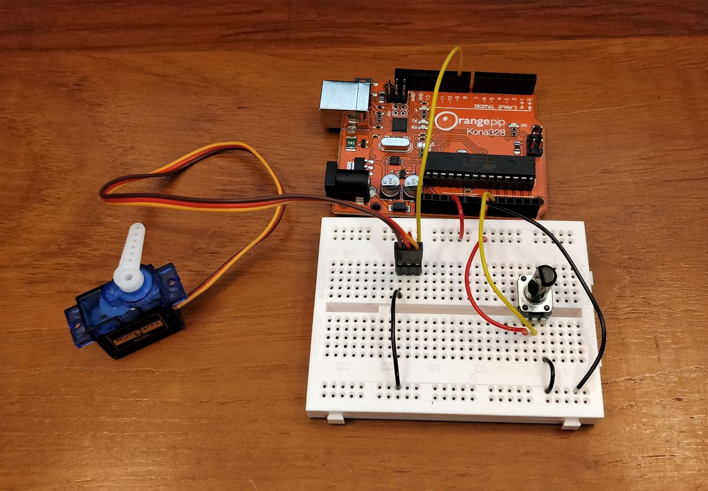
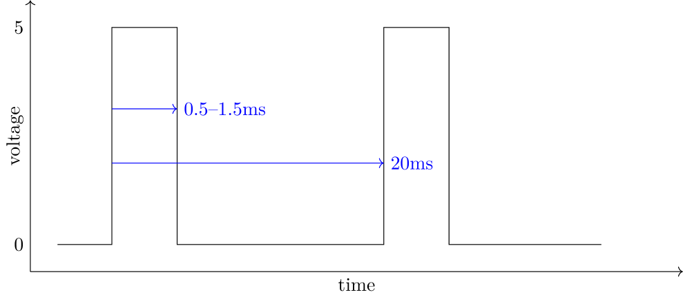
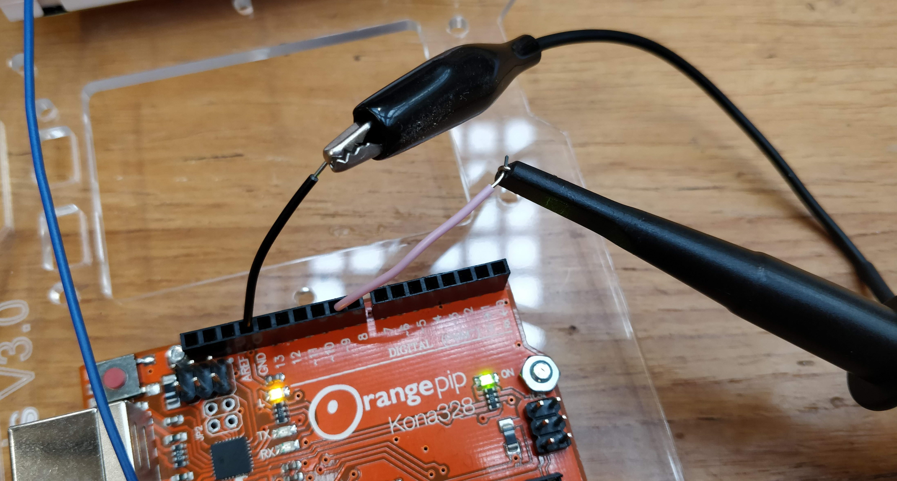
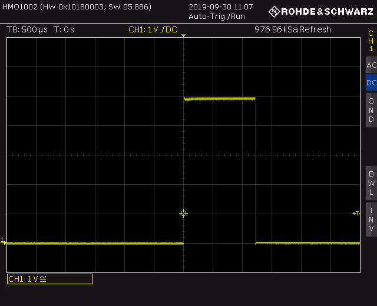
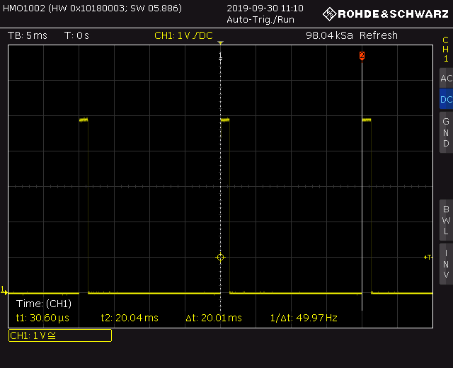

# Lab Skills
## Part 1
## Section 2 - Pulses

In this section you will use the oscilloscope to measure electrical pulses, and use those pulses to control a servo motor. The multimeter is useful for measuring static values like resistance or the voltage of a power supply but often we are more interested in how a quantity varies over time.
Voltages and other electrical quantities can change very quickly in electronic circuits and the oscilloscope is an instrument designed to display graphs of rapidly-changing signals.

A servo motor is a motor used to control the position of a mechanism.
The types included in your kit can't rotate continuously, but they can turn to a specific angle when commanded by a control signal.
In this section you'll use the Orangepip to generate the control signal and use the oscilloscope to find out how it works.
You'll need these items for this section:

| Description | Quantity | 
| -------- | ----------- |
| **Modules and assemblies** |
| EEEBug Chassis Assembly | 1 |
| **Equipment** |
| Oscilloscope | 1 |
| **Electronic components** |
| 3 way 2.54mm header | 2 |
| 10kΩ rotary potentiometer | 2 |
| **Wires and cables** |
| USB Cable | 1 |
| **Software** |
| [Arduino IDE](https://www.arduino.cc/en/software) |
| Fritzing ([Windows](https://imperiallondon-my.sharepoint.com/:u:/g/personal/estott_ic_ac_uk/EYMSuKU6nKdAtQDBqZ-yAmMBWbiFopQst7zYHCAp1rQMTA?e=rfrjEL), [macOS](https://imperiallondon-my.sharepoint.com/:u:/g/personal/estott_ic_ac_uk/EWyf1x87xQ9Hp-aI3YnMoEkBMoU5QXcG53RMPQRNkjm4cw?e=ZKbIkh), [Linux](https://imperiallondon-my.sharepoint.com/:u:/g/personal/estott_ic_ac_uk/EacyJjYan05PuMJQt34p5RQBWNtDkKRTS75Gl9E8ZVk-rw?e=Bm9uFJ))|
| **Downloads** |
| `servo.fz` Fritzing project‡ |
| `twoservo.fz` Fritzing project‡ |
| `servo.ino` Arduino Sketch‡ |

*‡The easiest way to download source files from GitHub is to get a copy of the entire lab note repository from [here](https://github.com/edstott/EEE1labs/archive/refs/heads/main.zip). The files are in EEE1labs/skills/downloads.*

### Before the lab
Install [Arduino IDE](https://www.arduino.cc/en/software) on your computer.
[Watch this video about using the oscilloscope](https://imperial.cloud.panopto.eu/Panopto/Pages/Viewer.aspx?id=9507f2f9-77a8-4b19-80d2-aada00cc383d)
	
### Test the servo motors
	
Connect a servo motor to the breadboard and the Orangepip as shown in the Fritzing project `servo.fz`.
The servo cable connects via a 3-pin header, which may already be inserted into the connector at the end of the servo motor cable.
Be certain that you have connected the servo motor wires correctly according to colour — it is possible to damage the servo motor if it is connected incorrectly.
A potentiometer is also included and, like before, it is used as a potential divider to generate a variable voltage.
The output from the potential divider is connected to the Orangepip, which converts the voltage into a control signal for the servo motor.
		
Connect the Orangepip to your computer with the USB cable.
Run Arduino IDE, open the `servo.ino` file and connect to the Orangepip by clicking Tools→Port and selecting the item which says `Arduino Uno'.
Click the upload button, which will start the compilation process and program the Orangepip.
		

		
Now when you power up the circuit you should see some initial movement of the servo motor.
Try turning the potentiometer and you should see the servo motor change position.
	
- [ ]	Wire up a servo motor to the 5V power supply and the control signal generated by the Orangepip. Check that you can rotate the motor using the potentiometer. Suggested logbook entry: video of servo moving (or photos in different positions if an embedded video is not possible).
	
### Oscilloscope
	
The servo motor is controlled by a digital pulse signal.
A digital signal is a voltage that switches between two discrete levels and a pulse means that the waveform is asymmetric — the signal is on for less time than it is off.
The servo motor signal has pulses at a regular interval of 50 per second (50 Hz) and the *width* (on time) of each pulse is in the range 0.5–1.5ms.
		

	
The oscilloscope normally shows a graph of voltage on the y axis and time on the x axis.
The x origin of the graph (where time = 0) is synchronised to an event called the *trigger*.
Every time a trigger occurs, the graph is updated and if the trigger happens very frequently you will see waveform following any changes to the signal in real time.
		
The oscilloscope measures voltage with a *probe* that is connected to the signal that you wish to measure.
Connect one of the oscilloscope probes to the terminal A on the PicoScope.
The probe connector has a bayonet-type connector that you twist to lock into place. 
Make sure that the slider on the body of the probe is set to '10x'.
		
Disconnect the servo motor control wire from pin 9 of the Orangepip and connect the oscilloscope probe in its place with a short length of wire as shown below.
Since voltage is a relative measurement, not absolute, a ground lead is also attached to a reference point on the circuit — usually the 0V or GND node of the circuit.
Connect the ground lead to the GND pin with a separate piece of wire.
		

Set up the oscilloscope as follows:
1. Load the default settings by pressing `SAVE/RECALL`, then choosing `DEVICE SETTINGS`, `LOAD` and selecting `EELAB.SCP` with the `SELECT` knob.
2. Set up the oscilloscope probes. Usually they are used in ×10 mode, so set the switch on the probe to the correct position and tell the oscilloscope they are in this mode by pressing `MENU`, selecting page 2, choosing `PROBE` and selecting the ×10 option.
3. The signal has a voltage range of 0--5V. The oscilloscope screen has 10 vertical divisions so choosing 1 volt per division will fit the signal on the screen nicely. Adjust the vertical sensitivity `VOLTS/DIV` until 'CH1: 1V` is shown in the bottom left of the screen.
4. The minimum voltage of the signal is 0V so change the vertical position to move the y axis origin to near the bottom of the screen with the `POSITION` control. The y origin is temporarily displayed as a line as you change the setting, then it reverts to an arrow with the channel number (1) on the left of the screen.
5. The signal has a frequency of 50Hz: a period of 20ms. The oscilloscope has 12 horizontal divisions so a horizontal resolution (called the *timebase*) of 5ms per division will let us see at least 2 repetitions of the signal on the screen. Adjust the timebase control `TIME/DIV` until 'TB: 5ms' is shown in the top left of the screen.
6. The trigger should be set up to detect the rising edge of the pulses. That way, each pulse that is captured will be displayed in the same position on the screen. Set the trigger threshold voltage to 2.5V with the trigger `LEVEL` control so that the threshold is crossed when the signal transitions from 0V to 5V.

You should see a graph showing the pulses of the waveform.
Use the gridlines on the oscilloscope screen in conjunction with the displayed vertical sensitivity and timebase to read the voltage and period (repetition time) of the signal.
Decrease the timebase to 0.5ms per division to `zoom in' on the pulse and measure its width more accurately. 

Adjust the potentiometer on your breadboard to see how the signal changes as the servo is commanded to move to different angles.
This system of representing information in the width of a pulse is called *pulse width modulation* (PWM).
		

	    	
- [ ]	Use the oscilloscope to display the servo motor control signal. Make measurements of the period, pulse width and voltage of the signal using the oscilloscope display gridlines. Suggested logbook entry: a screen capture of the oscilloscope showing pulses.
	
### Cursors
	
Using the gridlines to make precise measurements can be labourious so *cursors* are provided make it easier.
Change the timebase back to 10ms so that multiple pulses are visible on the screen.
Turn on x axis cursors by pressing `CURSOR MEASURE`, selecting `TIME` and pushing the knob twice.
Then, move each cursor on the screen by turning the knob. Pressing the knob selects a different cursor to adjust — the active cursor or cursors are shown with a solid line.

Move the cursors so they align with the rising edges of two consecutive pulses.
Now you can read the time difference between the pulses (and hence the period of the signal) as the Δt value shown on the screen. The equivalent frequency 1/Δt is also given. Zoom in on a single pulse and set the cursors to the rising and falling edges to find the width of the pulse and the relationship between potentiometer output voltage and pulse width.

Cursors can also be used to measure voltage.
Change the cursor mode to y axis by repeating the cursor set-up process and selecting `VOLTAGE` instead of `TIME`.
Check the difference between the high and low voltages of the signal.

- [ ]	Use the cursors to make more accurate measurements of the control signal characteristics. Find the relationship between the potentiometer voltage and the pulse width. Suggested logbook entry: a table of voltages and pulse widths.

- [ ] Reconnect the servo motor and find the relationship between the pulse width and approximate motor angle (it's fine to guess if you don't have a protractor or similar to measure angle). Suggested logbook entry: an extra column in the previous table showing approximate motor angle.
		
### Challenge: two servo motors
The Orangepip can generate control signals for two servo motors. Use the circuit in `twoservo.fz` to connect a second servo motor and potentiometer.
