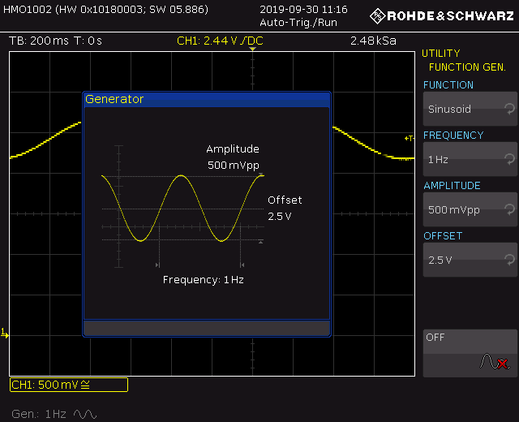
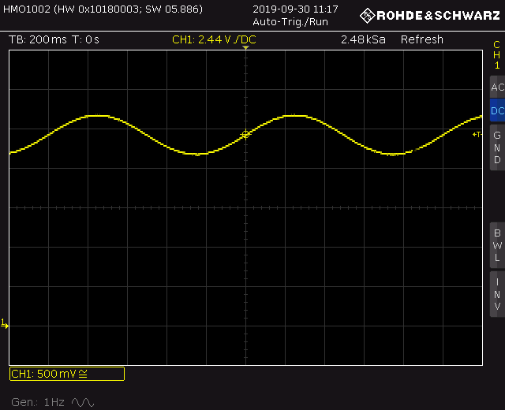

# Lab Skills
## Part 1
## Section 3 - Sinusoids

Sinusoidal signals are an important class of signal in electronics and signal processing.
In this part of the experiment, we will use a sine signal to achieve a smooth side to side sweep of the antennae.
The sine wave will be generated by the signal generator (also know as arbitrary waveform generator) in the PicoScope.

| Description | Quantity | 
| -------- | ----------- |
| **Modules and assemblies** |
| EEEBug Chassis Assembly | 1 |
| **Equipment** |
| Oscilloscope | 1 |
| **Electronic components** |
| 3 way 2.54mm header | 2 |
| 33kΩ resistor† | 1 |
| 68kΩ resistor† | 1 |
| 1μF ceramic capacitor† | 1 |
| **Wires and cables** |
| USB Cable | 1 |
| **Software** |
| [Arduino IDE](https://www.arduino.cc/en/software) |
| Fritzing ([Windows](https://imperiallondon-my.sharepoint.com/:u:/g/personal/estott_ic_ac_uk/EYMSuKU6nKdAtQDBqZ-yAmMBb-T4JyRNwS-hO_WeYL_piw?e=5aDJaS), [macOS](https://imperiallondon-my.sharepoint.com/:u:/g/personal/estott_ic_ac_uk/EWyf1x87xQ9Hp-aI3YnMoEkBMoU5QXcG53RMPQRNkjm4cw?e=ZKbIkh), [Linux](https://imperiallondon-my.sharepoint.com/:u:/g/personal/estott_ic_ac_uk/EacyJjYan05PuMJQt34p5RQBWNtDkKRTS75Gl9E8ZVk-rw?e=Bm9uFJ))|
| **Downloads** |
| `phase-shift.fz` Fritzing project‡ |
| `twoservosin.fz` Fritzing project‡ |
| `servo.ino` Arduino Sketch‡ |

*†Collect from lab component drawers*

*‡The easiest way to download source files from GitHub is to get a copy of the entire lab note repository from [here](https://github.com/edstott/EEE1labs/archive/refs/heads/main.zip). The files are in EEE1labs/skills/downloads.*

### Before the lab
[Watch this video about using the oscilloscope function generator](https://imperial.cloud.panopto.eu/Panopto/Pages/Viewer.aspx?id=17f83d22-ac33-4d37-8c64-aada00d16a17)
	
### Generate a sine wave
	
First you need to calculate the characteristics of the sine wave — if a voltage is represented by the function y = A sin(ωt) + c, then the parameters A, ω and c define its characteristics:
* A is the amplitude and will represent the angular range of motion of the motor. Use your measurements from the previous section to find the voltage that will achieve approximately 30° total rotation range, i.e ±15° from the centre position.
* ω is the angular velocity — this should be chosen to give an oscillation frequency of 1Hz, bearing in mind that the relationship between angular velocity and frequency is ω=2𝜋f.
* c is a constant, also known as a *DC offset*. It is needed because a pure sine function will give a negative output at times and the input voltage to the Orangepip must be in the range 0–5V. Use c=1V, which is the maximum DC offset of the PicoScope signal generator.
	
Turn on the function generator by pressing `UTIL` and selecting 'FUNCTION GENERATOR'. Use the menu and control knob to set up the parameters of the signal as required. Connect a BNC–test clip lead to the output connector and connect the oscilloscope probe to the test clips. Use the oscilloscope to check that signal characteristics, setting up the vertical and horizontal axes as required for the expected voltages and time periods.
		

		
Note that the x axis of the oscilloscope will now represent at least one second of time and so the update rate of the screen will be quite low. Allow time for the screen to update following an adjustment before making further changes to the controls. Remember to choose an appropriate trigger voltage.
		
Connect the sine signal to the input pin of the Orangepip, disconnecting the potentiometer that you used before. Power up the circuit and check that the servo motor moves as expected. Use the oscilloscope to verify that the pulse width of the servo motor control signal is varying as the motor moves.
	
- [ ] Set up the function generator on the oscilloscope to create a sine signal input to the Orangepip. Check the pulse output varies as you expect and connect the servo motor to see it sweep from side to side. Suggested logbook entry: oscilloscope screenshots of function generator, sine wave and pulses, and a video of the antenna moving.

### Make a phase shifter
	
The sine signal could be connected to the second servo control input but then the antennas would be locked in the same position. It would be more interesting to allow the antennas to move at the same frequency but with a time lag between them, known as a *phase shift*. A phase shift is represented mathematically by adding a time offset φ to the sine function so it becomes y = A sin(ωt+φ) + c.
	    
A phase shift can be implemented using the circuit in the Fritzing project `phase-shift`.
You will learn how it works in detail soon, but for now think of it as integrating the sine function thanks to the capacitor equation V(t)=1/C ∫ I(t) dt.
Integrating sine produces a cosine, which is equal to a phase-shifted sine.
Build the circuit on the breadboard and connect the phase shifter output to the second oscilloscope probe, so that you can compare the input and output of the circuit.
		
Set up channel 1 to display the input sine signal as before and then add the second oscilloscope channel by pressing `CH2` and setting all the y-axis settings the same as channel 1. You should now see two sinusoids on the oscilloscope screen with a time lag between them.
		

		
Use the time axis cursors to measure the time difference between the signals.
From this calculate the phase difference in radians according to the formula φ = 2𝜋t/T, where t is the time difference and T is the period of the signal.
Try changing the value of the resistor in the circuit to find the effect on the phase.
A drawback of this circuit is that the amplitude of the output signal is less than the input; this is known as *attenuation*.
You'll also find that the amount of phase shift and the attenuation vary with the frequency of the input.

- [ ] Build the phase-shift circuit on the breadboard and use oscilloscope cursors to measure the phase difference between the input and output sinusoids. Suggested logbook entry: screenshot of sine waves with phase difference

You can use your two sine signals with a phase shift to control your antennae.
Connect them to the Orangepip inputs A0 and A1, like you did with the potentiometer outputs in [Section 2](https://github.com/edstott/EEE1labs/blob/main/skills/section2.md#challenge-two-servo-motors).
Connect the two servo motors to pins 9 and 11 via the breadboard the same as before.
Refer to the design in `twoservosin.fz`.
		
- [ ] Connect the sine wave and phase-shifted sine wave to the Orangepip and observe the effect of the motors moving out of phase. Suggested logbook entry: video of the antennae moving.
	
### Challenge: more signals
You may have noticed that the oscilloscope can generate other types of signal.
You can try using the signals to control the servo motors via the Orangepip, but make sure to respect the 0--5V input voltage limit of the Orangepip.
Measure the maximum and minimum voltage peaks before connecting the signal to the Orangepip.
			
Try the following exercises on the oscilloscope:
1. Set up a pulse signal with 5kHz frequency, 1Vpp amplitude, 1V DC offset and 10% duty cyle. The rise time of a digital signal is the time taken for the signal to change from 10% to 90% of the final voltage during a transition. Likewise, the fall time is measured from 90% to 10%. Measure these values by zooming in with the timebase until the edges become slopes and using the cursors.
2. Set up a sine signal with 25kHz frequency, 100mVpp amplitude and 3V DC offset. You will find it hard to get a steady trigger on this signal because the amplitude is small compared to the DC offset. Try changing the input channel mode from DC to AC. What does this do and how is it useful?
3. Set up a ramp signal with 500Hz frequency, 2Vpp amplitude and 1V DC offset. Zoom in on part of the ramp until the timebase is 50μs and the vertical sensitivity is 50mV. The ramp now appears to have steps, why is this?
4. Set up a triangle wave with 1kHz frequency, 1Vpp amplitude and 2V DC offset. Instead of adjusting the vertical and horizontal controls manually, try pressing the button marked `AUTO SET`. This is a helpful shortcut but always take care because the scope might decide to focus on some kind of noise instead of the signal you intended. Always check the vertical and horizontal sensitivities are a reasonable value after using Auto Set.

- [ ] Suggested logbook entries: oscilloscope screenshot of each signal plus discussion of questions. 
