# Lab Skills
## Part 1
## Section 4 - Power and Motor Drive

This experiment continues work on the EEEBug platform and develops it into a self-powered, autonomous, light-seeking robot.
To complete the EEEBug, you will need to assemble a printed circuit board, sense light with the phototransistor antennae and develop code for the Orangepip module.

In the first section, you will build and test the printed circuit board, which is used to manage the battery and drive motor connections on the EEEBug PCB.

## Before the lab

[Watch this video about soldering a printed circuit board](https://imperial.cloud.panopto.eu/Panopto/Pages/Viewer.aspx?id=407366d5-b4be-4e33-80a8-ab28010574bb).

## Bill of Materials

A *bill of materials* (BOM) is a list of all the parts needed to assemble a design.
The table below is the BOM for the completion of the EEEBug, starting from the partially-built result of the first Lab Skills experiment.

| Designator | Quantity | Description | 
| ---------- | ----------- | -------- |
|            | | **PCB Assembly** |
| | 1 | EEEBug PCB v3.0 |
| C1, C2 | 2 | 10nF Ceramic Capacitor |
| C3 | 1 | 100µF Electrolytic Capacitor* |
| C4 | 1 | 10µF Electrolytic Capacitor* |
| D1 | 1 | 1N4004	Diode* |
| F1 | 1 | CFH02 Fuseholder |
| J1, J6 | 2 | 2×2 Way PCB Socket |
| J2 | 1 | 1×2 Way PCB Socket |
| J3 | 1 | 1×4 Way PCB Socket |
| J7, J8, J9 | 3 | 2 Way Screw Terminal Block* |
| R1, R2 | 2 | 1Ω	Resistor |
| SW1 | 1 | STSSS9121 SPDT Slide Switch |
| U1 | 1 | MCP1826S-5002E/AB 5V Linear Regulator* |
| | | **Other Electronic Components** |
| | 2 | DC Motor Assembly* |
| | 1 |	1A Fuse |
| | 4 | LR6 Alkaline Cell* |
| | 2 | BC337 NPN Bipolar Junction Transistor* |
| | 2 | 1kΩ	Resistor |
| | | **Mechanical Components** |
| | 2 | Wheel |
| | 2 | Rubber O-ring |
| | 2 | Self-tapping Screw |
| | 1 | M4×18mm Machine Screw with Panel Head |
| | 4 | M3×25mm Machine Screw with Panel Head |
| | 2 | M3×10mm Machine Screw with Panel Head |
| | 4 | M2.5×12mm Machine Screw with Panel Head |
| | 2 | M2.5×10mm Machine Screw with Countersunk Head |
| | 1 | M4 Nut |
| | 1 | M4 Washer |
| | 1 | M4 Dome Nut |
| | 6 | M3 Nut |
| | 6 | M2.5 Nut |
| | 1 | Keystone 2478 Battery Box |
| | 2 | PCB Spacer |

*Polarised components must be connected in the correct orientation. Check before soldering and powering up!

- [ ] Find all the components you will need to finish the assembly of the EEEBug PCB
	
## PCB Assembly

A *printed circuit board* is an assembly of electronic components soldered onto a substrate that contains wiring, holes and other features.
Unlike the breadboard, a PCB is designed to implement a specific circuit and it is not readily reuseable for different applications.
A PCB is, however, much more reliable than a breadboard and its parasitic impedances are smaller and easier to predict.
		
The function of the EEEBug PCB is *power management*. 
It takes electrical power from a battery pack and *regulates* the voltage so that it behaves more like an ideal voltage source.
It also provides *circuit protection* to reduce the damage arising from faults or errors, and connectors to supply power to other parts of the EEEBug system.
There are also connectors and *current sense* resistors for the main motors.

### Component placement

Assemble the PCB by placing and soldering the components one by one.
Each PCB component has a unique *designator* that links the BOM, the circuit diagram and the PCB.
Fit each component into the holes indicated its designator and outline markings.

Refer to the BOM and [circuit diagram](graphics/EEELAB-EEEBUG-002.PDF) to identify all the components.
		
Be aware of *polarised* components, which must be fitted in a specific orientation.
Polarised components have markings or other features on their bodies that relate in some way to the outline markings on the PCB.

For example, the 1N4004 diode has the standard circuit symbol for the diode: 

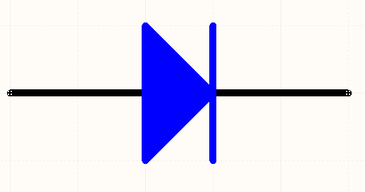

The physical component has a silver or white band around its body:

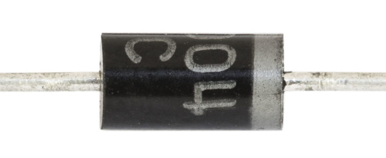

And the PCB footprint shows the band to indicate the correct orientation:

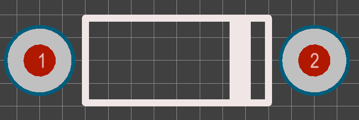

If you are unsure about polarisation markings consult the component datasheet, which will contain drawings that highlight the markings and show how they relate to the circuit symbol.

### Soldering

#### Soldering Safety
1. Soldering iron tips and molten solder will burn instantly on contact with skin. Take care and always seek help if you suffer a burn.
2. Wear safety glasses when soldering because the process occasionally ejects hot flux
3. The PCB, components and solder joint will retain heat. Avoid touching them until they have cooled.
4. Component leads and wires conduct heat so avoid holding them while soldering. If you do need to support them, hold them as far away from the joint as possible.
5. Tie back long hair and remove dangling jewellery before soldering.
6. Solder no longer contains lead so it is safe to handle. However, it does contain flux, a chemical which helps the molten solder flow over the joint. Flux emits fumes when it is heated - avoid inhaling it.

Once a component is placed its leads must be soldered to the *pads* on the PCB.
It will take some practice to master the technique so watch the preparation video, ask for a one-to-one demo and practice on a spare PCB.
Components are difficult to remove once they are soldered, so take time to check that the component type and orientation are correct before making the joints.
		
The soldering process is illustrated below a cross-section through the PCB.

First, the component leads are bent if necessary and inserted through the correct holes in the PCB. 

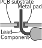

Then, the soldering iron is used to heat up both the lead and the pad where they meet.

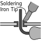

Once the area is hot enough, solder is introduced to the joint.

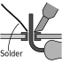

Add enough solder to cover the entire pad and fill the gap around the lead and keep the soldering iron in place long enough so that the solder flows around the joint.

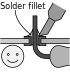

If there is not enough heat, or if the soldering iron is removed too early, the solder won't stick to the metal parts properly and the joint will be unreliable (e).

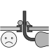

Check the following to ensure you have a good quality joint:

- Set the soldering iron temperature to 340C to melt the solder reliably.
- The pad, lead and iron should be clean and shiny before soldering. Use the sponge, tip cleaner and/or a small amount of solder to keep the iron tinned with a thin layer of bright solder.
- Good joints are smooth, shiny and have a concave surface.
- Too much solder can cause short circuits and make it hard to check the quality of the joint. Use a desoldering pump to remove solder if there is too much.
- Thicker leads and larger pads will take longer to reach sufficient temperature for a good joint.

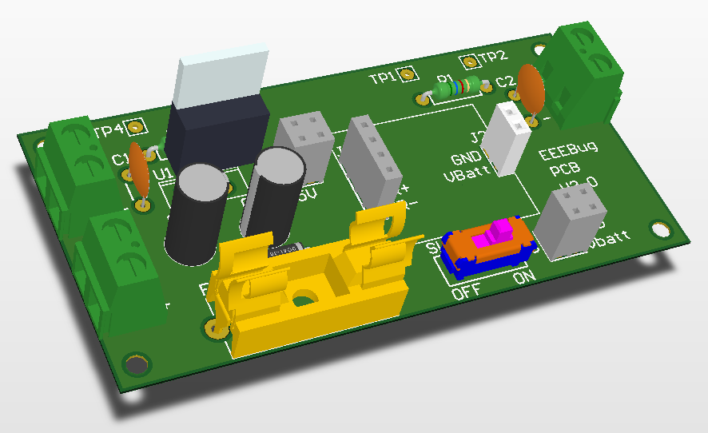

- [ ] Solder the components onto the PCB
		
## Continuity Testing
	
PCBs are normally tested at manufacture to check far any defects.
Developing a quick, automated test procedure will be an important part of the design process of a commercial design, a principle known as *design for test*.
For prototyping, you will need to test your PCB manually using *continuity testing* and *functional testing*.
		
A continuity test is a measurement of resistance to check that the connections between components are correct.
A measurement between component terminals that are connected to the same circuit node should show a very low resistance, while terminals on different nodes should produce a higher reading.
Checking continuity before applying power to a circuit can prevent permanent damage, especially if there are *short circuits*.
		
Test continuity by studying the circuit diagram for the PCB and identifying all the different nodes (nodes are also called *nets* on a PCB).
Set your multimeter to *continuity test* mode, which measures resistance and gives an audible tone when it is low so you can check continuity without looking at the display.

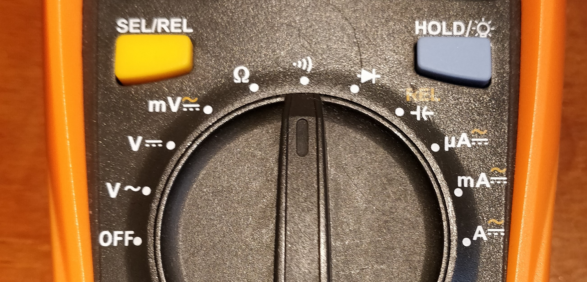
		
For each node in the circuit, check that all the component terminals on that node have continuity (low resistance) between them.
Probe the component leads directly so you are measuring both the solder joints and the PCB track.
Be wary of intermittent connections - if the measurement seems unreliable try pushing the component to check for an insecure joint.

		
Also test for short circuits by probing between different pairs of nodes.
This time there should be no direct continuity, however, some node pairs may exhibit a low resistance due to the components in the circuit, for example the 1Ω resistors.
Short circuits are a particular problem between power nodes, so make sure to check that there is no connection between these nets:

- Vbatt and GND
- 5V and GND
- Vbatt and 5V
- the + and - terminals of J7, J8 and J9

- [ ] Use the multimeter to test for continuity and short circuits. Repair any faults by resoldering the affected joints.
	
## Functional Test
		
Before you can test the functionality of your PCB you will need to build a pair of motor drivers on your breadboard.
Each motor driver is a transistor, which acts a switch to allow the low-current output of the Orangepip to control the high-current motor.
Build the motor drivers and connect them to the Orangepip and PCB as shown below.
Do not mount the PCB and motors to the EEEBug chassis at this time in case there are faults to repair.
Look up the datasheet for the BC337 transistor to determine the relationship between the circuit symbol and the physical package so you can connect the terminals correctly.
	
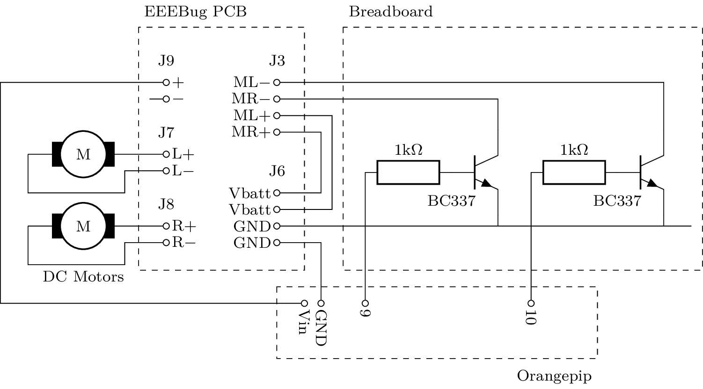
  
The PCB is designed for use with a 6V battery, but for now use the Orangepip with the 7.5V power supply by connecting the Vin pin to J9 on the PCB.
This is safer for testing because the power supply has a maximum current of 1A whereas, if there is a fault, the short circuit current of the battery is much higher and it could melt wires and connectors.
Fuse F1 is used to protect against most faults but it would not guard against, for example, a short circuit between the pins of J9.
		
- [ ] Build the motor drive circuit on the breadboard and connect it to the Orangepip and EEEBug PCB
		
It is common for electronic systems to have dedicated test software that is loaded during manufacture to exercise all the functionality of the system quickly and systematically.
Download the `motorTest.ino` Arduino sketch from this repository, compile it with the Arduino IDE and download it to the Orangepip.
The test software generates PWM signals that drive the motors at variable speeds - you can view these with the oscilloscope on pins 9 and 10.
These are connected to the transistors to control the motors.
The motor speed varies with the pulse width.
		
The EEEBug PCB includes two resistors, R1 and R2, for *current sensing*.
Measuring voltage across a current sensing resistor is easier than using an ammeter to measure current because the circuit would have to be broken to insert the ammeter in series with the motor.
Measure the current through the right motor (J8) by measuring the voltage between the *test points* TP1 and TP2 using the multimeter.
You should find the current varies as the PWM duty cycle changes, up to a maximum of around 80mA.
Since the resistance is 1Ω, the magnitudes of the voltage and current are equal.
Repeat for the left motor with TP3 and TP4.

- [ ] Load the motor test code onto the Orangepip and confirm that the motor speeds vary according to the PWM signals. Measure the motor current using the current sensing resistors.
		
The final test is to measure the output of the voltage regulator.
With the Orangepip power supply still connected, use the multimeter to confirm that the voltage between the 5V and GND pins of J1 is 5 Volts.
		
## EEEBug final assembly
	
Now you have tested the PCB you can finish assembling the EEEBug.
Refer to the [assembly drawing](graphics/EEELAB-EEEBUG-010_1-0.pdf) to see how the parts should be fitted to the chassis.
You may need to refer to the assembly drawing in Lab Skills Part 1 if any of the Part 1 assembly is incomplete.
		
The wire to Orangepip Vin should be disconnected and the battery box wired to J9 in its place.
You can also disconnect the USB cable from the Orangepip and supply its power from the EEEBug PCB instead.
Add a wire between a 5V pin of J1 and the 5V pin of the Orangepip.
When switched on, the EEEBug should drive in a meandering line as the motor speeds vary.
The modified connection diagram is shown below.
		
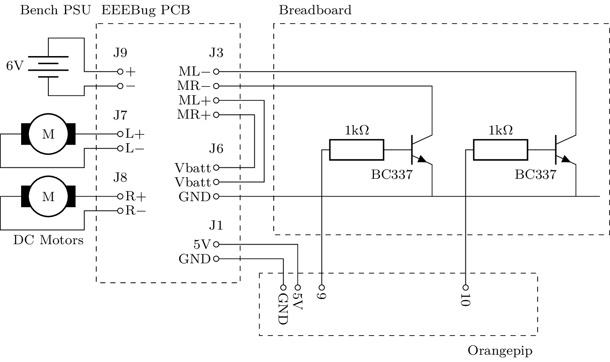

- [ ] Finish constructing the EEEBug
