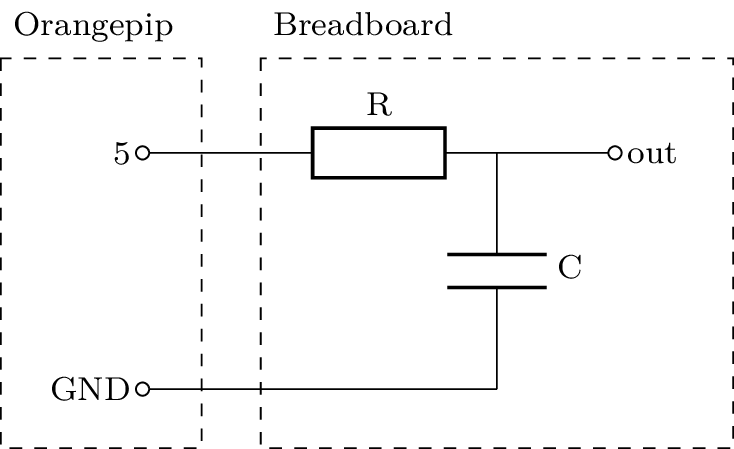
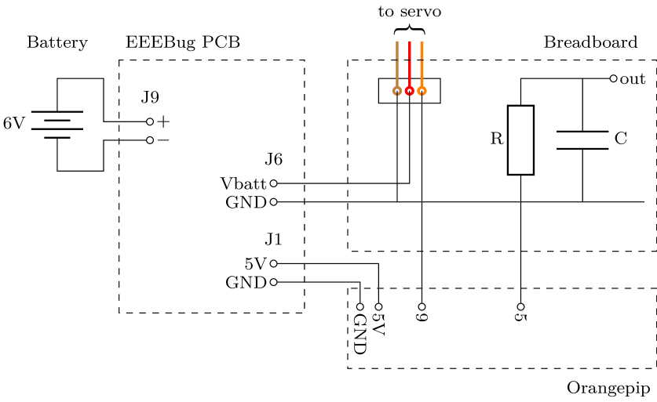

# Lab Skills
## Part 2
## Section 5 - Signal Generation
	
### Synthesising a signal
	
In Part 1 of Signals and Systems, you used the function generator to provide the sine wave that controlled the motion of the antennae servo motors.
The EEEBug cannot remain permanently tethered to the function generator so you will need to create the sine wave using the Orangepip.
Enter the following an Arduino *sketch* (C++ source file), which executes the sine function in a loop over an entire cycle.. 
		
    void setup() {
      //Initialise serial port
      Serial.begin(9600);
    }

    void loop() {
      //Iterate over one cycle of the sine wave
      for (double x=-PI; x<PI; x += 0.025)
        //Write the value of the sin function to the serial port
        Serial.println(sin(x));
    }

Arduino sketches don't contain a `main()` function like a normal C++ programme.
Instead, there is a `setup()` function, which runs once when the microntroler is programmed or powered up, and a `loop()` function, which runs repeatedly thereafter.
Like most embedded software, the code loops forever (until power off or a hard reset) and it does not terminate.

The sketch uses the `Serial.println()` function to send data over the USB cable to the attached computer.
`Serial.begin()` initialises the communication port with the given speed, in this case 9600 bits per second.
You can view the data on your computer once the code is running by opening the Serial Monitor, found in the Tools menu.
You may need to set the bit rate in the Serial Monitor to 9600 to match the code.
		
Observe the results of your sine calculation on the Serial Monitor.
You can also use the Serial Plotter, which plots numerical data from the serial port as a graph.
		
- [ ] Run the sin function on the Orangepip and view the results with the Serial Plotter.

### Digital to analogue conversion

The Orangepip does not have a true analogue output to turn the sine function into a voltage signal, but you can create one using a digital PWM output and a filter.
Use the `analogWrite()` to set the duty cycle of output pin 5 to the value returned by the sin function.
You'll need to apply scaling and an offset to change the range of the output from [-1,+1] to [0,255].
Remove the serial output now because it slows down the execution too much.
Look at the signal on pin 5 with the oscilloscope.
			
    void setup() {
    }

    void loop() {
      //Iterate over one cycle of the sine wave
      for (double x=-PI; x<PI; x += 0.025) {
        //Calculate sin(x) and scale the result to the range 0-255
        int outPWM = (sin(x) + 1.0) * 127.5;
        //Set the PWM duty cycle of pin 5 to the value of the sin function
        analogWrite(5,outPWM);
      }
    }

- [ ] Use the sin function to vary the duty cycle of a PWM signal.
	
The PWM signal you have generated is a digital signal and it doesn't look like a sine wave.
If you zoom out with the timebase you can maybe see how the duty cycle varies over time.
The average voltage of a PWM signal is proportional to its duty cycle so you can turn your digital PWM signal into an analogue sine wave by passing it through a low-pass filter, as shown below.
	

*Digital to analogue conversion with PWM. Upper trace: unfiltered PWM signal. Lower trace: filtered PWM signal. Note the phase shift of the sine wave caused by the low-pass filter*

Using the circuit below, build an RC low-pass filter with a corner frequency of 10Hz and use it to covert the PWM signal into a sine wave.
The frequency of the PWM square wave is around 1kHz so it is removed by the filter leaving just the sine wave.
Resistor R should be less than 100kΩ.
			

- [ ] Use a low-pass filter to convert the PWM signal to a sine wave.
		
### Timers
	
The frequency of your sine wave is too fast for sweeping the antennae.
The Orangepip CPU has built-in *timers* that allow you to measure time and control the execution speed.
		
The `delay(int milliseconds)` function pauses execution for the number of milliseconds passed in the argument.
You can use it to control the rate at which a loop executes, like this example for flashing the LED at 1Hz:
			
    //Initialise global variables and constants	 
    bool LEDstate = False;
    const int INTERVAL = 500;

    void setup() {
      //Set LED pin to output mode
      pinMode(LED_BUILTIN,OUTPUT);	
    }

    void loop() {
      //Wait for 500ms
      delay(INTERVAL);

      //Toggle the LED and set the output pin
      LEDstate = !LEDstate;			
      digitalWrite(LED_BUILTIN,LEDstate);
    }

Based on the example above, add a delay to your sine wave generator to set the sine wave frequency to 1Hz.
You will need to consider the number of iterations of the inner loop that are needed to complete an entire period, which is governed by the bounds and step size of the `for` loop.

- [ ] Add a delay to control the frequency of the sine function and verify the result with the oscilloscope.
	
### Challenge: Servo motor control
As you saw in Lab Skills Part 1, the servo motors for the EEEBug optical antennae are controlled by a form of PWM signal, where the width of the pulse commands the motor to move to a certain angle.
A dedicated library `Servo` is provided in Arduino IDE that adjusts the PWM signal to the correct frequency for a servo motor and converts between angle and pulse width.
			
Open the `Sweep' example code for the Servo library in Arduino IDE from the menu File→Examples→Servo.
Study it to see how the servo motor is initialised and then commanded to go to a certain angle.
Modify your sine wave code so that each sine calculation is used to set the angle of the servo motor.
The Servo library permits a range of angles from 0° to 180° and start by making your antennae oscillate between 75° and 115°, where 90° is straight ahead.
Use pin 9 to control the servo and retain the PWM output on pin 5.
			

			
- [ ] Make the antenna servo motor sweep from side to side to follow your sine function.

Previously, you used both servo motors with a phase difference between them.
You can recreate this functionality by adding a second calculation for $\text{sin}(x+\phi)$ and sending the result to a second `Servo` instance attached to pin 10.
			
- [ ] Add a second output channel with a phase offset and adjust the parameters to achieve an effective sweep motion of both antennae.	
