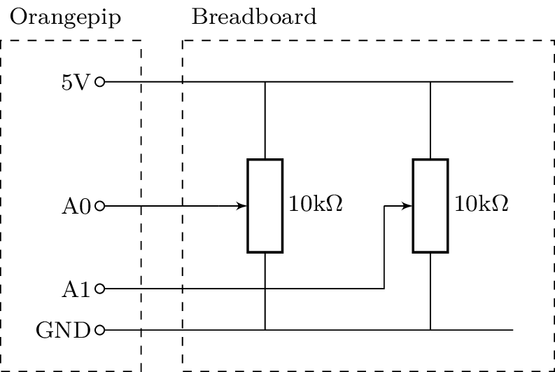
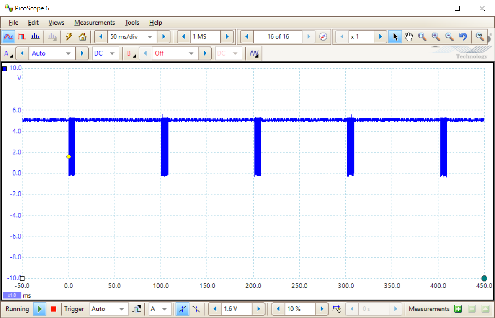
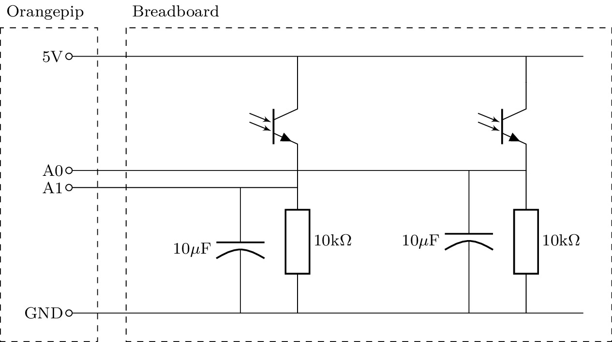

# Lab Skills
## Part 2
## Section 6 - Sensing

### Analogue to Digital Conversion

The Orangepip microcontroller can measure a voltage and represent it as a binary number using a hardware feature called an *analogue to digital converter* (ADC). 
		
Build the circuit below to test the ADC with variable input voltages from potentiometers.

Create a new sketch in Arduino IDE and enter the following code:
		
    void setup() {
      //Initialise pin modes and serial
      pinMode(A0, INPUT);
      pinMode(A1, INPUT);
      Serial.begin(9600);
    }

    void loop() {
      //Read both input voltages
      int VA0 = analogRead(A0);
      int VA1 = analogRead(A1);

      //Write ADC values to serial
      Serial.print(VA0);
      Serial.write(' ');
      Serial.println(VA1);

      //Pause before next calculation
      delay(100);
    }
		
The `loop()` function reads the voltage of the two input pins and transmits it over the *serial port*.
Compile and download the code to the Orangepip.
View the results on the Serial Monitor.
The compiler puts the `loop()` function in an infinite loop so you should see repeated messages displaying the value of each analogue input on the Serial Monitor.
		
You should see the ADC results change as you adjust the potentiometers.
Measure the voltages at the A0 and A1 pins of the Orangepip and find the relationship between voltage and ADC value.

- [ ] Connect the ADC input and find the relationship between voltage and ADC value.
	
### UART Communication

The data sent over the serial port uses a *UART* (universal asynchronous receiver transmitter) protocol.
In UART, each byte (8 bits) of data is sent as a digital sequence preceded by a *start bit* (logic low) and terminated by a *stop bit* (logic high). The least significant bit (bit 0) is transmitted first, so the binary data will appear reversed on an oscilloscope trace compared to how you would normally write it.
		

For example, a transmission of `0x31`, which is the ASCII character `1`, would look like this:

		
In the Arduino library, `Serial.print(int val)` converts the integer `val` to a string of characters and sends them in ASCII format.
For example, if `val`=10, the bytes `0x31` and `0x30` would be sent, since these are the ASCII character codes for `1` and `0`.
		
You'll also see in your code the function call `Serial.write(' ')`.
This function sends data without converting it from a number to text, so the space character given as the argument is sent as an ASCII code `0x20`.
		
The final serial communication function used is `Serial.println()`.
This is the same as `Serial.print()`, except two extra bytes are appended to the end: `0x13` and `0x10`.
These two bytes are the ASCII characters for 'carriage return' and 'line feed' and they make the next message appear on a new line in the Serial Monitor window.
		
Overall, this means that each message should consist ofthe following bytes:

| Number of bytes | Content |
| --------------- | ------- |
| 1–4             | `VA0` in decimal charcters |
| 1               | Space character |
| 1-4             | `VA1` in decimal charcters |
| 2               | New line characters |
		
You can see the UART signal by connecting the oscilloscope to pin 1 of the Orangepip.
A transmission occurs in a burst approximately every 100ms, as shown below.
		

 
 Identify all the data in your message within the observed signal.
 You may find it helpful to fit the whole transmission into the oscilloscope screen then use the Zoom button to get a closer look at different parts.
 There is no pause between each byte of the message so the stop bits are immediately followed by the next start bit.
				
- [ ] View the UART communication on the oscilloscope and confirm that you can see the message.

### Phototransistor
	
A phototransistor acts like a light-dependent current source.
It requires a bias voltage to work and a load resistor in series to convert the current into a voltage that can be measured by the ADC.
Additionally, a capacitor can be added to create a low-pass filter that will remove any high-frequency noise.
Construct the phototransistor bias, load and filter circuit shown below using the phototransistors on the EEEBug antennae.
They have been wired with a pink wire to the collector (for connection to the 5V node) and a white wire to the emitter.
	

Your code does not need to change, you can now read the light level just like you did the potentiometer setting.
Improvise a light source to shine at the phototransistors and find the relationship between distance and ADC value.
Use your results from earlier to convert the ADC values to voltage and, based on the value of the load resistors, the DC current flowing in the phototransistors.
Identify any difference in sensitivity between your two phototransistors.
			
- [ ] Build the phototransistor bias, load and filter circuit. Find the sensitivity to light of the output voltage
	
### Challenge: light measurement
		
Your two phototransistors can be used to measure any imbalance in light level between left and right.
Write code to do this, taking into account any difference in sensitivity between the two phototransistors.
			
- [ ] Write Arduino code to measure both phototransistor levels and find the difference.
